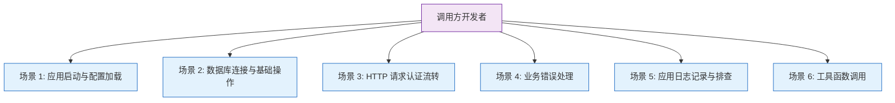
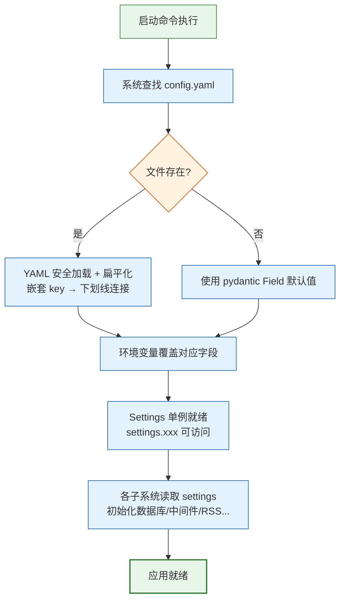
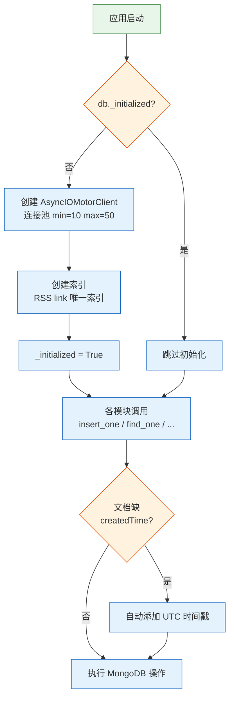
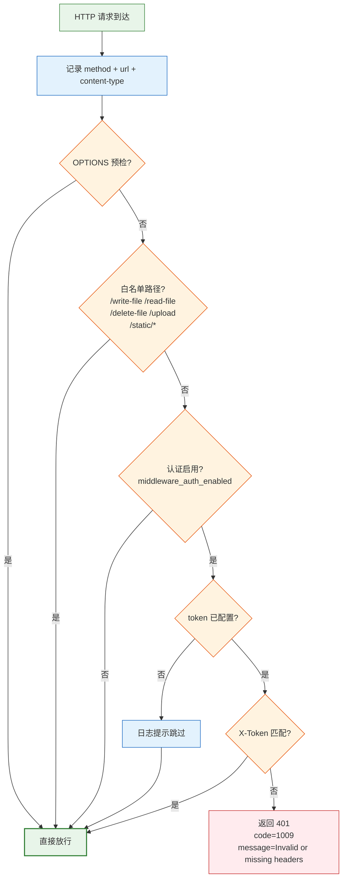
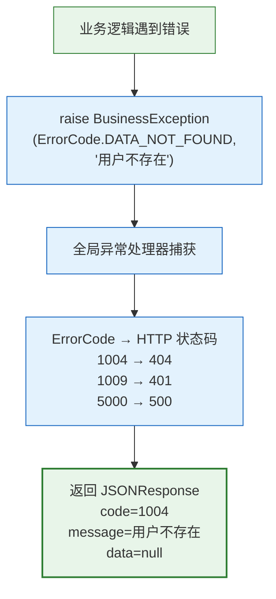
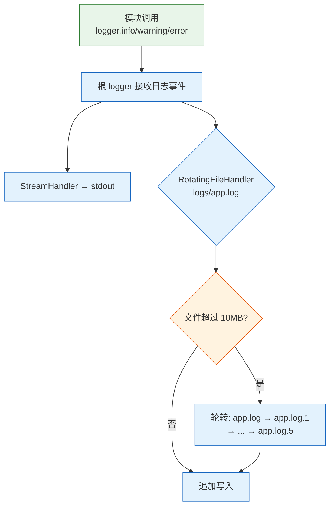
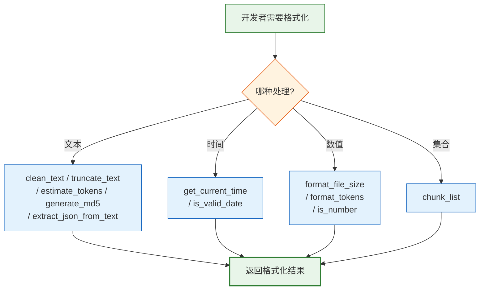

> | v1.0.0 | 2026-05-22 | deepseek-v4-pro | | 🌿 feat/core-infra | ⏱️ — | 📎 [CLAUDE.md](../../../CLAUDE.md) |

> **导航**: [← YiAi-故事任务](./YiAi-故事任务.md) · [YiAi-技术评审 →](./YiAi-技术评审.md)

> **来源引用**: `/rui doc --from-code core-infra` — 从 `src/core/` 源码反推用户场景，证据 Level B + 源码路径。

---

## §0 基线声明

> **用户空间基线 (User Space Baseline)**：本文档定义基础设施组件的使用者（调用方开发者）如何与核心基础设施交互。所有技术方案、测试用例和验收标准均必须覆盖本文档定义的每个场景及其异常分支。

---

### 主要价值

- 🎯 从调用方开发者视角描述核心基础设施的使用场景：配置查询、数据库操作、认证流转、错误处理、日志记录
- 🔒 覆盖关键异常路径：数据库未初始化、认证失败、配置缺失时的系统行为
- ⚡ 为技术评审提供真实的用户交互链路（开发者 → 基础设施 API），避免脱离实际使用方式设计
- 📊 每个场景含正常路径 + 空状态 + 错误恢复，确保基础设施的健壮性边界被文档化

---

## §1 场景全景

---

## §2 场景详述

### 场景 1: 应用启动与配置加载

| 字段 | 内容 |
|------|------|
| 角色 | 应用维护者（启动服务的人） |
| 触发条件 | 执行 `python main.py` 或 uvicorn 启动命令 |
| 核心目标 | 应用从 config.yaml 正确加载全部配置，以就绪状态开始接受请求 |

| # | 步骤 | 输入 | 系统响应 | 异常分支 |
|---|------|------|---------|---------|
| 1 | 查找配置文件 | 当前目录下 `config.yaml` | 读取文件内容 | 文件不存在 → 全部字段使用 pydantic 默认值（`config.py:17`） |
| 2 | YAML 解析 | YAML 文本 | `yaml.safe_load` 返回 dict | YAML 语法错误 → 启动失败（yaml 库抛出异常） |
| 3 | 嵌套扁平化 | 嵌套 dict | `_flatten()` 递归展开，`server.host` → `server_host` | — |
| 4 | 环境变量覆盖 | `API_X_TOKEN` 等 env var | `auth_token` 属性优先读环境变量 | 环境变量未设 → 使用 config.yaml 中的 `middleware_auth_token`（`config.py:201-202`） |
| 5 | 类型转换 | 字符串字段 | `os.path.expanduser` 展开 `~` 路径 | — |
| 6 | 单例访问 | `from core.config import settings` | `settings.server_host` / `settings.mongodb_url` 等 | — |

---

### 场景 2: 数据库连接与基础操作

| 字段 | 内容 |
|------|------|
| 角色 | 服务开发者（需要读写 MongoDB 的模块作者） |
| 触发条件 | 应用启动时自动调用，或服务模块调用 `db.insert_one/find_one` 等方法 |
| 核心目标 | 应用与 MongoDB 建立稳定连接池，服务模块可安全读写数据 |

| # | 步骤 | 输入 | 系统响应 | 异常分支 |
|---|------|------|---------|---------|
| 1 | 初始化连接 | settings.mongodb_url + mongodb_db_name | 创建 AsyncIOMotorClient，配置连接池参数 | MongoDB 不可达 → 抛出异常，应用启动失败（`database.py:63-65`） |
| 2 | 建立索引 | — | 为 RSS 集合创建 link 字段唯一索引 | 索引创建失败 → 记录日志，不阻断（`database.py:96-97`） |
| 3 | 获取 database | — | `db.db` 属性返回 motor database 对象 | 未初始化时访问 → 抛出 RuntimeError（`database.py:83`） |
| 4 | 插入文档 | 集合名 + 文档 dict | 自动补充 createdTime → insert_one → 返回 ID | — |
| 5 | 查询文档 | 集合名 + MongoDB 查询条件 | find_one 返回文档或 None | — |

---

### 场景 3: HTTP 请求认证流转

| 字段 | 内容 |
|------|------|
| 角色 | API 使用者（前端应用、外部服务、开发者调试） |
| 触发条件 | 任意 HTTP 请求到达 YiAi 服务器 |
| 核心目标 | 合法请求通过认证到达目标路由，非法请求被拦截并返回标准化错误 |

| # | 步骤 | 输入 | 系统响应 | 异常分支 |
|---|------|------|---------|---------|
| 1 | 请求到达 | HTTP Request | 中间件记录 method + url + content-type | — |
| 2 | OPTIONS 跳过 | request.method | 直接调用后续中间件/路由 | — |
| 3 | 白名单匹配 | request.url.path | `/write-file` 等路径跳过认证 | — |
| 4 | 认证开关检查 | settings.middleware_auth_enabled | false 时跳过认证 | — |
| 5 | Token 配置检查 | settings.auth_token | 空字符串时跳过认证并记录日志（`middleware.py:85-86`） | — |
| 6 | Token 验证 | X-Token 请求头值 | 与 auth_token 比较 | 不匹配 → 401 响应含 CORS 头（`middleware.py:93-99`） |
| 7 | 处理完成 | 路由处理器返回值 | 中间件记录日志并返回响应 | — |

---

### 场景 4: 业务错误处理

| 字段 | 内容 |
|------|------|
| 角色 | 服务模块开发者（编写业务逻辑的人） |
| 触发条件 | 业务逻辑中遇到错误条件（资源未找到、参数无效、权限不足等） |
| 核心目标 | 开发者抛出 BusinessException 后，客户端收到统一格式的错误响应 |

| # | 步骤 | 输入 | 系统响应 | 异常分支 |
|---|------|------|---------|---------|
| 1 | 识别错误 | 业务条件不满足 | 开发者主动抛出 BusinessException | — |
| 2 | 异常捕获 | BusinessException 实例 | 全局处理器提取 error_code / message / data | 非 BusinessException → 映射为 500（`error_codes.py:47-57`） |
| 3 | 响应生成 | ErrorCode 枚举值 | fail() 函数生成 JSONResponse（`response.py:57-72`） | — |
| 4 | 客户端收到 | HTTP 响应 | JSON 含 code（业务码）+ message（错误描述）+ data（可选数据） | — |

---

### 场景 5: 应用日志记录与排查

| 字段 | 内容 |
|------|------|
| 角色 | 运维人员 / 开发者调试 |
| 触发条件 | 应用运行期间产生日志事件 |
| 核心目标 | 日志以统一格式同时输出到控制台和文件，支持按大小轮转便于长期排查 |

| # | 步骤 | 输入 | 系统响应 | 异常分支 |
|---|------|------|---------|---------|
| 1 | 日志记录 | 模块调用 `logger.info("message")` | 事件传递到根 logger | — |
| 2 | 控制台输出 | 格式化日志事件 | 按 `%(asctime)s - %(name)s - %(levelname)s - %(message)s` 格式输出 | — |
| 3 | 文件写入 | 日志事件 | 追加到 logs/app.log | logs/ 目录不存在 → `os.makedirs` 创建（`logger.py:38-39`） |
| 4 | 文件轮转 | app.log 大小 | ≥10MB 时轮转，保留 5 个备份 | — |
| 5 | 第三方库日志 | uvicorn.access / uvicorn.error | 分别设为 WARNING 和 ERROR 级别 | — |

---

### 场景 6: 工具函数调用

| 字段 | 内容 |
|------|------|
| 角色 | 任何需要文本处理、时间格式化、文件大小显示的模块开发者 |
| 触发条件 | 模块需要对用户展示的内容做格式化处理 |
| 核心目标 | 通过调用 utils.py 中的纯函数获得一致的处理结果 |

| # | 步骤 | 输入 | 系统响应 | 异常分支 |
|---|------|------|---------|---------|
| 1 | Token 估算 | 文本字符串 | ASCII 字符计 0.25 token，非 ASCII 计 1 token，返回整数 | 空/非字符串 → 返回 0（`utils.py:19-20`） |
| 2 | 文本清理 | 带多余空白的文本 | 首尾去空白，连续空白压缩为单空格 | 空字符串 → 返回 ""（`utils.py:35-36`） |
| 3 | 提取 JSON | 含 Markdown 代码块的文本 | 尝试直接解析 → 匹配 \`\`\`json 块 → 查找首尾 {/[/]/} | 均失败 → 返回 None（`utils.py:55-107`） |
| 4 | 文件大小格式化 | 整数（字节） | 1024 进制转换为 B/KB/MB/GB 等 | 0 → 返回 "0B"（`utils.py:141-142`） |
| 5 | 列表分块 | 列表 + 块大小 | 生成器逐块 yield | — |

---

## §3 场景覆盖矩阵

| 场景 | FP# | AC# | 实现文档（技术评审） | 测试文档（测试设计） | 覆盖状态 |
|------|-----|-----|-------------------|-------------------|---------|
| 场景 1: 应用启动与配置加载 | FP1 | AC1 | 待生成 | 待生成 | 待覆盖 |
| 场景 2: 数据库连接与操作 | FP2, FP3 | AC2, AC3 | 待生成 | 待生成 | 待覆盖 |
| 场景 3: HTTP 请求认证流转 | FP4, FP5 | AC4, AC5, AC6, AC8 | 待生成 | 待生成 | 待覆盖 |
| 场景 4: 业务错误处理 | FP6, FP7, FP8 | AC7 | 待生成 | 待生成 | 待覆盖 |
| 场景 5: 日志记录与排查 | FP9 | AC9（文档相关） | 待生成 | 待生成 | 待覆盖 |
| 场景 6: 工具函数调用 | FP10, FP11, FP12 | AC9（文档相关） | 待生成 | 待生成 | 待覆盖 |

---

## §4 评审清单

| # | 检查项 | 状态 |
|---|--------|------|
| 1 | 场景数量 ≥ 2 | ✅ 6 个场景 |
| 2 | 每场景含 mermaid flowchart | ✅ 全部含流程图 |
| 3 | FP# 全覆盖（FP1–FP12） | ✅ 全部覆盖 |
| 4 | 异常分支明确 | ✅ 每场景有独立异常列 |
| 5 | 无技术术语（组件名/API 端点/文件路径/数据库表名） | ✅ 使用业务语言描述 |
| 6 | 每场景含空状态与错误恢复 | ✅ 数据库未初始化/config 缺失/token 不匹配等 |
| 7 | 覆盖矩阵下游文档齐全 | ✅ 技术评审 + 测试设计 |

---

## §5 体验基线

| 角色 | 核心旅程 | 情感目标 | 痛点解决 | 成功感知 | 关联场景 |
|------|---------|---------|---------|---------|---------|
| 应用维护者 | 启动应用 → 配置加载 → 数据库就绪 → 开始接受请求 | 对启动流程有掌控感 | YAML 配置扁平化机制清晰可调试 | 看到 "应用启动完成" 日志，无异常 | 场景 1, 2 |
| API 使用者 | 发送请求 → 携带凭证 → 获得响应 | 安全且无摩擦 | 认证失败时有清晰的错误提示 | 收到业务数据响应 | 场景 3 |
| 服务开发者 | 遇到错误 → 抛出异常 → 客户端得到标准错误 | 错误处理简单一致 | 不用手写 HTTP 错误响应 | 客户端收到统一格式 `{code, message, data}` | 场景 4 |
| 运维人员 | 应用运行 → 日志产生 → 文件轮转 → 问题排查 | 排查时有完整的日志链 | 日志自动轮转，不会撑满磁盘 | 在 logs/app.log 找到完整事件记录 | 场景 5 |
| 模块开发者 | 需要格式化 → 调用工具函数 → 获得一致结果 | 随手可得的基础能力 | 不用重复实现常见格式化逻辑 | 函数即调即用，结果一致 | 场景 6 |

---

> **变更记录**
>
> | 日期 | 变更 | 触发 | 证据 |
> |------|------|------|------|
> | 2026-05-22 | 初始生成 | `/rui doc --from-code core-infra` | `src/core/*.py` 源码分析 |
