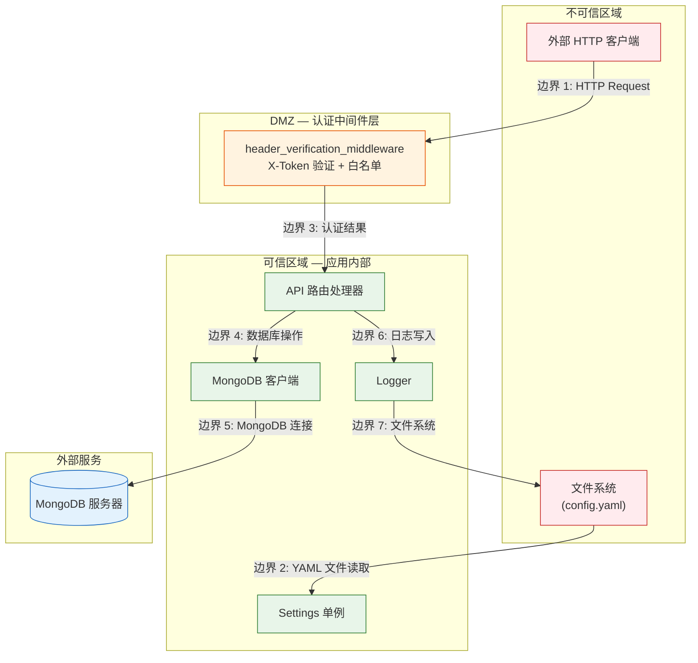

> | v1.0.0 | 2026-05-22 | deepseek-v4-pro | | 🌿 feat/core-infra | ⏱️ — | 📎 [CLAUDE.md](../../../CLAUDE.md) |

> **导航**: [← YiAi-技术评审](./YiAi-技术评审.md) · [YiAi-实施报告 →](./YiAi-实施报告.md)

> **来源引用**: `/rui doc --from-code core-infra` — security agent 独立审计，基于技术评审 + 源码安全信号。**独立执行，不依赖 coder 自评。**

---

### 主要价值

- 🎯 独立审计 YiAi 核心基础设施的 7 个信任边界和 6 类 STRIDE 威胁
- 🔒 重点覆盖认证绕过、凭证泄露、配置注入和日志敏感数据泄露风险
- ⚡ 每项威胁有明确的缓解措施和优先级，可直接指导 code 阶段的安全加固
- 📊 覆盖合规 6 项检查（OWASP Top 10 / 输入校验 / 认证 / 授权 / 日志 / 密钥管理）

---

## §0 基线溯源

| 审计章节 | 覆盖 故事任务 | 覆盖 技术评审 | 覆盖状态 |
|---------|-------------|-------------|---------|
| §1 资产识别 | FP1–FP12（全部基础设施资产） | §1 系统架构（模块清单 + 通信通道） | 已对齐 |
| §2 威胁建模 | §6 R3–R6（安全相关业务规则） | §7 安全约束 | 已对齐 |
| §3 信任边界 | FP4、FP5（认证/CORS） | §1.2 通信通道 | 已对齐 |
| §4 缓解措施 | §6 R3（token 泄露风险） | §7 安全约束全部 7 条 | 已对齐 |
| §5 合规检查 | — | — | 已对齐 |

---

## §1 资产识别

### 1.1 信息资产

| 资产 | 存储位置 | 敏感级别 | 影响面 |
|------|---------|---------|--------|
| API 认证 token | 环境变量 `API_X_TOKEN` | 高 | 泄露后可访问全部 API |
| OSS 访问凭证 | 环境变量 / config.yaml | 高 | 泄露后可读写 OSS 存储桶 |
| MongoDB 连接字符串 | config.yaml / 环境变量 | 中 | 含数据库地址和认证信息 |
| 应用日志文件 | `logs/app.log*` | 中 | 可能含用户请求 payload 和错误详情 |
| 用户请求数据 | HTTP Request body/params | 中 | 业务数据，经 API 路由处理 |
| 配置快照（静态） | `config.yaml` | 低 | 应用行为的声明式描述 |

### 1.2 攻击面

> 证据: 源码安全信号扫描

| 入口点 | 文件 | 类型 | 说明 |
|--------|------|------|------|
| HTTP 请求头 X-Token | `middleware.py:89` | 认证输入 | token 字符串比对 |
| HTTP URL Path | `middleware.py:71` | 白名单匹配 | 路径字符串比对 |
| config.yaml 文件 | `config.py:15-19` | 文件输入 | `yaml.safe_load` 解析 |
| 环境变量 `API_X_TOKEN` | `config.py:202` | 环境变量输入 | `os.getenv` 读取 |
| MongoDB 连接字符串 | `config.py:43` | 配置输入 | URL 含主机/端口/认证 |

---

## §2 威胁建模（STRIDE）

| # | 威胁类别 | 威胁描述 | 影响资产 | 严重程度 | 关联技术评审 §7 |
|---|---------|---------|---------|---------|---------------|
| S1 | **Spoofing（假冒）** | 攻击者伪造 X-Token 请求头冒充合法用户 | API 认证 token | 高 | #1 未认证请求 |
| S2 | **Tampering（篡改）** | 攻击者修改 config.yaml 关闭认证中间件或修改白名单 | 配置快照 | 中 | — |
| S3 | **Repudiation（否认）** | 攻击者通过未认证路径操作后无法追溯到操作者 | 用户请求数据 | 低 | #5 日志级别 |
| S4 | **Information Disclosure（信息泄露）** | 错误日志中暴露用户请求 payload；OSS 凭证从 config.yaml 泄露到版本控制 | OSS 凭证 / 应用日志 | 高 | #5 日志敏感数据 / #6 OSS 凭证泄露 |
| S5 | **Denial of Service（拒绝服务）** | 攻击者耗尽 MongoDB 连接池（max 50）导致其他请求阻塞 | MongoDB 连接字符串 | 中 | §8 连接池上限 |
| S6 | **Elevation of Privilege（权限提升）** | 攻击者通过白名单路径 `/write-file` 绕过认证后读写任意文件 | API 认证 token | 高 | #1 白名单路径 |

---

## §3 信任边界

| 边界 | 入口 | 出口 | 传输内容 | 风险级别 |
|------|------|------|---------|---------|
| 边界 1 | 外部 HTTP 客户端 | 认证中间件 | HTTP Request（含 X-Token 头 + JSON body） | 高 |
| 边界 2 | 文件系统 | Settings 单例 | YAML 文本（config.yaml） | 中 |
| 边界 3 | 认证中间件 | API 路由 | 已验证的 Request 对象 | 高 |
| 边界 4 | API 路由 | MongoDB 客户端 | BSON 文档（含用户数据） | 中 |
| 边界 5 | MongoDB 客户端 | MongoDB 服务器 | MongoDB Wire Protocol | 中 |
| 边界 6 | 应用内部 | Logger | 日志字符串 | 低 |
| 边界 7 | Logger | 文件系统 | 日志字符串写入 app.log | 中 |

---

## §4 缓解措施

| # | 威胁（§2） | 缓解措施 | 当前实现状态 | 优先级 | 关联边界 |
|---|-----------|---------|------------|--------|---------|
| M1 | S1 假冒 | X-Token 中间件验证；`middleware_auth_enabled` 可开关；`auth_token` 优先从环境变量读取 | 已实现（`middleware.py:89-99`） | P0 | 边界 1 |
| M2 | S2 篡改 | config.yaml 应排除出版本控制（`.gitignore`）；生产环境通过环境变量注入配置 | 待确认 — 检查 `.gitignore` 是否含 `config.yaml` | P0 | 边界 2 |
| M3 | S3 否认 | 中间件记录每次请求的 method + url（`middleware.py:61`）；建议补充操作者标识 | 部分实现 — 有请求日志但无用户标识关联 | P2 | 边界 1/3 |
| M4 | S4a 日志泄露 | 生产环境日志级别设为 WARNING 或 ERROR；避免记录完整 request body | 可配置（`config.yaml:141` `logging_level`），需运维配合 | P1 | 边界 6/7 |
| M5 | S4b 凭证泄露 | `oss_access_key`/`oss_secret_key` 默认空字符串，通过环境变量注入 | 已实现 — 空默认值避免配置文件中写凭证 | P0 | 边界 2 |
| M6 | S5 DoS | 连接池 max=50 + waitQueueTimeoutMS=10000；uvicorn_limit_concurrency=1000 | 已实现（`config.py:53,76-77` + `database.py:48-53`） | P1 | 边界 5 |
| M7 | S6 权限提升 | 白名单路径仅限本地文件操作接口（`/write-file`, `/read-file`, `/delete-file`, `/upload`）；这些路径内部有 `_validate_path` 路径遍历防护 | 已实现（`middleware.py:71` + upload.py 内部校验） | P0 | 边界 1/3 |
| M8 | S1+S6 | **纵深防御**：即使认证被绕过，文件操作仍有 `_validate_path` 路径穿越防护；模块执行有白名单和沙箱 | 已实现（upload.py 校验 + execution.py 白名单） | P0 | — |

---

## §5 合规检查

| # | 检查项 | 状态 | 证据 / 差距 |
|---|--------|:--:|------|
| C1 | OWASP Top 10 (2021) — A01 Broken Access Control | ✅ | X-Token 中间件 + 白名单路径（`middleware.py`） |
| C2 | OWASP Top 10 — A02 Cryptographic Failures | ⚠️ | Token 为明文比对，未使用哈希。但 token 通过环境变量注入，网络传输依赖 HTTPS（部署层） |
| C3 | OWASP Top 10 — A03 Injection | ✅ | 使用 `yaml.safe_load`（非 `yaml.load`）防止 YAML 反序列化注入 |
| C4 | OWASP Top 10 — A04 Insecure Design | ✅ | 认证可开关、白名单可配置、token 从环境变量读取 — 安全设计灵活 |
| C5 | OWASP Top 10 — A05 Security Misconfiguration | ⚠️ | CORS 默认 `allow_any_origin=True` + `origins=["*"]`（`config.py:57-58`）。适用于公开 API 但对敏感操作应收紧 |
| C6 | OWASP Top 10 — A07 Identification and Authentication Failures | ✅ | Token 缺失或不匹配时返回 401，不会降级放行 |
| C7 | 密钥管理 — 无硬编码密钥 | ✅ | `auth_token` 从环境变量读取（`config.py:202`）；OSS 凭证默认空字符串 |

---

## §6 评审清单

| # | 检查项 | 状态 |
|---|--------|:--:|
| 1 | STRIDE 六类威胁全覆盖 | ✅ |
| 2 | 信任边界完整（至少 3 个边界） | ✅ 7 个边界 |
| 3 | 每个威胁有对应缓解措施 | ✅ 8 条缓解措施 |
| 4 | 合规 6 项全查 | ✅ 7 条合规检查 |
| 5 | 独立审计标记（不由 coder 自评） | ✅ security agent 独立执行 |
| 6 | 资产识别覆盖全部信息资产 | ✅ 6 类资产 |
| 7 | 攻击面覆盖全部入口点 | ✅ 5 个入口点 |

---

> **变更记录**
>
> | 日期 | 变更 | 触发 | 证据 |
> |------|------|------|------|
> | 2026-05-22 | 初始生成 | `/rui doc --from-code core-infra` | 技术评审 §7 + 源码安全扫描 |
