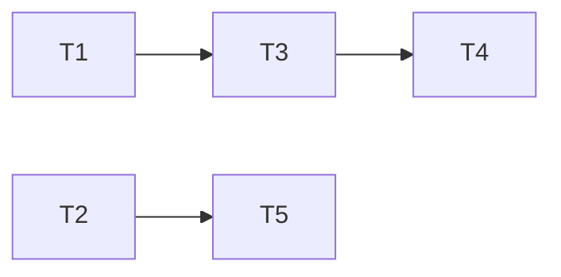
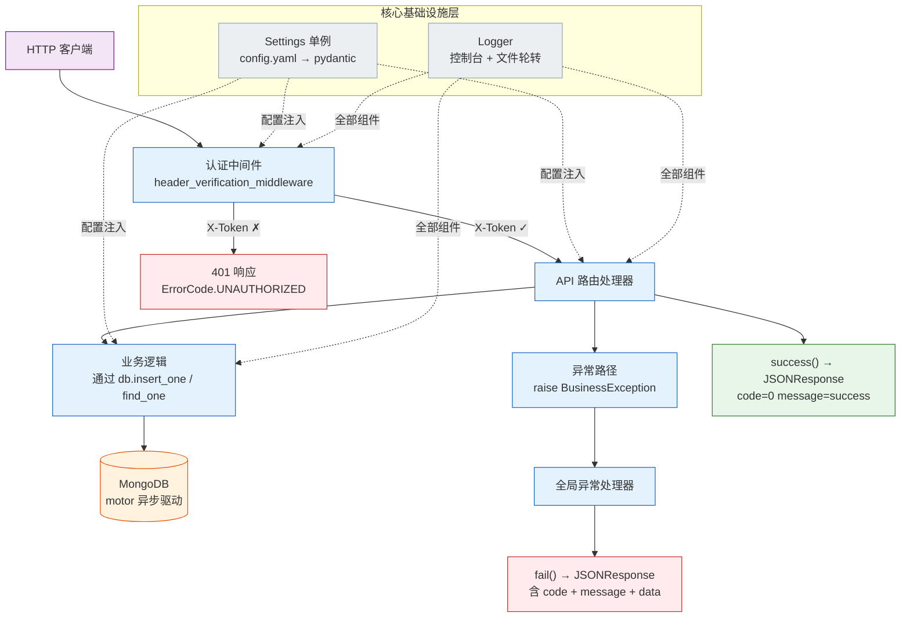
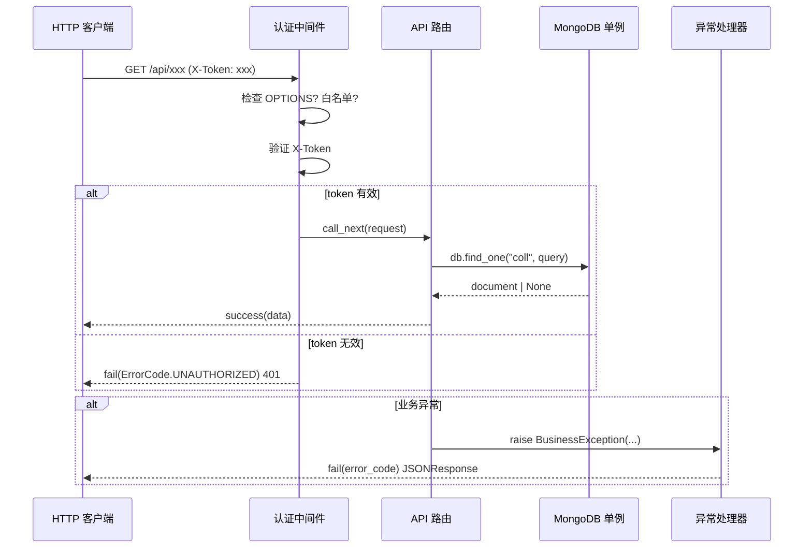

> | v1.0.0 | 2026-05-22 | deepseek-v4-pro | | 🌿 feat/core-infra | ⏱️ — | 📎 [CLAUDE.md](../../../CLAUDE.md) |

> **导航**: [← YiAi-使用场景](./YiAi-使用场景.md) · [YiAi-测试设计 →](./YiAi-测试设计.md) · [YiAi-安全审计 →](./YiAi-安全审计.md)

> **来源引用**: `/rui doc --from-code core-infra` — 从 `src/core/` 8 个 Python 文件只读提取技术架构。项目类型：backend — 跳过 §4 组件与状态、§5 交互与样式、§6 DOM·事件·依赖。

---

### 主要价值

- 🎯 完整描述 YiAi 核心基础设施的技术架构：配置加载链路、数据库单例模式、中间件流转、响应对象契约
- 🔒 每接口附源码路径（Level A/B 证据），可追溯到具体文件和行号
- ⚡ 按后端项目类型裁剪章节，聚焦 API 接口契约、数据模型、安全约束和性能限制
- 📊 为下游测试设计和安全审计提供精确的技术事实基线

---

## §0 设计决策与任务规划

### §0.0 基线溯源

| 本设计章节 | 实现 故事任务 | 服务 使用场景 | 覆盖状态 |
|-----------|-------------|-------------|---------|
| §1 系统架构 | FP1–FP12（全部核心基础设施） | 场景 1–6（全部） | 已对齐 |
| §2 API 接口（内部契约） | FP1–FP3, FP6–FP8 | 场景 1, 2, 4 | 已对齐 |
| §3 数据模型 | FP2, FP3 | 场景 2 | 已对齐 |
| §7 安全约束 | FP4, FP5, FP7, FP8 | 场景 3, 4 | 已对齐 |
| §8 性能与限制 | FP1–FP3, FP9 | 场景 1, 2, 5 | 已对齐 |

### §0.1 设计决策

| 决策领域 | 选定方案 | 选择理由 | 详见 | 实现 FP# |
|---------|---------|---------|------|---------|
| 配置加载 | YAML 扁平化 + pydantic-settings，自定义 `YamlConfigSettingsSource` | 保持 YAML 嵌套可读性，同时兼容 pydantic 扁平字段访问 | §1.1 | FP1 |
| 数据库访问 | Motor 异步驱动 + DCL 单例 | 异步 I/O 与 FastAPI 一致；单例避免连接池泄漏 | §2.3 | FP2, FP3 |
| 认证方案 | X-Token 请求头验证中间件 | 轻量级，可开关，白名单路径免认证 | §1.2, §7 | FP4, FP5 |
| 错误处理 | ErrorCode 枚举 + BusinessException + 全局异常处理器 | 统一错误格式，业务码与 HTTP 码分离 | §2.1 | FP7, FP8 |
| 日志方案 | 标准 logging + RotatingFileHandler | Python 生态标准，无外部依赖，自动轮转 | §1.3 | FP9 |

### §0.2 任务规划

| ID | 描述 | 工作量 | 依赖 | 交付物 | Agent | 门禁 | 交接下游 | 实现 FP# |
|----|------|--------|------|--------|-------|------|---------|---------|
| T1 | 文档化配置加载机制 | S | — | 技术评审 §1.1 | coder | Gate A | 测试设计 | FP1 |
| T2 | 文档化数据库层 | S | — | 技术评审 §2.3 + §3 | coder | Gate A | 测试设计 | FP2, FP3 |
| T3 | 文档化中间件流转 | S | — | 技术评审 §1.2 | coder | Gate A | 安全审计 | FP4, FP5 |
| T4 | 文档化错误处理体系 | S | — | 技术评审 §2.1–§2.2 | coder | Gate A | 测试设计 | FP6–FP8 |
| T5 | 文档化日志与工具 | S | — | 技术评审 §1.3 + §2.4 | coder | Gate A | — | FP9–FP12 |



---

## §1 系统架构

### 效果示意 — 全链路请求流



### 1.1 模块/文件清单

| 变更类型 | 模块/文件 | 职责 |
|---------|----------|------|
| 现有 | `src/core/config.py` | YAML 扁平化配置加载，Settings 单例（40+ 配置字段，206 行） |
| 现有 | `src/core/database.py` | MongoDB 单例（DCL），连接池管理，CRUD 包装，索引管理（163 行） |
| 现有 | `src/core/middleware.py` | X-Token 认证中间件，CORS 头注入，白名单路径（112 行） |
| 现有 | `src/core/response.py` | StandardResponse 类，success()/fail() 辅助函数（72 行） |
| 现有 | `src/core/error_codes.py` | ErrorCode 枚举（1xxx 客户端 / 5xxx 服务端，12 个错误码）（57 行） |
| 现有 | `src/core/exceptions.py` | BusinessException 自定义异常（20 行） |
| 现有 | `src/core/logger.py` | 日志初始化：控制台 handler + RotatingFileHandler（57 行） |
| 现有 | `src/core/utils.py` | 文本/时间/数字/集合工具函数集（177 行） |

### 1.2 通信通道



| 通道 | 方向 | 协议 | Payload | 错误处理 |
|------|------|------|---------|---------|
| HTTP → 中间件 → 路由 | 入站 | HTTP/1.1 | X-Token 头 + JSON body | 401/500 + 标准错误格式 |
| 路由 → MongoDB | 内部 | Motor async (MongoDB Wire Protocol) | BSON 文档 | 抛出异常，阻断请求 |
| 路由 → 异常处理器 | 内部 | Python 异常机制 | BusinessException(error_code, message, data) | 全局捕获 → JSONResponse |

---

## §2 API 接口（内部 Python 契约）

### 2.1 ErrorCode 枚举

> 证据: `src/core/error_codes.py:15-56`

| 错误码 | business | http | message | 分类 |
|--------|----------|------|---------|------|
| OK | 0 | 200 | 成功 | 成功 |
| INVALID_REQUEST | 1000 | 400 | 无效的请求 | 客户端 |
| BUSINESS_ERROR | 1001 | 400 | 业务错误 | 客户端 |
| INVALID_PARAMS | 1002 | 400 | 无效的参数 | 客户端 |
| RATE_LIMITED | 1003 | 429 | 请求过于频繁 | 客户端 |
| DATA_NOT_FOUND | 1004 | 404 | 未找到资源 | 客户端 |
| PERMISSION_DENIED | 1008 | 403 | 权限拒绝 | 客户端 |
| UNAUTHORIZED | 1009 | 401 | 未认证 | 客户端 |
| SERVER_ERROR | 5000 | 500 | 服务器繁忙 | 服务端 |
| INTERNAL_ERROR | 5001 | 500 | 内部错误 | 服务端 |
| DATA_STORE_FAIL | 5002 | 500 | 新增失败 | 服务端 |
| DATA_UPDATE_FAIL | 5003 | 500 | 更新失败 | 服务端 |
| DATA_DESTROY_FAIL | 5004 | 500 | 删除失败 | 服务端 |

`map_http_to_error_code(status)` 将 HTTP 状态码反向映射为 ErrorCode（`error_codes.py:47-57`）。

### 2.2 响应对象

> 证据: `src/core/response.py:12-72`

**StandardResponse**（内部对象，不直接用于 HTTP 响应）：

| 字段 | 类型 | 说明 |
|------|------|------|
| code | int | 业务状态码（默认 0） |
| message | str | 提示消息（默认 "success"） |
| data | Optional[T] | 数据载荷（默认 None） |
| http_code | int | HTTP 状态码（仅用于 status_code，不序列化到响应体） |

**success() 函数签名**:

```python
def success(data=None, message="success", pagination=None, http_code=200) -> Response
```
生成 `{"code": 0, "message": "success", "data": ...}` 格式的 JSONResponse。

**fail() 函数签名**:

```python
def fail(error: ErrorCode, message=None, data=None) -> Response
```
生成 `{"code": <business>, "message": "...", "data": ...}` 格式的 JSONResponse，HTTP 状态码由 ErrorCode 决定。

**BusinessException 类**:

> 证据: `src/core/exceptions.py:5-19`

```python
class BusinessException(Exception):
    def __init__(self, error_code: ErrorCode, message: Optional[str] = None, data: Any = None)
```

### 2.3 数据库服务

> 证据: `src/core/database.py:14-162`

**MongoDB 单例**:

| 方法 | 签名 | 返回 | 说明 |
|------|------|------|------|
| initialize | `async initialize()` | None | 建立连接池 + 创建索引。已初始化时幂等返回 |
| close | `async close()` | None | 关闭连接，重置状态 |
| db | `property db` | motor database | 访问 database 对象。未初始化时抛 RuntimeError |
| insert_one | `async insert_one(collection_name: str, document: dict) -> str` | inserted_id | 自动补充 createdTime（UTC） |
| insert_many | `async insert_many(collection_name: str, documents: list) -> list[str]` | inserted_ids | 每文档自动补充 createdTime |
| find_one | `async find_one(collection_name: str, query: dict) -> dict \| None` | document | 标准 MongoDB 查询 |

**连接池参数**（`database.py:47-54`）:

| 参数 | 值 | 说明 |
|------|-----|------|
| maxPoolSize | 50 | 最大连接数 |
| minPoolSize | 10 | 最小连接数 |
| maxIdleTimeMS | 30000 | 空闲连接 30s 回收 |
| waitQueueTimeoutMS | 10000 | 等待连接最长 10s |
| retryWrites | True | 写重试 |
| retryReads | True | 读重试 |

### 2.4 工具函数

> 证据: `src/core/utils.py`

**文本处理**:

| 函数 | 签名 | 返回 | 说明 |
|------|------|------|------|
| estimate_tokens | `(text: str \| bytes) -> int` | token 数 | ASCII 0.25/字符，非 ASCII 1/字符 |
| clean_text | `(text: str) -> str` | 清理后文本 | 去首尾空白，压缩连续空白 |
| truncate_text | `(text: str, length: int, ellipsis="...") -> str` | 截断文本 | 超长添加省略号 |
| generate_md5 | `(text: str) -> str` | MD5 哈希 | — |
| generate_random_string | `(length=8, chars=ascii_letters+digits) -> str` | 随机字符串 | — |
| extract_json_from_text | `(text: str) -> dict \| list \| None` | JSON 对象 | 支持 Markdown 代码块提取 |

**时间处理**: `get_current_time()` → ISO 8601 UTC 字符串 · `is_valid_date(date_str)` → bool

**数字/文件**: `is_number(value)` → bool · `format_file_size(bytes)` → "1.5 MB" · `format_tokens(n)` → "1.5K"

**集合处理**: `chunk_list(lst, size)` → Generator（按 size 分块）

---

## §3 数据模型

### 3.1 配置字段结构

> 证据: `src/core/config.py:47-204`

**Settings 类字段分组**:

| 分组 | 字段 | 类型 | 默认值 | 说明 |
|------|------|------|--------|------|
| Server | `server_host` | str | "0.0.0.0" | 绑定地址 |
| Server | `server_port` | int | 8000 | 监听端口 |
| Server | `server_reload` | bool | True | 热重载 |
| Server | `uvicorn_limit_concurrency` | int | 1000 | 并发限制 |
| Server | `uvicorn_limit_max_requests` | int | 10000 | 最大请求数 |
| Server | `uvicorn_timeout_keep_alive` | int | 5 | Keep-Alive 超时 |
| CORS | `cors_origins` | str/list | ["*"] | 允许来源 |
| CORS | `cors_allow_any_origin` | bool | True | 允许任意来源 |
| Pagination | `pagination_default_size` | int | 2000 | 默认分页 |
| Pagination | `pagination_max_size` | int | 8000 | 最大分页 |
| Pagination | `pagination_min_size` | int | 1 | 最小分页 |
| Database | `mongodb_url` | str | "mongodb://localhost:27017" | 连接 URL |
| Database | `mongodb_db_name` | str | "ruiyi" | 数据库名 |
| Database | `mongodb_pool_size` | int | 10 | 最小连接池 |
| Database | `mongodb_max_pool_size` | int | 50 | 最大连接池 |
| OSS | `oss_access_key` | str | "" | 访问密钥 |
| OSS | `oss_secret_key` | str | "" | 秘密密钥 |
| OSS | `oss_endpoint` | str | "" | 端点 |
| OSS | `oss_bucket` | str | "" | 存储桶 |
| OSS | `oss_domain` | str | "" | 域名 |
| OSS | `oss_max_file_size_mb` | int | 50 | 最大文件 |
| OSS | `oss_allowed_extensions` | list[str] | [".jpg", ...] | 允许扩展名 |
| Logging | `logging_level` | str | "INFO" | 日志级别 |
| Logging | `logging_format` | str | "%(asctime)s - ..." | 日志格式 |
| Middleware | `middleware_auth_enabled` | bool | False | 认证开关 |
| Middleware | `middleware_auth_token` | str | "" | 认证 token（config.yaml 中） |
| Observer | `observer_enabled` 等 11 个字段 | mixed | 见 config.py:120-134 | Observer 子系统配置 |

**配置优先级**（`config.py:148-163`）: `__init__ params` → `env vars` → `dotenv` → `file secrets` → `config.yaml`

**特殊逻辑**:
- `auth_token` 属性优先读环境变量 `API_X_TOKEN`，fallback 到 `middleware_auth_token`（`config.py:201-202`）
- `_flatten()` 将嵌套 YAML key 用下划线连接（`config.py:23-31`）

### 3.2 MongoDB 集合名

> 证据: `src/core/config.py:79-85`

| 集合常量 | 集合名 | 用途 |
|---------|--------|------|
| `collection_sessions` | "sessions" | 会话数据 |
| `collection_rss` | "rss" | RSS 条目 |
| `collection_chat_records` | "chat_records" | 聊天记录 |
| `collection_pet_data_sync` | "pet_data_sync" | 数据同步 |
| `collection_seeds` | "seeds" | 种子数据 |
| `collection_oss_file_tags` | "oss_file_tags" | OSS 文件标签 |
| `collection_oss_file_info` | "oss_file_info" | OSS 文件信息 |
| `collection_state_records` | "state_records" | 状态记录 |

---

## §7 安全约束

| # | 威胁 | 信任边界 | 缓解措施 | 优先级 |
|---|------|---------|---------|--------|
| 1 | 未认证请求访问 API | HTTP 请求头 → 路由处理器 | X-Token 验证中间件（可开关），白名单路径免认证 | P0 |
| 2 | Token 硬编码泄露 | config.yaml → 环境变量 | `auth_token` 优先从 `API_X_TOKEN` 环境变量读取 | P0 |
| 3 | CORS 配置过于宽松 | 浏览器 → API 服务器 | `cors_allow_any_origin=True` 允许所有来源，适用于公开 API | P1 |
| 4 | MongoDB 未授权访问 | 应用 → MongoDB | 依赖 MongoDB 连接字符串中的认证信息（当前默认 localhost） | P1 |
| 5 | 日志文件含敏感数据 | 应用 → logs/app.log | 日志级别和格式通过 config.yaml 控制，生产环境建议 WARNING+ | P2 |
| 6 | OSS 凭证泄露 | config.yaml → OSS API | `oss_access_key` / `oss_secret_key` 默认空字符串，通过环境变量或 config.yaml 注入 | P1 |
| 7 | 配置注入 | 外部 → config.yaml | 使用 `yaml.safe_load`（非 `yaml.load`），防止任意代码执行 | P0 |

---

## §8 性能与限制

| 维度 | 约束 | 应对 |
|------|------|------|
| 连接池上限 | maxPoolSize=50 | 高并发时排队等待，最长 10s（waitQueueTimeoutMS） |
| 连接空闲回收 | maxIdleTimeMS=30000 | 30s 无活动连接自动回收 |
| 请求并发 | uvicorn_limit_concurrency=1000 | 超过 1000 并发时排队 |
| 最大请求数 | uvicorn_limit_max_requests=10000 | 达到后 worker 重启（防止内存泄漏） |
| 日志轮转 | 10MB/文件，5 个备份 | 总计最多 ~60MB 日志存储 |
| 配置加载 | 启动时一次性加载 | 运行时修改 config.yaml 需要重启生效 |
| 数据库初始化 | 启动时阻塞初始化 | 失败则应用无法启动（设计决定） |

---

## §9 评审清单

| # | 检查项 | 状态 |
|---|--------|------|
| 1 | 效果示意完整（全链路请求流 mermaid） | ✅ |
| 2 | 模块/文件清单完整（8 文件全部覆盖） | ✅ |
| 3 | 内部接口签名有源码路径 | ✅ 每个接口标注证据路径 |
| 4 | 配置字段全部覆盖 | ✅ 40+ 字段按分组列出 |
| 5 | 错误码全部列出 | ✅ 13 个 ErrorCode 枚举 |
| 6 | 安全约束至少覆盖认证/注入/凭证 3 面 | ✅ 7 条安全约束 |
| 7 | 性能维度按后端侧重（吞吐/延迟/连接池） | ✅ 7 个维度 |
| 8 | 基线溯源表完整 | ✅ §0.0 5 行全部已对齐 |
| 9 | 章节按后端类型正确裁剪（无 §4 §5 §6） | ✅ |
| 10 | 无硬编码密钥（auth_token 从环境变量读） | ✅ 已记录在 §7 |

---

> **变更记录**
>
> | 日期 | 变更 | 触发 | 证据 |
> |------|------|------|------|
> | 2026-05-22 | 初始生成 | `/rui doc --from-code core-infra` | `src/core/*.py` 全部 8 文件只读分析 |
