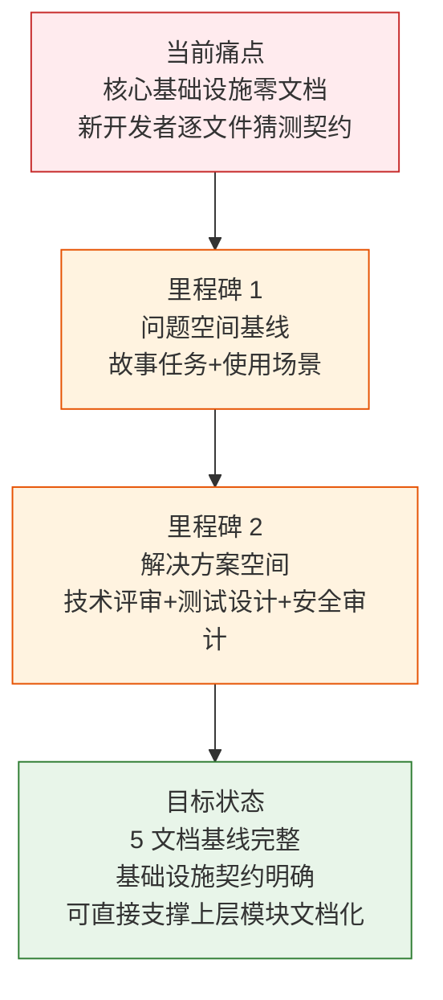
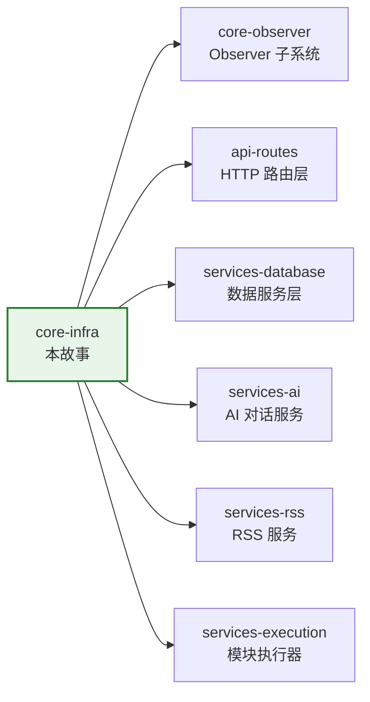

> | v1.0.0 | 2026-05-22 | deepseek-v4-pro | | 🌿 feat/core-infra | ⏱️ — | 📎 [CLAUDE.md](../../../CLAUDE.md) |

> **导航**: [YiAi-使用场景 →](./YiAi-使用场景.md)

> **来源引用**: `/rui doc --from-code core-infra` — 从 `src/core/` 源码反推，证据 Level B + 源码路径。

### 项目信息

| 字段 | 内容 |
|------|------|
| 项目名 | YiAi（宜 AI） |
| 故事名 | core-infra |
| 故事类型 | 核心基础设施文档化 |
| 项目类型 | backend |
| 分支 | feat/core-infra |
| 源码范围 | `src/core/config.py`, `src/core/database.py`, `src/core/middleware.py`, `src/core/response.py`, `src/core/error_codes.py`, `src/core/exceptions.py`, `src/core/logger.py`, `src/core/utils.py` |

### 需求概述

YiAi 的核心基础设施层（`src/core/`）是应用启动、配置加载、数据库连接、请求认证、错误处理、日志记录和通用工具的基础。这 8 个模块构成了所有其他模块的运行基座——API 路由依赖配置和中间件，服务层依赖数据库和错误码，整个应用依赖日志和工具函数。当前这层没有任何故事文档，所有模块的使用方式、契约约定和边界条件仅存在于源码中，新开发者需要逐文件阅读理解。

本次任务的目标：通过只读源码分析，为这 8 个核心基础设施模块生成完整的故事文档基线，使上层模块的开发和维护有明确的基础设施契约可循。

### 主要价值

- 🎯 为 YiAi 核心基础设施建立可追溯的文档基线，使配置管理、数据库访问、请求认证、错误处理、日志规范和工具函数的使用契约显式化
- 🔒 明确安全边界：X-Token 认证流程、CORS 配置策略、配置中的敏感字段隔离方式
- ⚡ 降低新开发者上手成本：从逐文件猜测接口行为变为通过文档快速定位基础设施组件的职责与契约
- 📊 为后续上层模块文档化提供基础：API 路由、服务层、Observer 子系统的文档可以引用基础设施层的已知契约

---

## §1 Story

### Story 1: 核心基础设施文档化

| 字段 | 内容 |
|------|------|
| 作为 | 项目维护者和新加入的开发者 |
| 我想要 | 有一个完整的文档基线来描述 YiAi 核心基础设施的配置体系、数据库访问方式、请求认证流程、错误处理规范、日志规范和工具函数集合 |
| 以便 | 理解应用基座如何运行，知道如何正确使用配置、数据库、错误码和工具函数，理解请求如何在认证中间件中流转 |
| 优先级 | P0 |
| 范围边界 | 只读源码 `src/core/`（不含 observer 子系统），生成 5 文档基线 |
| 依赖 | `src/core/` 源码可读，8 个 Python 文件存在 |

#### 范围外

- 不涉及 `src/core/observer/` 子系统（throttle/sampler/sandbox/guard/lazy_start），该子系统属于独立的 `core-observer` 故事
- 不涉及源码修改
- 不涉及实施报告/测试报告/自改进复盘（属于 code 阶段产出）

#### §1.1 User Operations

| # | 操作 | 触发条件 | 操作步骤 | 预期结果 |
|---|------|---------|---------|---------|
| 1 | 理解配置体系 | 开发者需要添加新配置项或理解现有配置 | 阅读 config.py → 理解 YAML 扁平化机制 → 查看 Settings 类字段定义 | 知道如何添加新配置项，理解 YAML → pydantic 的映射规则 |
| 2 | 连接数据库 | 应用启动时需要初始化 MongoDB 连接 | 调用 `db.initialize()` → MongoDB 单例建立连接池 → 创建索引 | 数据库连接就绪，可通过 `db.db` 访问 database 对象 |
| 3 | 请求认证 | HTTP 请求到达服务器 | 中间件检查 X-Token → 验证通过放行/失败返回 401 | 合法请求通过，非法请求被拦截 |
| 4 | 错误处理 | 业务逻辑中发生异常 | 抛出 `BusinessException(error_code, message)` → 全局异常处理器捕获 → 返回标准错误响应 | 客户端收到统一格式的错误响应 |
| 5 | 日志记录 | 应用运行期间需要记录事件 | 使用 `logging.getLogger(__name__)` → 日志输出到控制台和文件 | 日志按统一格式输出，文件自动轮转 |

---

## §2 Requirements

### 功能点

| FP# | 描述 | 输入 | 输出 | 错误行为 | 优先级 |
|-----|------|------|------|---------|--------|
| FP1 | 配置加载 — 从 `config.yaml` 读取扁平化配置到 pydantic Settings 对象 | config.yaml 文件 | Settings 单例（含全部配置字段） | 文件不存在时使用默认值；YAML 格式错误时启动失败 | P0 |
| FP2 | 数据库初始化 — 建立 MongoDB 连接池并创建索引 | MongoDB URL + 数据库名 | 就绪的 AsyncIOMotorClient 连接池 + 索引 | MongoDB 不可达时抛出异常阻断启动 | P0 |
| FP3 | 数据 CRUD — 提供 insert_one/many, find_one 等常用操作的包装方法 | 集合名 + 文档/查询条件 | 操作结果（插入 ID / 查询文档 / 更新计数等） | 数据库未初始化时抛出 RuntimeError | P0 |
| FP4 | 请求认证 — X-Token 请求头验证中间件 | HTTP Request（含 X-Token 头） | 放行或 401 响应 | token 不匹配时返回 401；中间件异常时返回 500 | P0 |
| FP5 | CORS 处理 — 为错误响应添加跨域头 | JSONResponse | 带 CORS 头的响应 | — | P1 |
| FP6 | 统一响应格式 — success()/fail() 生成标准化 JSON 响应 | 数据/消息/错误码 | JSONResponse（含 code/message/data） | — | P0 |
| FP7 | 错误码枚举 — ErrorCode 枚举管理全部业务错误码（1xxx 客户端 / 5xxx 服务端） | — | 错误码对象（business/http/message） | — | P0 |
| FP8 | 业务异常 — BusinessException 携带 ErrorCode 抛出，由全局处理器捕获 | ErrorCode + 可选 message/data | 异常对象 | — | P0 |
| FP9 | 日志配置 — 初始化控制台和文件日志处理器（含轮转） | — | 全局日志配置 | logs/ 目录创建失败时日志仅输出到控制台 | P1 |
| FP10 | 文本工具 — token 估算、文本清理、截断、Markdown JSON 提取、MD5、随机字符串 | 文本字符串 | 处理后文本/数值 | 空输入返回空字符串或 0 | P2 |
| FP11 | 时间工具 — UTC 时间字符串生成、日期格式校验 | 日期字符串 | ISO 8601 字符串 / boolean | 无效日期格式返回 False | P2 |
| FP12 | 文件工具 — 文件大小格式化、token 数量格式化、列表分块 | 数值/列表 | 格式化字符串/生成器 | 零字节返回 "0B" | P2 |

### 业务规则

| R# | 描述 | 校验方式 | 证据级别 |
|----|------|---------|---------|
| R1 | 配置加载优先级：初始化参数 > 环境变量 > dotenv > secrets > config.yaml | 检查 `settings_customise_sources` 方法源码 | A（`config.py:148-163`） |
| R2 | 数据库使用双重检查锁定 (DCL) 单例模式 | 检查 `MongoDB.__new__` 方法源码 | A（`database.py:24-29`） |
| R3 | 认证中间件跳过 OPTIONS 预检和白名单路径 | 检查 `header_verification_middleware` 源码 | A（`middleware.py:64-72`） |
| R4 | 认证中间件可在运行时通过配置开关启用/禁用 | 检查 `settings.middleware_auth_enabled` | A（`middleware.py:75-78`） |
| R5 | 所有错误码分 1xxx（客户端）和 5xxx（服务端）两组 | 检查 ErrorCode 枚举定义 | A（`error_codes.py:19-34`） |
| R6 | 错误响应通过 `BusinessException` + 全局异常处理器捕获 | 检查 exceptions.py + main.py 全局处理器 | B（`exceptions.py:5-19`） |
| R7 | 日志轮转：每文件 10MB，保留 5 个备份 | 检查 RotatingFileHandler 参数 | A（`logger.py:44-46`） |

### 数据约束

| 约束 | 类型 | 范围/格式 | 来源 |
|------|------|----------|------|
| 配置字段命名 | string | YAML 嵌套 key 以下划线连接扁平化（`server.host` → `server_host`） | `config.py:23-31` |
| 默认分页大小 | int | 默认 2000，最大 8000，最小 1 | `config.py:61-63` |
| 连接池大小 | int | 最小 10，最大 50 | `config.py:76-77` |
| 日志级别 | enum | DEBUG/INFO/WARNING/ERROR/CRITICAL | `config.py:141` |
| 错误码范围 | int | 1xxx（客户端），5xxx（服务端） | `error_codes.py:1-2` |
| MongoDB 集合名 | string | 通过 config.yaml 配置的 collection_* 字段 | `config.py:79-85` |

---

## §3 成功标准

| SC# | 描述 | 度量方式 | 目标值 | 优先级 | 关联 FP# |
|-----|------|---------|--------|--------|---------|
| SC1 | 开发者能通过文档理解配置加载机制并正确添加新配置项 | 文档中技术评审的配置章节覆盖全部 40+ 配置字段的分组说明 | 全部配置字段分组覆盖 | P0 | FP1 |
| SC2 | 开发者能通过文档独立完成数据库连接配置和基础 CRUD 操作 | 技术评审中数据库章节含连接池参数说明和 CRUD 方法签名 | 全部 CRUD 方法有文档 | P0 | FP2, FP3 |
| SC3 | 安全审计文档覆盖认证中间件的完整威胁面分析 | 安全审计中 STRIDE 六类威胁全覆盖 + 缓解措施 | 6/6 STRIDE 类别覆盖 | P0 | FP4 |
| SC4 | 开发者能通过文档快速查找错误码并正确使用 BusinessException | 技术评审中错误处理章节含完整错误码表和使用示例 | 全部 12 个错误码有文档 | P0 | FP7, FP8 |
| SC5 | 文档能指导测试人员编写核心基础设施的集成测试 | 测试设计文档覆盖正常/边界/异常三类用例 | 每 FP ≥ 1 条用例 | P1 | FP1–FP12 |

---

## §4 范围边界

### 范围内

| # | 条目 | 关联 FP# | 边界说明 |
|---|------|---------|---------|
| 1 | 配置管理模块（config.py） | FP1 | YAML 扁平化 + pydantic-settings + Settings 类全部字段 |
| 2 | 数据库访问层（database.py） | FP2, FP3 | MongoDB 单例 + 连接池 + CRUD 包装 + 索引管理 |
| 3 | 认证中间件（middleware.py） | FP4, FP5 | X-Token 验证 + CORS + 白名单路径 |
| 4 | 响应对象（response.py） | FP6 | StandardResponse + success/fail 函数 |
| 5 | 错误码系统（error_codes.py + exceptions.py） | FP7, FP8 | ErrorCode 枚举 + BusinessException |
| 6 | 日志系统（logger.py） | FP9 | setup_logging + RotatingFileHandler |
| 7 | 工具函数（utils.py） | FP10–FP12 | 文本/时间/文件/集合工具函数 |

### 范围外

| # | 条目 | 排除原因 | 替代方案 |
|---|------|---------|---------|
| 1 | Observer 子系统（observer/） | 独立故事 `core-observer`，含沙箱/限流/采样/守卫/懒启动 | `/rui doc --from-code core-observer` |
| 2 | 源码修改 | doc 阶段只读源码，实现属于 code 阶段 | `/rui code core-infra` |
| 3 | 实施报告/测试报告/自改进复盘 | 属于 code 阶段产出 | `/rui code core-infra` |
| 4 | API 路由层文档化 | 独立故事 `api-routes` | `/rui doc --from-code api-routes` |
| 5 | 服务层文档化 | 独立故事（services-database, services-rss, services-ai 等） | 按推荐排序逐个执行 |

---

## §5 AC

| AC# | Given | When | Then | 门禁 |
|-----|-------|------|------|------|
| AC1 | config.yaml 文件存在且格式正确 | 应用启动时加载配置 | Settings 单例包含全部 40+ 配置字段，YAML 嵌套 key 正确扁平化 | Gate A |
| AC2 | MongoDB 服务可用 | 调用 `db.initialize()` | 建立连接池（min 10 / max 50），创建 RSS link 唯一索引 | Gate A |
| AC3 | MongoDB 已初始化 | 调用 `db.insert_one("coll", doc)` | 文档插入成功，自动添加 createdTime 字段，返回插入 ID | Gate A |
| AC4 | 请求携带正确的 X-Token 头 | 中间件处理请求 | 请求放行，正常到达路由处理器 | Gate A |
| AC5 | 请求携带错误的 X-Token 头 | 中间件验证 token | 返回 401 响应，含标准错误格式（code=1009, message="Invalid or missing headers"） | Gate A |
| AC6 | 请求路径为 /write-file（白名单） | 中间件处理请求 | 跳过认证，请求直接放行 | Gate A |
| AC7 | 业务逻辑中抛出 `BusinessException(ErrorCode.DATA_NOT_FOUND, "用户不存在")` | 全局异常处理器捕获 | 返回 404 响应，body 含 `{"code": 1004, "message": "用户不存在", "data": null}` | Gate A |
| AC8 | settings 中 `middleware_auth_enabled` 为 false | 中间件处理请求 | 跳过认证，请求直接放行 | Gate A |
| AC9 | 文档基线 5 份全部生成 | 管线执行 P0 检查清单 | 5 文档全部通过（主要价值 ≥ 4 条、无占位符、回溯链完整、语言边界通过、技术评审含效果示意、测试设计 Gate A 信号完整、安全审计 STRIDE 全覆盖） | Gate A |

---

## §6 风险与假设

| # | 风险/假设 | 类型 | 可能性 | 影响 | 缓解/验证策略 | 关联 FP# |
|---|----------|------|--------|------|-------------|---------|
| 1 | 配置文件缺失或格式错误导致应用启动失败 | 风险 | L | H | YAML 解析异常时会抛出，应用无法启动。默认值覆盖最常用场景 | FP1 |
| 2 | MongoDB 不可达导致应用无法启动 | 风险 | M | H | `db.initialize()` 失败直接抛出异常，阻断启动——这是设计决定，见 CLAUDE.md 退化对策表 | FP2 |
| 3 | 认证 token 泄露导致 API 被未授权访问 | 风险 | M | H | token 通过环境变量 `API_X_TOKEN` 注入，不写入 config.yaml，减少泄露面 | FP4 |
| 4 | 日志文件目录权限不足导致文件日志静默丢失 | 风险 | L | M | `os.makedirs` 失败时不阻断，日志仅输出到控制台 | FP9 |
| 5 | 配置扁平化嵌套 key 命名冲突导致字段被覆盖 | 风险 | L | M | 配置结构较浅，扁平化算法用下划线连接，冲突概率低 | FP1 |
| 6 | 所有核心模块的使用者都依赖本文档给出的接口契约 | 假设 | — | — | 文档基于源码反推，Level B 证据 + 源码路径，任何偏差可在 code 阶段修复 | FP1–FP12 |

---

## §7 跨文档索引

| 本文档章节 | 基线内容 | 下游文档编号 | 预期覆盖 | 状态 |
|-----------|---------|-------------|---------|------|
| §2 FP1 | 配置加载机制 | 03-技术评审 §1, §2 | YAML 扁平化源码分析 + Settings 字段表 | 待生成 |
| §2 FP2–FP3 | 数据库连接与 CRUD | 03-技术评审 §3 | MongoDB 单例模式 + 连接池参数 + CRUD 方法签名 | 待生成 |
| §2 FP4–FP5 | 认证中间件与 CORS | 03-技术评审 §1, §7 | 中间件流转流程 + 安全约束 | 待生成 |
| §2 FP6 | 统一响应格式 | 03-技术评审 §2 | success/fail 函数签名 + 响应格式示例 | 待生成 |
| §2 FP7–FP8 | 错误码与异常 | 03-技术评审 §2 | 错误码表 + BusinessException 使用 | 待生成 |
| §2 FP9 | 日志配置 | 03-技术评审 §1 | setup_logging 调用链 + 轮转策略 | 待生成 |
| §2 FP10–FP12 | 工具函数 | 03-技术评审 §2 | utils.py 全部函数签名 | 待生成 |
| §5 AC4–AC6 | 认证中间件验收标准 | 04-测试设计 §2 | TC-N* 正常/边界/异常认证用例 | 待生成 |
| §5 AC7 | 业务异常处理验收 | 04-测试设计 §2 | TC-E* 异常用例 | 待生成 |
| §6 R3 | 认证安全 | 05-安全审计 §2–§4 | STRIDE 威胁建模 + 缓解措施 | 待生成 |

---

## §R 关联故事

| 关联故事 | 关系类型 | 说明 |
|---------|---------|------|
| core-observer | 同层子模块 | core-infra 覆盖 `config.py`/`database.py`/`middleware.py` 等；core-observer 覆盖 `observer/` 子目录 |
| api-routes | 上游依赖 | 所有 API 路由依赖 config、middleware、response、error_codes |
| services-database | 上游依赖 | data_service 依赖 database.py 的 MongoDB 单例 |
| services-ai | 上游依赖 | chat_service 依赖 config（Ollama 配置）和 exceptions |
| services-rss | 上游依赖 | RSS 服务依赖 config、database、error_codes |
| services-execution | 上游依赖 | 模块执行器依赖 config、exceptions、error_codes |

---

> **变更记录**
>
> | 日期 | 变更 | 触发 | 证据 |
> |------|------|------|------|
> | 2026-05-22 | 初始生成 | `/rui doc --from-code core-infra` | `src/core/*.py` 全部 8 文件只读分析 |
