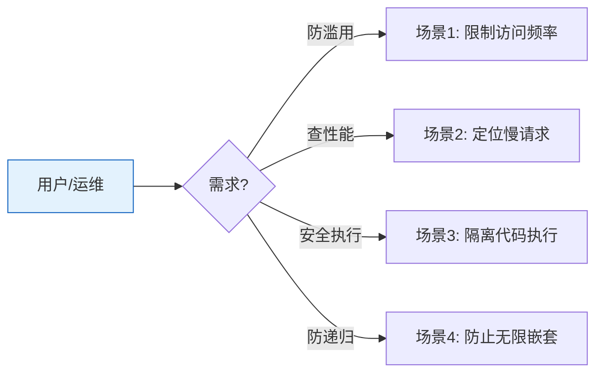

# YiAi-使用场景 — core-observer

> Observer 可靠性子系统的使用场景文档。覆盖限流、采样、沙箱、懒启动、重入守卫。
>
> **来源**：源码分析 `/rui doc --from-code core-observer`
> **证据等级**：B | **项目类型**：backend

---

## 效果示意

---

## 场景 1：限制访问频率

### 场景描述
防止单个用户或 IP 在短时间内发送过多请求，保护系统不被滥用。

### 操作步骤
1. 系统为每个客户端 IP 独立计数
2. 在时间窗口内请求数达到上限后返回"请求过于频繁"
3. 响应中提示何时可以重试
4. 信任的 IP 可加入豁免名单不受限制
5. 限流组件自身异常时拒绝请求（而非放行）

### 异常情况
- 限流组件故障 → 返回 500（宁可误拒也不放行）

---

## 场景 2：定位慢请求

### 场景描述
无需记录所有请求，只采集异常慢（如超过 5 秒）和出错的请求，以便快速定位问题。

### 操作步骤
1. 系统自动记录每个请求的开始时点
2. 请求完成后计算耗时
3. 快速且正常的请求跳过不记录
4. 慢请求和错误请求存入固定容量的记录区
5. 随时可查看最近的慢请求列表

---

## 场景 3：隔离代码执行

### 场景描述
当系统需要动态执行第三方或用户提供的代码时，限制其文件读写和网络访问范围。

### 操作步骤
1. 配置允许访问的目录和网络地址
2. 在受限上下文中执行代码
3. 代码尝试访问未授权文件时被阻止并报错
4. 上下文退出后自动恢复正常权限

---

## 场景 4：防止无限嵌套

### 场景描述
动态模块执行时可能出现模块 A 调用模块 B 再调用模块 A 的嵌套调用，通过嵌套深度限制防止死循环或栈溢出。

### 操作步骤
1. 每次进入执行上下文深度计数 +1
2. 退出时自动恢复
3. 达到最大深度时拒绝执行并报错
4. 每个异步任务独立计数互不影响

---

### 主要价值

- 🛡️ **防滥用** — IP 级别频率限制
- 🔍 **精准诊断** — 只记录有问题的请求
- 🔒 **安全隔离** — 动态代码在受控环境运行
- 🔄 **防嵌套死锁** — 上下文隔离的深度限制

---

## 回溯链

| 来源 | 路径 |
|------|------|
| 故事任务 | `YiAi-故事任务.md` §1 Story 1–5 |
| 源码 | `src/core/observer/` |

### 变更记录

| 日期 | 版本 | 变更内容 |
|------|------|---------|
| 2026-05-22 | 1.0.0 | 初始 /rui doc --from-code |
