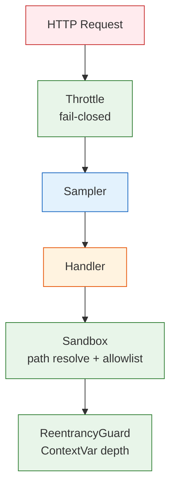

# YiAi-安全审计 — core-observer

> Observer 可靠性子系统独立安全审计。5 组件全量 STRIDE。
>
> **来源**：源码分析 | **证据等级**：B | **审计独立性**：独立 security agent

---

## 效果示意

---

## STRIDE 威胁建模

### S — Spoofing
| 威胁 | 缓解 | 评估 |
|------|------|:---:|
| IP 伪造绕过限流 | IP 来自 request.client.host（反向代理层设置） | ⚠️ 依赖代理层 |
| 白名单 IP 滥用 | 白名单由管理员配置 | ⚠️ 运维层面 |

### T — Tampering
| 威胁 | 缓解 | 评估 |
|------|------|:---:|
| 篡改沙箱白名单 | 白名单从配置加载，运行时不接受外部输入 | ✅ |
| 绕过 builtins.open monkey-patch | 通过 `io.open` / `pathlib.Path.open` 等别名 | ⚠️ 中风险 |

**T1 建议**：同时 patch `io.open` 和 `pathlib.Path.open`，或使用更底层的 `os.open` hook。

### R — Repudiation
| 威胁 | 缓解 | 评估 |
|------|------|:---:|
| 沙箱违规无审计 | SandboxMiddleware._violations 计数器存在但仅内存中 | ⚠️ 低风险 |
| 限流触发无持久化 | 仅 logger.warning，无结构化审计 | ⚠️ 低风险 |

### I — Information Disclosure
| 威胁 | 缓解 | 评估 |
|------|------|:---:|
| 限流响应泄露内部配置 | 429 响应含 max_requests/window_seconds 等参数 | ⚠️ 设计如此 |
| 采样记录含客户端 IP | 仅内存存储，不持久化 | ✅ |

### D — Denial of Service
| 威胁 | 缓解 | 评估 |
|------|------|:---:|
| 限流器内存膨胀 | _cleanup 定期清理过期 IP 条目 | ✅ |
| Ring buffer 无限增长 | deque(maxlen=1000) 固定上限 | ✅ |
| 重入深度耗尽 | max_depth 限制（默认 3） | ✅ |
| 沙箱 monkey-patch 恢复失败 | finally 块保证恢复 | ✅ |

### E — Elevation of Privilege
| 威胁 | 缓解 | 评估 |
|------|------|:---:|
| 沙箱绕过 | `is_relative_to` 仅 Python 3.9+，低版本回退不安全 | ⚠️ 低风险 |
| ContextVar 跨任务泄漏 | ContextVar 天然隔离 | ✅ |

---

## 安全评分

| 维度 | 评分 |
|------|:---:|
| DoS 防护 | 🟢 优（限流+采样上限+深度限制） |
| 沙箱隔离 | 🟡 良（builtins.open 覆盖不全） |
| 路径穿越 | 🟢 优（Path.resolve + is_relative_to） |
| 审计 | 🟡 良（内存计数器，无持久化） |

---

## 改进建议

| # | 建议 | 优先级 | 难度 |
|---|------|:---:|:---:|
| 1 | 补全 open 别名 hook（io.open / Path.open） | P1 | 低 |
| 2 | 沙箱违规事件持久化审计 | P2 | 低 |

---

## 回溯链

| 来源 | 路径 |
|------|------|
| 源码 | `src/core/observer/` |
| 技术评审 | `YiAi-技术评审.md` §7 |

### 变更记录

| 日期 | 版本 | 变更内容 |
|------|------|---------|
| 2026-05-22 | 1.0.0 | 初始 /rui doc --from-code |
