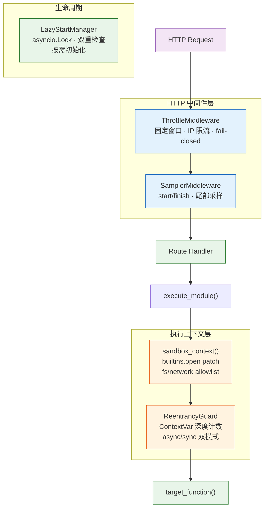

# YiAi-技术评审 — core-observer

> Observer 可靠性子系统技术评审。5 组件架构与接口设计。
>
> **来源**：源码分析 | **证据等级**：B | **项目类型**：backend → 跳过 §4/§5/§6

---

## 效果示意



---

## §1 架构设计

### 1.1 组件关系

| 组件 | 层级 | 激活方式 | 配置驱动 |
|------|------|---------|---------|
| ThrottleMiddleware | HTTP 中间件 | Starlette 中间件栈 | max_requests / window_seconds / whitelist |
| SamplerMiddleware | HTTP 中间件 | Starlette 中间件栈 | max_size(1000) / slow_threshold_ms(5000) |
| SandboxMiddleware | 执行上下文 | executor._run_function() | fs_allowlist / network_allowlist |
| ReentrancyGuard | 执行上下文 | executor._acquire_guard() | max_depth(3) |
| LazyStartManager | 生命周期 | 组件首次使用时 | — |

### 1.2 限流算法

固定窗口计数器：`window_seconds` 内每 IP 最多 `max_requests` 次。窗口过期数据惰性清理。

### 1.3 沙箱实现

monkey-patch `builtins.open` → 替换为 `_check_path` 校验版本 → 上下文退出时恢复原函数。

---

## §2 API / 方法签名

### ThrottleMiddleware

| 参数 | 默认值 | 说明 |
|------|--------|------|
| max_requests | 100 | 窗口内最大请求数 |
| window_seconds | 60 | 窗口秒数 |
| whitelist | [] | IP 白名单 |

### TailSampler

| 参数 | 默认值 | 说明 |
|------|--------|------|
| max_size | 1000 | ring buffer 容量 |
| slow_threshold_ms | 5000 | 慢请求阈值 |

### sandbox_context

```python
with sandbox_context(
    fs_allowlist=["/var/www/YiAi/"],
    network_allowlist=["api.example.com"],
) as sandbox:
    ...
```

### ReentrancyGuard

```python
guard = ReentrancyGuard(max_depth=3)

@guard.guard          # async
async def fn(): ...

@guard.guard_sync     # sync
def fn(): ...
```

### LazyStartManager

```python
mgr = LazyStartManager()
mgr.set_init(heavy_init_func)
await mgr.ensure_initialized()  # 幂等
mgr.reset()                     # 允许重新初始化
```

---

## §7 安全设计

| 组件 | 安全策略 |
|------|---------|
| Throttle | fail-closed（异常→500），白名单，固定窗口 |
| Sandbox | Path.resolve() 防路径穿越，is_relative_to 校验，builtins.open monkey-patch |
| Guard | ContextVar 上下文隔离，跨异步任务不共享深度 |

### sandbox_context 安全分析

- **路径穿越防护**：`Path.resolve()` 解析符号链接和 `..`
- **时序攻击**：`is_relative_to` 纯字符串比较，无 TOCTOU 风险（open 时实时校验）
- **网络隔离**：`network_allowlist` 需调用方主动调用 `check_network()`

---

### 主要价值

- 🛡️ **限流 fail-closed** — 异常时拒绝而非放行
- 🔒 **沙箱路径安全** — resolve + is_relative_to 双重防护
- 🔄 **ContextVar 隔离** — 重入计数异步安全

---

## 回溯链

| 来源 | 路径 |
|------|------|
| 源码 | `src/core/observer/` (5 文件) |
| 故事任务 | `YiAi-故事任务.md` §2 FP1–FP10 |

### 变更记录

| 日期 | 版本 | 变更内容 |
|------|------|---------|
| 2026-05-22 | 1.0.0 | 初始 /rui doc --from-code |
