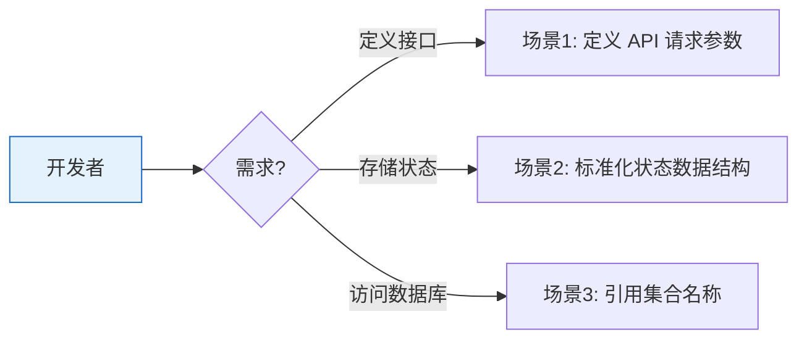

# YiAi-使用场景 — models

> 数据模型层的使用场景文档。覆盖请求校验与集合常量引用。
>
> **来源**：源码分析 `/rui doc --from-code models`
> **证据等级**：B | **项目类型**：backend

---

## 效果示意

---

## 场景 1：定义 API 请求参数

### 场景描述
新增 API 或修改现有接口时，需要定义请求体的字段、类型和约束。使用 Pydantic 模型可让 FastAPI 自动完成参数校验、类型转换和 OpenAPI 文档生成。

### 操作步骤
1. 确定 API 需要的参数及其类型、是否必填、默认值
2. 在 models/schemas.py 中定义 Pydantic BaseModel 子类
3. 为每个字段添加 Field 约束（默认值、长度限制、正则模式等）
4. 在路由函数签名中使用该模型作为参数类型
5. FastAPI 自动校验：不合法请求返回 422，合法请求传入路由

### 异常情况
- 缺少必填字段 → FastAPI 返回 422 含字段错误明细
- 字段值不符合约束（超长/超范围/格式错误）→ 同上

---

## 场景 2：标准化状态数据结构

### 场景描述
不同子系统（执行记录、会话管理、数据迁移）需要一致的数据结构来表示状态信息。通过 Pydantic 模型统一定义，确保各层使用相同的数据契约。

### 操作步骤
1. 分析业务领域需要的状态字段
2. 定义 StateRecord/SessionState/SkillExecutionRecord 等模型
3. 添加字段级约束（状态枚举、长度上限、数值范围）
4. 各服务通过 `model_validate()` 或 `model_dump()` 使用模型

### 异常情况
- 字段值不符合约束 → ValidationError，需业务层处理

---

## 场景 3：引用集合名称

### 场景描述
系统有多个 MongoDB 集合（sessions、rss、chat_records 等），各服务需要访问这些集合。通过集中管理的常量避免硬编码字符串分散各处。

### 操作步骤
1. 在 collections.py 中定义集合名常量
2. 在 __init__.py 中导出
3. 各服务通过 `from models.collections import SESSIONS` 引用
4. 新增集合时在 collections.py 添加常量并更新导出

---

### 主要价值

- ✅ **自动校验** — FastAPI 集成 Pydantic，参数校验零手工代码
- 📊 **类型安全** — 15 模型编译期字段检查，杜绝拼写错误
- 🏷️ **集中管理** — 8 集合常量单一来源，修改一处全局生效
- 🔒 **多层约束** — min_length/max_length/ge/le/pattern 层层防护

---

## 回溯链

| 来源 | 路径 |
|------|------|
| 故事任务 | `YiAi-故事任务.md` §1 Story 1–2 |
| 源码 | `src/models/` |

### 变更记录

| 日期 | 版本 | 变更内容 |
|------|------|---------|
| 2026-05-22 | 1.0.0 | 初始 /rui doc --from-code |
