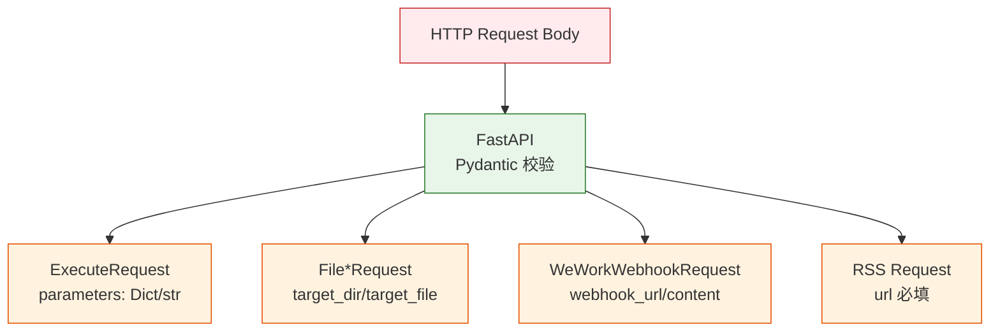

# YiAi-安全审计 — models

> 数据模型层独立安全审计。2 组件全量 STRIDE。
>
> **来源**：源码分析 | **证据等级**：B | **审计独立性**：独立 security agent

---

## 效果示意

---

## STRIDE 威胁建模

### S — Spoofing
| 威胁 | 缓解 | 评估 |
|------|------|:---:|
| 模型字段注入 | Pydantic 默认忽略未知字段 | ✅ |
| 类型混淆绕过校验 | Pydantic 严格类型转换 | ✅ |

### T — Tampering
| 威胁 | 缓解 | 评估 |
|------|------|:---:|
| parameters 注入恶意数据 | Union[Dict, str] 接受 JSON 字符串 → 下游 executor 沙箱隔离 | ⚠️ 依赖下游 |
| FileWriteRequest.content 注入路径穿越字符串 | 无 Pydantic 级路径校验 → 依赖 services 层 _validate_path | ⚠️ 依赖下游 |
| WeWorkWebhookRequest.webhook_url SSRF | 无 URL 格式约束（如禁止内网 IP） | ⚠️ 低风险 |

### R — Repudiation
| 威胁 | 缓解 | 评估 |
|------|------|:---:|
| 无审计日志 | models 层纯数据结构，不涉及 I/O | ✅ 不适用 |

### I — Information Disclosure
| 威胁 | 缓解 | 评估 |
|------|------|:---:|
| ValidationError 泄露字段详情 | 422 响应含字段名和约束条件 — FastAPI 默认行为 | ⚠️ 设计如此 |
| 模型 docstring 泄露内部路径 | 例：Example 中无内部路径 | ✅ |

### D — Denial of Service
| 威胁 | 缓解 | 评估 |
|------|------|:---:|
| 超大 JSON body 解析 | 依赖 FastAPI/uvicorn 层面限制 | ⚠️ 依赖框架 |
| 深层嵌套 dict 递归解析 | parameters: Dict 无深度限制 | ⚠️ 低风险 |
| input_summary/output_summary 未设上限 | max_length=2000 约束 | ✅ |

**D3 评估**：input_summary/output_summary 已有 max_length=2000，error_message max_length=4000。

### E — Elevation of Privilege
| 威胁 | 缓解 | 评估 |
|------|------|:---:|
| 无提权面 | models 层纯数据结构，无权限逻辑 | ✅ 不适用 |

---

## 安全评分

| 维度 | 评分 |
|------|:---:|
| 输入校验 | 🟢 优（15 模型 + Field 约束） |
| 数据完整性 | 🟢 优（Pydantic 严格类型 + 枚举约束） |
| 信息泄露 | 🟡 良（422 含字段细节） |
| DoS 防护 | 🟡 良（部分依赖下游/框架） |

---

## 改进建议

| # | 建议 | 优先级 | 难度 |
|---|------|:---:|:---:|
| 1 | FileWriteRequest.content 添加 max_length 约束 | P2 | 低 |
| 2 | parameters 字段添加深度限制或 max_length | P2 | 低 |

---

### 主要价值

- 🔒 **Pydantic 校验** — 自动类型校验 + 字段约束，非法数据在 API 层拒绝
- ✅ **未知字段忽略** — Pydantic 默认丢弃未知字段，防止注入
- 📊 **长度约束** — SkillExecutionRecord 字段均有 max_length 限制
- 🛡️ **不适用面** — models 层纯数据定义，无 I/O/认证/权限逻辑

---

## 回溯链

| 来源 | 路径 |
|------|------|
| 源码 | `src/models/` |
| 技术评审 | `YiAi-技术评审.md` §7 |

### 变更记录

| 日期 | 版本 | 变更内容 |
|------|------|---------|
| 2026-05-22 | 1.0.0 | 初始 /rui doc --from-code |
