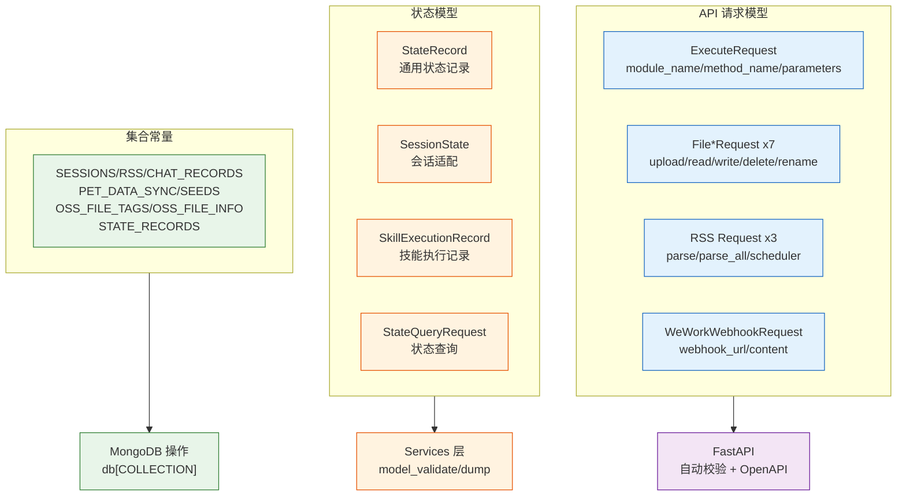
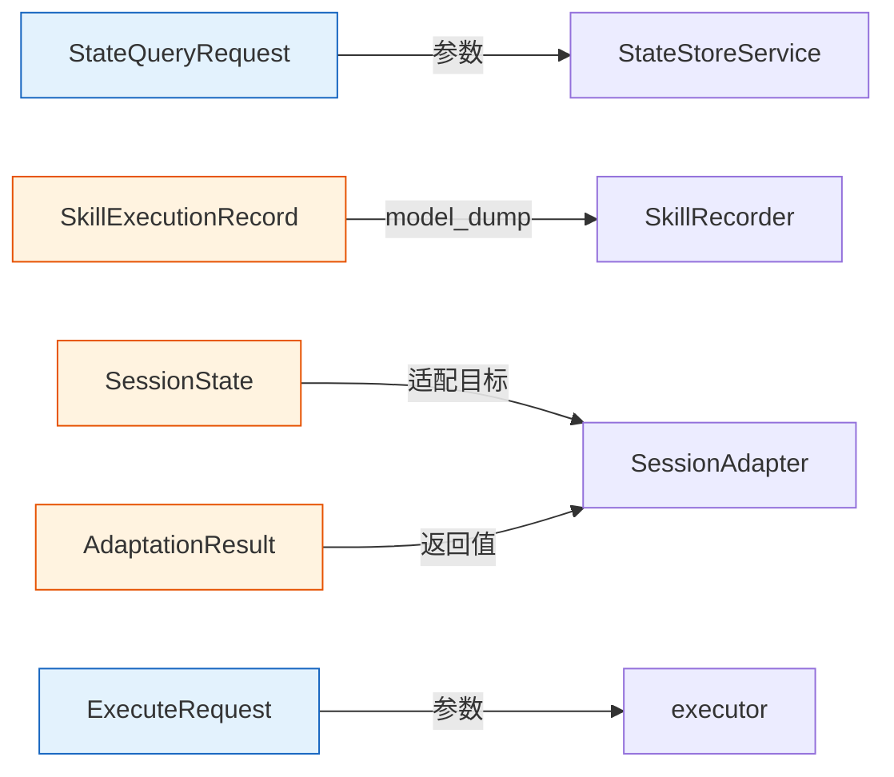

# YiAi-技术评审 — models

> 数据模型层技术评审。Pydantic schemas + 集合常量设计。
>
> **来源**：源码分析 | **证据等级**：B | **项目类型**：backend → 跳过 §4/§5/§6

---

## 效果示意



---

## §1 架构设计

### 1.1 模型分类

| 类别 | 模型数 | 用途 |
|------|:---:|------|
| 模块执行 | 1 | ExecuteRequest |
| 文件操作 | 7 | upload/read/write/delete/rename（含 folder 变体）+ OSS |
| RSS | 3 | 单源解析/批量解析/调度器配置 |
| 企业微信 | 1 | Webhook 消息发送 |
| 状态存储 | 5 | StateRecord/SessionState/SkillExecutionRecord/StateQueryRequest/AdaptationResult |

### 1.2 约束分布

| 约束类型 | 应用模型 | 示例 |
|---------|---------|------|
| min_length | SkillExecutionRecord.skill_name, StateRecord.record_type | ≥1 字符 |
| max_length | SkillExecutionRecord input/output/error | 2000/2000/4000 |
| ge/le | SkillExecutionRecord.duration_ms, StateQueryRequest.page_size | ≥0 / 1–8000 |
| pattern | SkillExecutionRecord.status | `^(success\|failed\|timeout\|cancelled)$` |
| default_factory | tags, parameters, errors | 可变默认值 |

---

## §2 API / 方法签名

### ExecuteRequest

| 字段 | 类型 | 默认值 | 约束 |
|------|------|--------|------|
| module_name | str | "" | — |
| method_name | str | "" | — |
| parameters | Dict/str | {} | 支持 dict 或 JSON 字符串 |

### FileUploadRequest

| 字段 | 类型 | 默认值 | 约束 |
|------|------|--------|------|
| filename | str | (必填) | — |
| content | str | (必填) | — |
| is_base64 | bool | False | — |
| target_dir | str | "static" | — |

### StateQueryRequest

| 字段 | 类型 | 默认值 | 约束 |
|------|------|--------|------|
| record_type | Optional[str] | None | — |
| tags | Optional[List[str]] | None | — |
| title_contains | Optional[str] | None | — |
| created_after | Optional[str] | None | ISO 8601 |
| created_before | Optional[str] | None | ISO 8601 |
| page_num | int | 1 | ge=1 |
| page_size | int | 2000 | ge=1, le=8000 |

### 集合常量

```python
SESSIONS = "sessions"
RSS = "rss"
CHAT_RECORDS = "chat_records"
PET_DATA_SYNC = "pet_data_sync"
SEEDS = "seeds"
OSS_FILE_TAGS = "oss_file_tags"
OSS_FILE_INFO = "oss_file_info"
STATE_RECORDS = "state_records"
```

---

## §3 数据设计

### 模型间引用关系



---

## §7 安全设计

| 组件 | 安全策略 |
|------|---------|
| ExecuteRequest | parameters 接受 dict/str，由 executor 层做沙箱隔离 |
| 文件操作模型 | target_dir/target_file 必填，路径校验由 services 层处理 |
| SkillExecutionRecord | status 正则约束四值枚举，duration_ms ≥ 0 |
| StateQueryRequest | page_size ≤ 8000 硬上限防止查询过载 |
| 集合常量 | 纯字符串常量，无安全面 |

---

### 主要价值

- ✅ **统一契约** — 17 Pydantic 模型定义全系统数据边界
- 🔒 **输入约束** — 正则/长度/范围多层校验，非法数据在 API 层即被拒绝
- 📊 **类型安全** — 编译期字段检查 + 运行时自动转换
- 🏷️ **消除魔法字符串** — 8 集合名集中定义，一处修改全局生效

---

## 回溯链

| 来源 | 路径 |
|------|------|
| 源码 | `src/models/schemas.py` (192 行) |
| 源码 | `src/models/collections.py` (10 行) |
| 故事任务 | `YiAi-故事任务.md` |

### 变更记录

| 日期 | 版本 | 变更内容 |
|------|------|---------|
| 2026-05-22 | 1.0.0 | 初始 /rui doc --from-code |
