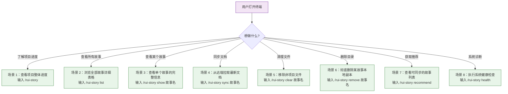
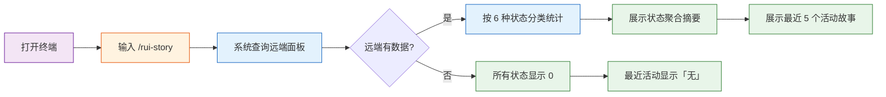
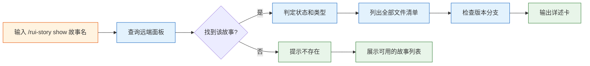
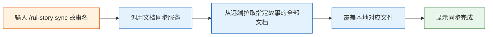
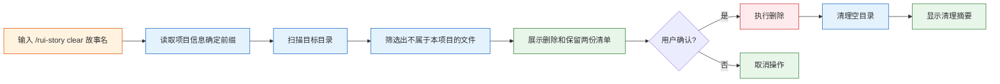
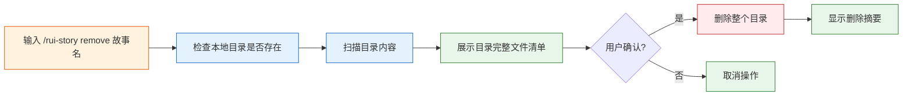

# YiAi-使用场景

> 故事任务面板管理 — 用户空间基线
>
> 溯源：故事任务 YiAi-故事任务.md · 来源 `skills/rui-story/SKILL.md` · 基线类型 用户空间
>
> **语言边界**：禁止技术术语（代码路径/API 路由/组件名/技术栈名）· 禁止 API 端点 · 禁止文件路径

## 效果示意

## 场景覆盖矩阵

| 场景 | 对应 FP# | 正常路径 | 空状态 | 错误恢复 | 关联 AC# |
|------|---------|---------|--------|---------|---------|
| SC1: 状态概览 | FP1–FP5 | ✓ | ✓ (无数据) | ✓ (API 不可达) | AC1 |
| SC2: 进度全景 | FP1–FP4, FP6 | ✓ | ✓ (无数据) | ✓ (API 不可达) | AC2 |
| SC3: 单故事详情 | FP1–FP4, FP7 | ✓ | — | ✓ (故事不存在) | AC3, AC4 |
| SC4: 文档同步 | FP8 | ✓ | ✓ (未指定名称) | ✓ (import-docs 不可用) | AC5 |
| SC5: 清理非项目文件 | FP9 | ✓ | — | ✓ (用户拒绝确认) | AC6, AC7 |
| SC6: 删除故事目录 | FP10 | ✓ | — | ✓ (目录不存在) | AC8 |
| SC7: 同步推荐 | FP11 | ✓ | ✓ (无数据) | ✓ (API 不可达) | AC9 |
| SC8: 健康检查 | FP12 | ✓ | ✓ (无 Token) | ✓ (部分检查失败) | AC10 |

---

## SC1: 查看项目整体进度

### 正常路径

| 步骤 | 用户动作 | 系统行为 | 屏幕显示 |
|------|---------|---------|---------|
| 1 | 输入 `/rui-story` | 连接远端面板服务 | `[rui-story] overview mode — 查询远端 API...` |
| 2 | 等待 | 获取所有故事面板数据，按故事名分组 | — |
| 3 | 等待 | 逐故事判定状态（6 种之一） | — |
| 4 | 等待 | 按状态聚合计数，提取最近活动 | — |
| 5 | 阅读输出 | — | 状态概览表 + 最近更新列表 |

### 空状态

> 远端无任何故事任务面板数据时，所有 6 状态显示 0，合计 0 个故事，最近活动显示「无」。

### 错误恢复：远端服务不可达

> 系统显示「远端不可达」信息后优雅退出，不崩溃。用户可稍后重试。

---

## SC2: 浏览全部故事详细表格

### 正常路径

| 步骤 | 用户动作 | 系统行为 | 屏幕显示 |
|------|---------|---------|---------|
| 1 | 输入 `/rui-story list` | 查询远端面板数据 | 进度提示 |
| 2 | 等待 | 并行推断所有故事的项目类型 | — |
| 3 | 等待 | 检查每个故事是否有对应的版本分支 | — |
| 4 | 阅读输出 | — | 表头 + 所有故事行 + 6 列完整信息 |

### 空状态

> 远端无数据时显示「远端无故事任务面板数据」。

### 错误恢复：类型推断失败

> 某故事的类型推断失败时，显示类型为「元」，不阻断其他故事的展示。

---

## SC3: 查看单个故事的完整信息

### 正常路径

### 错误恢复：故事不存在

> 显示红色提示「故事 "xxx" 不存在于远端」并列出远端已知的所有故事名称，供用户选择。

---

## SC4: 从远端同步文档到本地

### 正常路径

### 未指定故事名

> 输入 `/rui-story sync` 时，系统查询远端面板数据，展示可同步的故事列表，用户再选择具体故事。

### 错误恢复：同步服务不可用

> 报错但不崩溃，提示用户检查同步服务的配置。

---

## SC5: 移除非项目文件

### 正常路径

| 步骤 | 用户动作 | 系统行为 | 屏幕显示 |
|------|---------|---------|---------|
| 1 | 输入 `/rui-story clear 故事名` | 读取项目名前缀（如 `YiAi-`） | — |
| 2 | 等待 | 扫描目录，筛选文件 | — |
| 3 | 阅读清单 | — | 待删除文件清单 + 保留文件清单 |
| 4 | 输入确认（是/否） | 等待用户确认 | `⚠️ 即将删除 N 个文件，确认？` |
| 5 | 输入「是」 | 执行删除，清理空目录 | `✅ 已删除 N 个文件` |

### 错误恢复：用户拒绝确认

> 用户输入「否」时，不执行任何删除操作，直接取消。

---

## SC6: 彻底删除某故事的本地副本

### 正常路径

| 步骤 | 用户动作 | 系统行为 | 屏幕显示 |
|------|---------|---------|---------|
| 1 | 输入 `/rui-story remove 故事名` | 验证故事名已提供，检查本地目录存在 | 扫描信息 |
| 2 | 阅读清单 | — | 目录路径 + 全部文件清单 + 大小 |
| 3 | 输入确认 | 等待 | `⚠️ 即将删除整个目录及 N 个文件` |
| 4 | 输入「是」 | 删除整个目录 | `✅ 已删除，释放 X KB` |

### 错误恢复：故事名未指定

> 提示用法后终止。remove 命令必须指定故事名。

### 错误恢复：目录不存在

> 提示「目录不存在」后终止，不执行任何操作。

---

## SC7: 查看可同步的故事列表

### 正常路径

### 空状态

> 远端无故事面板数据时显示「远端无故事任务面板数据」。

### 错误恢复：远端不可达

> 优雅退出，不崩溃。

---

## SC8: 系统健康检查

### 正常路径

### 空状态（无凭据）

> 凭据缺失时，仅检查本地项目配置，远端检查跳过，显示警告。

### 错误恢复：部分检查失败

> 任何单一检查失败不影响其他检查，最终汇总 pass/warn/error 统计。

---

## 主要价值

- 🧭 **一图知全景** — 状态概览：6 状态分类统计 + 最近活动，一句话看到项目全貌
- 📋 **一表查所有** — 进度全景表格：故事名/状态/文件数/最后修改/类型/分支，6 列完整信息
- 🔍 **一键看详情** — 单故事详述卡：文件清单 + 状态标记 + 元数据 + 分支状态
- 🔄 **一键拉取** — sync 从远端同步文档到本地，无需手动逐个下载
- 🧹 **一键清理** — clear 移除非项目前缀文件，保持目录整洁，不误伤远端数据
- 🩺 **一键诊断** — health 检查凭据/API/配置/数据四维健康，问题一目了然

---

## 变更记录

| 日期 | 版本 | 变更内容 | 来源 |
|------|------|---------|------|
| 2026-05-20 | 1.0 | 初始使用场景基线 — 基于 rui-story SKILL.md 反推生成 | YiAi-故事任务.md |
