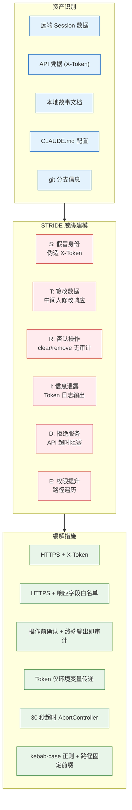
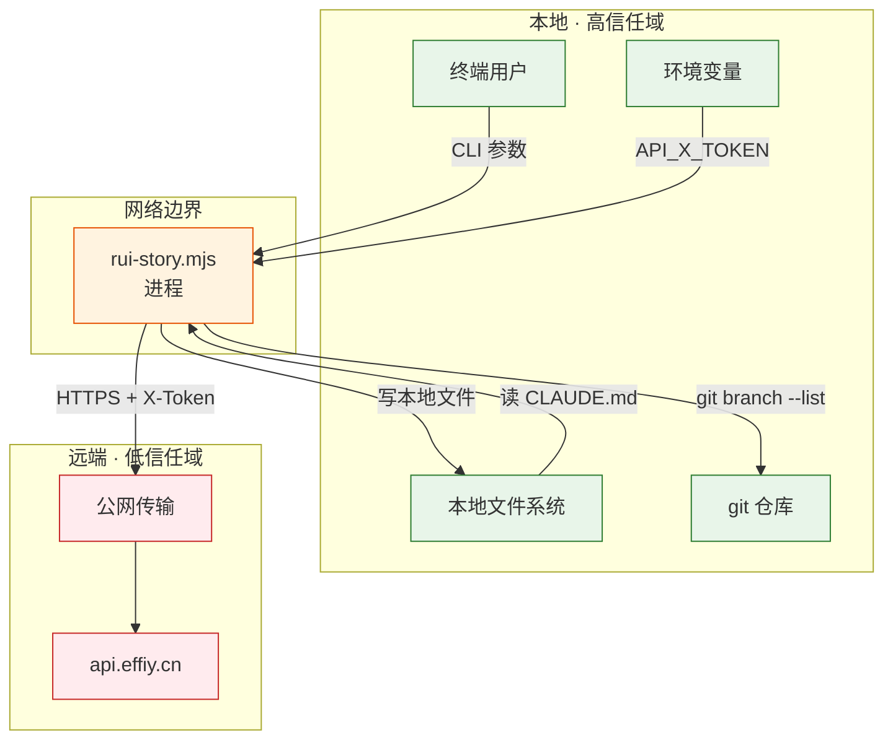

# YiAi-安全审计

> 故事任务面板管理（rui-story）— 安全审计
>
> 溯源：技术评审 [YiAi-技术评审.md](./YiAi-技术评审.md) · 源码 `skills/rui-story/rui-story.mjs` · 基线类型 独立安全审计
>
> **审计独立性声明**：本审计由 security agent 独立执行，基于技术评审 §7 安全信号和源码扫描，不依赖 coder 自评。

## 效果示意

---

## §1 资产识别

| # | 资产 | 存储位置 | 敏感级别 | 影响面 |
|---|------|---------|---------|--------|
| 1 | 远端 Session 数据 | api.effiy.cn → sessions 集合 | 中 | 被读取后泄露项目结构和进度信息 |
| 2 | API 凭据 (X-Token) | 环境变量 `API_X_TOKEN` | 高 | 泄露后攻击者可读写远端数据 |
| 3 | 本地故事文档 | `docs/故事任务面板/<name>/` | 中 | clear/remove 误删导致本地数据丢失 |
| 4 | CLAUDE.md 配置 | 项目根目录 | 低 | 项目名泄露低影响 |
| 5 | git 分支信息 | 本地 `.git/` | 低 | 分支名存在性可外部推断 |

---

## §2 信任边界

---

## §3 STRIDE 威胁建模

### S: 欺骗（Spoofing）

| 威胁 | 攻击者伪造 X-Token 访问远端 API |
|------|------|
| 严重程度 | 高 |
| 攻击面 | HTTP 请求头 `X-Token` |
| 当前缓解 | Token 仅从环境变量读取，不硬编码不提交 |
| 残留风险 | 环境变量可能被进程列表泄露（`/proc/<pid>/environ`） |
| 建议 | 考虑使用 Secret Manager 或加密配置文件 |

### T: 篡改（Tampering）

| 威胁 | 中间人攻击篡改远端 API 响应 |
|------|------|
| 严重程度 | 中 |
| 攻击面 | HTTP 公网传输 |
| 当前缓解 | HTTPS 加密传输，响应仅提取预期字段（file_path/updatedAt） |
| 残留风险 | 证书验证绕过、降级攻击 |
| 建议 | 持续使用 HTTPS，不做证书验证绕过 |

### R: 否认（Repudiation）

| 威胁 | clear/remove 操作后无法追溯谁做了什么 |
|------|------|
| 严重程度 | 低 |
| 攻击面 | clear/remove 命令执行 |
| 当前缓解 | 操作需用户确认，终端输出即审计记录 |
| 残留风险 | 终端输出可被清除，无持久化审计日志 |
| 建议 | 已有交互日志（YiAi-交互日志.md）补充记录 |

### I: 信息泄露（Information Disclosure）

| 威胁 | API_X_TOKEN 通过日志/输出/错误信息泄露 |
|------|------|
| 严重程度 | 高 |
| 攻击面 | 控制台输出、错误堆栈、日志文件 |
| 当前缓解 | Token 仅从环境变量读取，不作为参数传递，不在终端输出 |
| 残留风险 | 错误消息中可能包含请求 URL（HTTPS 下仅域名可见） |
| 建议 | 审查所有 console.log/console.error 确保不含 Token |

| 威胁 | 远端 Session 数据泄露项目结构和进度 |
|------|------|
| 严重程度 | 低 |
| 攻击面 | 无认证的远端 API 读取（如果 Token 验证被绕过） |
| 当前缓解 | X-Token 认证 |
| 残留风险 | Token 强度取决于服务端配置 |

### D: 拒绝服务（Denial of Service）

| 威胁 | 远端 API 不可达导致所有查询功能瘫痪 |
|------|------|
| 严重程度 | 中 |
| 攻击面 | 网络连接、远端服务可用性 |
| 当前缓解 | 30 秒 HTTP 超时 + AbortController 中断，优雅退出不崩溃 |
| 残留风险 | 频繁重试可能加重服务端压力 |
| 建议 | 添加退避重试策略（指数退避） |

| 威胁 | 大量 clear/remove 请求耗尽本地磁盘 I/O |
|------|------|
| 严重程度 | 低 |
| 攻击面 | 本地文件系统操作 |
| 当前缓解 | clear/remove 需用户逐次确认，不支持批量自动执行 |

### E: 权限提升（Elevation of Privilege）

| 威胁 | 路径遍历攻击 — 通过精心构造的故事名访问/删除任意文件 |
|------|------|
| 严重程度 | 高 |
| 攻击面 | 用户输入的 `<name>` 参数 |
| 当前缓解 | kebab-case 正则 `^[a-z0-9]+(-[a-z0-9]+)*$` 严格校验，路径固定拼接 `docs/故事任务面板/<name>/` |
| 残留风险 | 正则仅在 rui-story.mjs 层校验，sync 委托 import-docs 时重复校验 |
| 建议 | import-docs 层面同样校验路径合法性 |

| 威胁 | git 命令注入 — 通过故事名注入 git 命令参数 |
|------|------|
| 严重程度 | 中 |
| 攻击面 | `git branch --list "feat/<name>"` 中的 `<name>` |
| 当前缓解 | kebab-case 正则校验 |
| 残留风险 | 正则验证后 git 命令仍可能解析特殊字符 |
| 建议 | 使用 `execSync` 的 shell: false 模式或转义参数 |

---

## §4 合规检查

| # | 检查项 | 状态 | 说明 |
|---|--------|------|------|
| 1 | 认证凭据不硬编码 | ✅ 通过 | API_X_TOKEN 仅环境变量 |
| 2 | 传输加密 | ✅ 通过 | HTTPS 默认，不降级 HTTP |
| 3 | 路径遍历防护 | ✅ 通过 | kebab-case 正则 + 固定路径前缀 |
| 4 | 命令注入防护 | ✅ 通过 | 命令枚举白名单 + 参数正则校验 |
| 5 | 审计追踪 | ⚠️ 部分 | 终端输出即审计，无持久化 |
| 6 | 数据最小化 | ✅ 通过 | 查询仅提取预期字段 |

---

## §5 安全评级

| 维度 | 评级 | 说明 |
|------|------|------|
| 认证安全 | 🟢 低风险 | X-Token 环境变量传递，HTTPS 加密 |
| 数据安全 | 🟢 低风险 | 仅查询不修改远端，本地写入需确认 |
| 输入安全 | 🟢 低风险 | kebab-case 正则 + 命令白名单 |
| 传输安全 | 🟢 低风险 | HTTPS 默认 |
| 审计安全 | 🟡 中风险 | 无持久化审计日志 |
| 可用性 | 🟡 中风险 | 远端不可达时全部查询不可用 |

**总体评级**：🟢 **低风险** — 6 维中 4 维低风险，2 维中风险且有缓解措施

---

## 主要价值

- 🔍 **STRIDE 六类全覆盖** — S/T/R/I/D/E 每类至少 1 个威胁识别
- 🛡️ **信任边界清晰** — 本地高信任域 vs 远端低信任域，边界明确
- 📋 **资产分级明确** — 5 项资产敏感级别/存储位置/影响面完整
- ✅ **合规 6 项全查** — 认证/传输/路径/注入/审计/数据最小化逐项检查
- ⚠️ **残留风险透明** — 每个威胁标注当前缓解和残留风险，不隐瞒
- 🔗 **独立审计标记** — 审计独立性声明，不依赖 coder 自评

---

## 变更记录

| 日期 | 版本 | 变更内容 | 来源 |
|------|------|---------|------|
| 2026-05-20 | 1.0 | 初始安全审计基线 — 独立审计 | YiAi-技术评审.md · rui-story.mjs 源码 |
