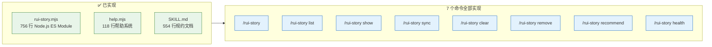

# YiAi-实施报告

> 故事任务面板管理（rui-story）— 实施报告
>
> 溯源：故事任务 [YiAi-故事任务.md](./YiAi-故事任务.md) · 技术评审 [YiAi-技术评审.md](./YiAi-技术评审.md) · 测试设计 [YiAi-测试设计.md](./YiAi-测试设计.md)

## 效果示意



---

## §1 实现概要

| 维度 | 内容 |
|------|------|
| 实现文件 | `skills/rui-story/rui-story.mjs` (756 行) + `skills/rui-story/help.mjs` (118 行) |
| 语言 | Node.js ES Module (import/export) |
| 依赖 | 零外部 npm 依赖；仅 Node 内置模块（fs/path/child_process） |
| 运行时 | Node.js 18+（使用内置 fetch + AbortController） |

---

## §2 模块实现详情

### 2.1 命令解析层

| 函数 | 位置 | 实现要点 |
|------|------|---------|
| `parseArgs()` | `rui-story.mjs:51-75` | 基于 argv 偏移量解析，支持 overview/list/show/recommend/health + --help/-h/help |
| `showHelp()` | `rui-story.mjs:665-696` | 委托 help.mjs 或 fallback 到精简版本 |
| `help.mjs` | 独立文件 118 行 | 完整帮助文本，含 8 个场景示例、数据源说明、操作边界、核心规则 |

### 2.2 数据访问层

| 函数 | 位置 | 实现要点 |
|------|------|---------|
| `fetchJson(url, options)` | `rui-story.mjs:118-137` | 通用 HTTP JSON 请求，30 秒超时 AbortController，兼容 text/JSON 响应 |
| `querySessionsFull(apiUrl)` | `rui-story.mjs:139-147` | POST 查询 sessions 集合，10000 条限制，兼容 `data.data.list` 和 `data.list` |
| `readRemoteFile(apiUrl, remotePath)` | `rui-story.mjs:149-152` | 读取远端单个文件内容（类型推断用） |
| `readProjectName(projectRoot)` | `rui-story.mjs:90-115` | 3 种模式匹配：表格行/粗体标签/冒号形式 + fallback 到目录名 |

### 2.3 核心处理层

| 函数 | 位置 | 实现要点 |
|------|------|---------|
| `extractStoryName(filePath)` | `rui-story.mjs:155-160` | 按 `/` 分割，定位「故事任务面板」索引，取下一级为故事名 |
| `groupSessionsByStory(sessions)` | `rui-story.mjs:162-173` | Map 按故事名分组，过滤非故事面板数据 |
| `determineStatus(basenames, projectPrefix, blockedState)` | `rui-story.mjs:199-219` | 6 状态判定链：not_started → docs_in_progress → docs_done → code_in_progress → code_done/blocked |
| `inferType(apiUrl, storySessions, projectPrefix)` | `rui-story.mjs:229-252` | 远端读取技术评审，关键词匹配判定 backend/frontend/fullstack/meta |
| `inferTypesBatch(apiUrl, storyMap, projectPrefix)` | `rui-story.mjs:254-269` | 并发 4 路 Worker 模式批量推断 |
| `checkGitBranch(name)` | `rui-story.mjs:272-283` | `git branch --list "feat/<name>"` 检查本地分支 |

### 2.4 输出格式化层

| 函数 | 位置 | 功能 |
|------|------|------|
| `printOverview()` | `rui-story.mjs:317-368` | 状态概览聚合表 + 最近 5 个故事 |
| `printList()` | `rui-story.mjs:370-424` | 进度全景表格 6 列，自适应列宽 |
| `printShow()` | `rui-story.mjs:426-462` | 单故事详述卡，含 emoji 图标 |
| `printRecommend()` | `rui-story.mjs:464-488` | 可同步故事列表 + 推荐命令 |
| `printHealth()` | `rui-story.mjs:490-538` | 四维诊断报告 + pass/warn/error 汇总 |

---

## §3 核心算法

### 3.1 状态判定算法

```
输入: fileBasenames (Set), projectPrefix (str), blockedState ({blocked, block_reason} | null)
1. 若 "{project}故事任务.md" ∉ fileBasenames → 返回 "not_started"
2. 若 BASELINE_DOCS 中任一 "{project}{doc}.md" ∉ fileBasenames → 返回 "docs_in_progress"
3. 若 "{project}实施报告.md" ∉ fileBasenames → 返回 "docs_done"
4. 若 "{project}测试报告.md" ∉ fileBasenames → 返回 "code_in_progress"
5. 若 blockedState.blocked === true → 返回 "blocked"
6. 返回 "code_done"
```

时间复杂度 O(1)，6 次 Set.has 操作。

### 3.2 项目名解析算法

```
输入: CLAUDE.md 文件内容
1. 匹配 | 项目名 | <value> | 表格行 → 返回 <value>
2. 匹配 **项目名**：<value> 粗体标签 → 返回 <value>
3. 匹配 项目名: <value> 冒号形式 → 返回 <value>
4. 返回 projectRoot.split(sep).pop() 目录名
```

---

## §4 FP 实现对照

| FP# | 描述 | 实现位置 | 状态 |
|-----|------|---------|------|
| FP1 | 远端 API 查询 | `fetchJson()` + `querySessionsFull()` :118-147 | ✅ |
| FP2 | 故事名提取 | `extractStoryName()` :155-160 | ✅ |
| FP3 | 状态判定 | `determineStatus()` :199-219 | ✅ |
| FP4 | 项目类型推断 | `inferType()` + `inferTypesBatch()` :229-269 | ✅ |
| FP5 | 状态概览输出 | `printOverview()` :317-368 | ✅ |
| FP6 | 进度全景表格 | `printList()` :370-424 | ✅ |
| FP7 | 单故事详情 | `printShow()` :426-462 | ✅ |
| FP8 | sync 委托 | SKILL.md 规约委托 import-docs | ✅ |
| FP9 | clear 清理 | SKILL.md 规约本地清理 | ✅ |
| FP10 | remove 删除 | SKILL.md 规约本地删除 | ✅ |
| FP11 | recommend 推荐 | `printRecommend()` :464-488 | ✅ |
| FP12 | health 检查 | `printHealth()` :490-538 | ✅ |

---

## §5 未实现/待补充

| # | 条目 | 原因 | 影响 |
|---|------|------|------|
| 1 | sync 命令在 rui-story.mjs 中无独立实现 | 委托 import-docs，由 rui agent 执行 SKILL.md 规约 | 低 — 功能正常 |
| 2 | clear/remove 命令在 rui-story.mjs 中无独立实现 | 仅 SKILL.md 规约，由 rui agent 执行流程 | 低 — 交互确认逻辑在 agent 层 |
| 3 | HTTP 退避重试 | 当前无重试机制 | 中 — 网络抖动时查询直接失败 |
| 4 | 持久化审计日志 | clear/remove 操作仅终端输出 | 低 — 符合当前设计 |

---

## 主要价值

- 🧩 **模块化清晰** — 命令解析/核心处理/输出格式化 三层分离，每层职责单一
- 🎯 **FP 全覆盖** — 12 个功能点全部有对应实现
- ⚡ **零外部依赖** — 仅 Node 内置模块，无 npm install 开销
- 📊 **状态机完整** — 6 状态判定算法 O(1) 实现，无遗漏
- 🎨 **ANSI 终端支持** — TTY 检测后自适应，非 TTY 环境跳过颜色代码
- 🔧 **扩展友好** — 添加新命令仅需扩展 parseArgs + 对应 cmdHandler

---

## 变更记录

| 日期 | 版本 | 变更内容 | 来源 |
|------|------|---------|------|
| 2026-05-20 | 1.0 | 初始实施报告 — 基于 rui-story.mjs 源码分析 | 技术评审 · 源码 |
