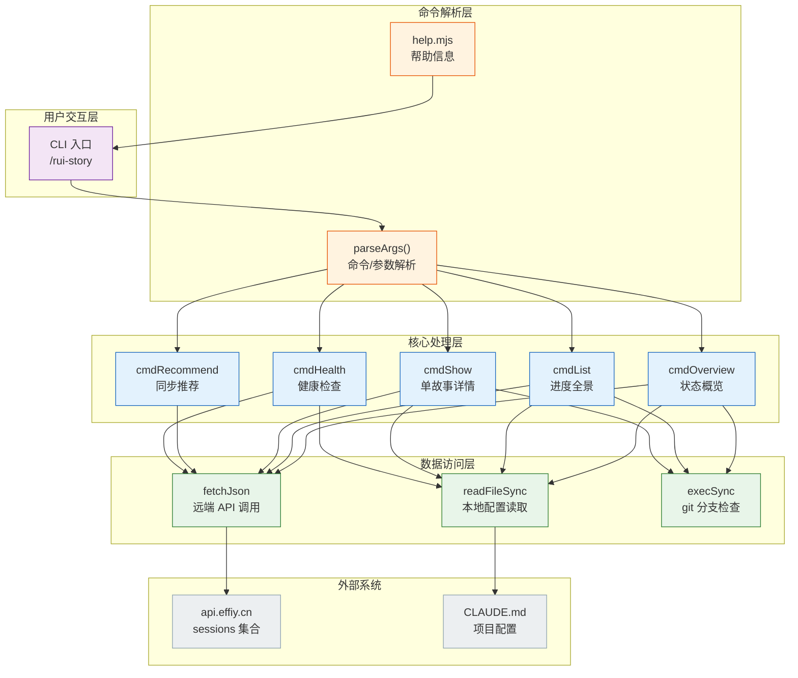
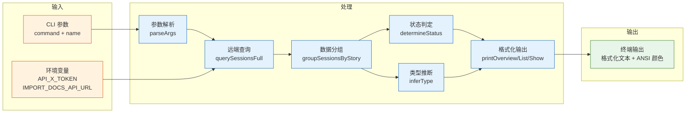
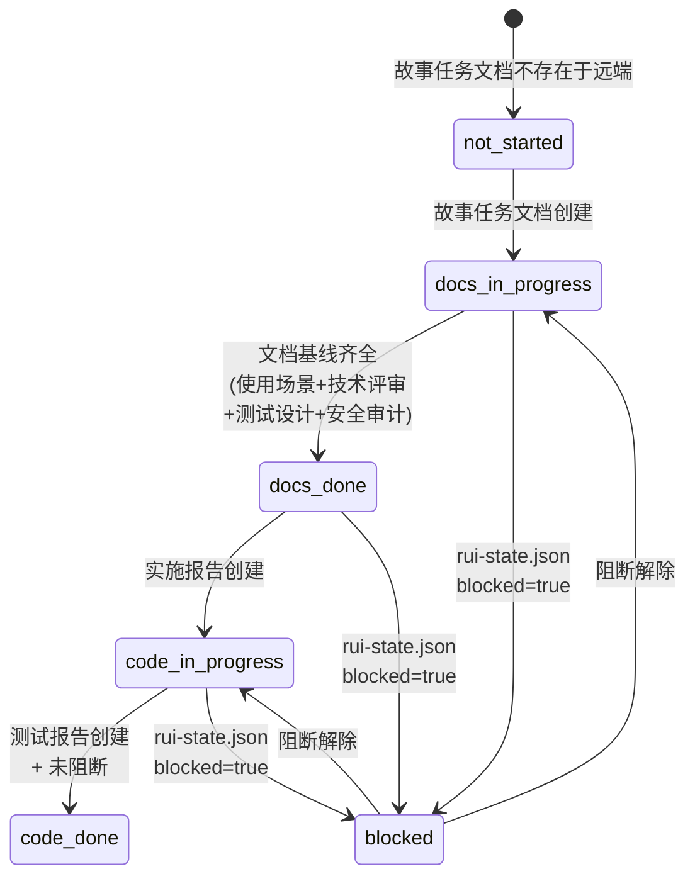
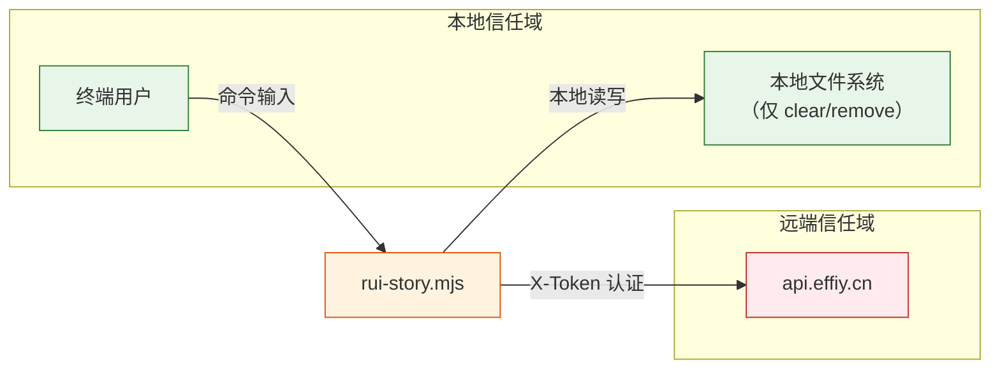

# YiAi-技术评审

> 故事任务面板管理（rui-story）— 技术设计
>
> 溯源：故事任务 [YiAi-故事任务.md](./YiAi-故事任务.md) · 使用场景 [YiAi-使用场景.md](./YiAi-使用场景.md) · 源码 `skills/rui-story/rui-story.mjs` · 基线类型 解决方案空间

## 效果示意



## §0 基线溯源

| 基线项 | 来源 | 证据等级 |
|--------|------|---------|
| 8 个 Story 定义 | YiAi-故事任务.md §1 | B |
| 8 个使用场景 | YiAi-使用场景.md 场景覆盖矩阵 | B |
| 12 个功能点 | YiAi-故事任务.md §2 FP1–FP12 | B |
| 8 条业务规则 | YiAi-故事任务.md §2 R1–R8 | B |
| 12 个 AC | YiAi-故事任务.md §5 AC1–AC12 | B |
| rui-story.mjs 脚本实现 | `skills/rui-story/rui-story.mjs` | A |
| help.mjs 帮助脚本 | `skills/rui-story/help.mjs` | A |
| SKILL.md 规约 | `skills/rui-story/SKILL.md` | A |

---

## §1 架构设计

### 1.1 整体架构

rui-story 采用三层架构：命令解析层 → 核心处理层 → 数据访问层。所有只读命令（overview/list/show/recommend/health）共享同一数据访问层。写入命令（sync/clear/remove）委托给 import-docs 和本地文件系统，不在核心处理层自行实现。

| 层级 | 职责 | 实现文件 | 关键函数 |
|------|------|---------|---------|
| 命令解析 | 参数解析、命令路由、帮助分发 | `rui-story.mjs:51-75` | `parseArgs()` |
| 核心处理 | 状态判定、类型推断、输出格式化 | `rui-story.mjs:542-662` | `cmdOverview()`, `cmdList()`, `cmdShow()`, `cmdRecommend()`, `cmdHealth()` |
| 数据访问 | 远端 API 调用、本地文件读取、git 分支检查 | `rui-story.mjs:118-147` | `fetchJson()`, `querySessionsFull()`, `readRemoteFile()`, `readProjectName()`, `checkGitBranch()` |
| 帮助系统 | 使用方法和场景示例展示 | `help.mjs:1-118` | 完整帮助文本 |

### 1.2 数据流



---

## §2 API 设计

### 2.1 远端 API 调用

```javascript
// POST <apiUrl>/ 
// body 格式：
{
  "module_name": "services.database.data_service",
  "method_name": "query_documents",
  "parameters": { "cname": "sessions", "limit": 10000 }
}
```

| 属性 | 值 | 说明 |
|------|-----|------|
| 端点 | `POST <apiUrl>/` | 由 IMPORT_DOCS_API_URL 环境变量配置，默认 `https://api.effiy.cn` |
| 认证 | `X-Token` 请求头 | 由 API_X_TOKEN 环境变量提供 |
| 超时 | 30 秒 | HTTP_TIMEOUT 常量，30 秒后 AbortController 中断 |
| 响应格式 | `data.data.list` 或 `data.list` | 兼容两种嵌套路径 |
| 模块 | `services.database.data_service` | 数据服务模块 |
| 方法 | `query_documents` | 文档查询方法 |
| 集合 | `sessions` | 目标集合名 |
| 限制 | 10000 | 一次查询最大文档数 |

### 2.2 远端文件读取 API

```javascript
// POST <apiUrl>/read-file
// body 格式：
{ "target_file": "故事任务面板/<name>/YiAi-技术评审.md" }
```

用于类型推断时读取远端技术评审文档内容。

### 2.3 内部数据契约

| 函数 | 输入 | 输出 | 备注 |
|------|------|------|------|
| `querySessionsFull(apiUrl)` | 远端 API URL | sessions 数组 | 所有 sessions |
| `extractStoryName(filePath)` | 文件路径字符串 | 故事名或 null | 按 `/` 分割查找面板目录 |
| `groupSessionsByStory(sessions)` | sessions 数组 | `Map<故事名, sessions[]>` | 按故事名分组 |
| `determineStatus(basenames, projectPrefix, blockedState)` | 文件名集合 + 前缀 + blocked | 6 种状态之一 | 按优先级判定 |
| `inferType(apiUrl, storySessions, projectPrefix)` | API URL + 故事 sessions + 前缀 | backend/frontend/fullstack/meta | 异步远端读取 |
| `inferTypesBatch(apiUrl, storyMap, projectPrefix)` | 同上 + 全部故事 Map | `Map<故事名, 类型>` | 并发 4 路 |
| `readProjectName(projectRoot)` | 项目根目录 | 项目名或目录名 | 3 种模式匹配 + fallback |
| `checkGitBranch(name)` | 故事名 | 分支名或 null | `git branch --list` |

---

## §3 数据模型

### 3.1 远端 Session 记录

```typescript
interface RemoteSession {
  file_path: string;    // "故事任务面板/<name>/YiAi-故事任务.md"
  title?: string;
  tags?: string[];
  createdAt?: number;
  updatedAt?: number;
  updated_at?: number;
}
```

### 3.2 状态机



| 状态 | 判定条件 | 含义 |
|------|---------|------|
| `not_started` | `{project}-故事任务.md` 不存在于远端 | 目录空或仅有元数据 |
| `docs_in_progress` | 故事任务存在于远端，文档基线不完整 | 文档生成进行中 |
| `docs_done` | 远端文档基线齐全，实施报告不存在 | 等待编码 |
| `code_in_progress` | 实施报告存在于远端，测试报告不存在 | 实现验证中 |
| `code_done` | 测试报告存在于远端，未阻断 | 可交付 |
| `blocked` | `.memory/rui-state.json` 含 `blocked=true` | 管线阻断 |

### 3.3 基线文档清单

```javascript
const BASELINE_DOCS = ["使用场景", "技术评审", "测试设计", "安全审计"];
```

状态判定通过检查这 4 个文档 + 故事任务 + 实施报告 + 测试报告的 `{project}-` 前缀文件是否存在。

### 3.4 项目类型推断

| 内容特征 | 判定 |
|---------|------|
| 含 API/数据/后端/服务端/接口/数据库/server/backend/服务/路由 关键词 | 含后端 |
| 含 组件/交互/样式/前端/页面/ui/frontend/界面/布局/渲染/响应式 关键词 | 含前端 |
| 两者均有 | fullstack |
| 两者均无 | meta |

---

## §7 安全考量

### 7.1 信任边界



| 边界 | 风险 | 缓解措施 |
|------|------|---------|
| 用户输入 → 命令参数 | 命令注入 | parseArgs 严格匹配命令枚举，未知命令直接拒绝 |
| 用户输入 → git 命令 | git 命令注入 | 故事名先校验 kebab-case 正则，再拼入 `git branch --list "feat/<name>"` |
| 远端 API → 本地 | 恶意响应数据 | 仅提取预期字段（file_path/updatedAt），不执行返回内容 |
| 本地 → 文件系统 | 路径遍历（clear/remove） | 故事名限制 kebab-case，路径固定在 `docs/故事任务面板/<name>/` 下 |
| 环境变量 | Token 泄漏 | API_X_TOKEN 仅用于 HTTP 请求头，不打印不存储 |
| 远端文件读取 | SSRF | API URL 仅从环境变量读取，不接收用户提供的 URL |

### 7.2 路径安全

clear/remove 操作限定在 `docs/故事任务面板/` 下：
- 故事名通过 kebab-case 正则校验 `^[a-z0-9]+(-[a-z0-9]+)*$`
- 目标路径硬拼接 `docs/故事任务面板/<name>/`，不允许 `..` 或绝对路径
- clear 仅按项目前缀筛选文件名，不执行文件内容，不追踪符号链接

---

## §8 性能考量

| 指标 | 设计 | 优化措施 |
|------|------|---------|
| 远端查询 | 单次 POST 拉取 10000 条 sessions | 一次查询完成，无需分页 |
| 类型推断并发 | 默认并发 4 路 | `CONCURRENCY` 常量，可调整 |
| list 命令延迟 | 类型推断为最慢步骤 | 4 路并发读取远端文件 |
| 输出格式化 | 纯文本，ANSI 颜色 | 无渲染开销 |
| HTTP 超时 | 30 秒总超时 | AbortController + setTimeout |

---

## 主要价值

- 🏗️ **三层架构清晰** — 命令解析/核心处理/数据访问 三层分离，职责单一
- 🔌 **远端优先设计** — 所有查询走远端 API，本地仅做 blocked 检查，数据源统一
- 🔄 **批量并发优化** — 类型推断 4 路并发，list 命令在 O(stories/4) 时间内完成
- 🛡️ **安全边界明确** — 信任域分明，路径严格校验，Token 不落地
- 📊 **状态机完整** — 6 状态判定逻辑清晰，覆盖从 not_started 到 code_done 全生命周期
- 🧩 **解耦设计** — sync 委托 import-docs，clear/remove 独立实现，不耦合核心管线

---

## 变更记录

| 日期 | 版本 | 变更内容 | 来源 |
|------|------|---------|------|
| 2026-05-20 | 1.0 | 初始技术评审基线 — 基于 rui-story.mjs 和 SKILL.md 反推 | YiAi-故事任务.md · YiAi-使用场景.md |
