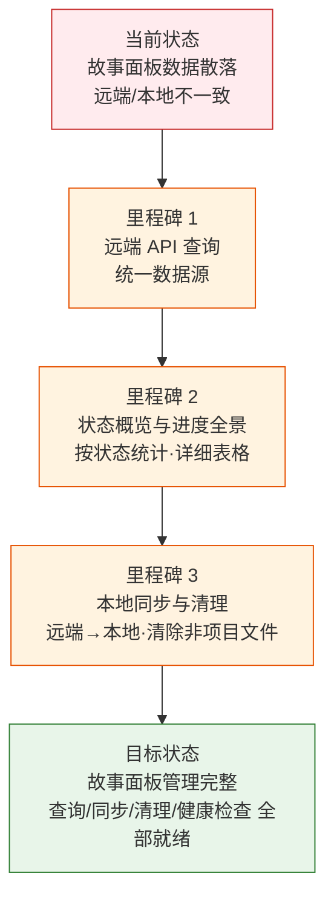

# YiAi-故事任务

> 故事任务面板管理（rui-story）— 问题空间基线
>
> 溯源：需求 `/rui update rui-story` · 来源 `skills/rui-story/SKILL.md` · 基线类型 问题空间
>
> **项目前缀**：`YiAi-`（来源：CLAUDE.md）

## 效果示意

## 主要价值

- 🎯 **统一数据源** — 所有查询操作使用远端 API，不读本地文件系统，消除本地/远端不一致
- 📊 **全景可视化** — 状态概览按 6 状态聚合统计 + 进度全景表格展示所有故事详情
- 🔄 **安全同步** — sync 从远端拉取文档到本地，clear 仅保留项目前缀文件，remove 精确删除目录
- 🛡️ **破坏性操作防护** — clear/remove 先展示待删除清单后要求用户确认，不触碰远端数据
- 🩺 **系统健康检查** — 凭据/API 可达性/配置/数据完整性四维诊断
- 📋 **kebab-case 命名规范** — 故事名纯语义，不加项目前缀，数据约束一致性

---

## §1 Story

### Story 1: 故事面板状态概览

| 字段 | 内容 |
|------|------|
| 作为 | 项目管理者 |
| 我想要 | 通过 `/rui-story` 查看所有故事的实时状态统计和最近活动 |
| 以便 | 快速了解项目整体进度，识别阻塞和延迟 |
| 优先级 | P0 |
| 范围边界 | 只读远端 API，不写本地文件系统 |
| 依赖 | 远端 API 可达，API_X_TOKEN 已配置 |

#### §1.1 User Operations

| # | 操作 | 触发条件 | 操作步骤 | 预期结果 |
|---|------|---------|---------|---------|
| 1 | 无参数入口查看概览 | 用户执行 `/rui-story` | 查询远端 sessions → 筛选故事任务面板数据 → 按故事分组 → 状态判定 → 聚合计数 → 输出摘要表 + 最近活动 | 显示 6 状态聚合统计 + 最近 5 个故事活动 |
| 2 | Token 未配置时降级提示 | API_X_TOKEN 缺失 | 检测 Token → 输出配置提示 | 展示 Token 缺失警告和配置方法 |

---

### Story 2: 进度全景列表

| 字段 | 内容 |
|------|------|
| 作为 | 项目管理者 |
| 我想要 | 通过 `/rui-story list` 查看所有故事的详细表格 |
| 以便 | 了解每个故事的状态、文件数、最后修改时间、类型和分支 |
| 优先级 | P0 |
| 范围边界 | 只读远端 API + 本地 git 分支检查 |
| 依赖 | Story 1 的状态判定逻辑 |

#### §1.1 User Operations

| # | 操作 | 触发条件 | 操作步骤 | 预期结果 |
|---|------|---------|---------|---------|
| 1 | 查看进度全景表格 | 用户执行 `/rui-story list` | 查询远端 → 分组 → 逐故事判定状态和类型 → 检查本地 git 分支 → 按更新时间降序排列输出表格 | 表格列出 Story/Status/Files/Last Modified/Type/Branch |
| 2 | 远端无数据时提示 | 远端无故事任务面板数据 | 查询结果为 0 → 提示空状态 | 显示「远端无故事任务面板数据」 |

---

### Story 3: 单故事详情查看

| 字段 | 内容 |
|------|------|
| 作为 | 开发者 |
| 我想要 | 通过 `/rui-story show <name>` 查看指定故事的所有文件清单和元数据 |
| 以便 | 快速了解某故事的文档完整性、状态和分支情况 |
| 优先级 | P0 |
| 范围边界 | 只读远端 API + 本地 git 分支检查 |
| 依赖 | 远端 stories 集合可查询 |

#### §1.1 User Operations

| # | 操作 | 触发条件 | 操作步骤 | 预期结果 |
|---|------|---------|---------|---------|
| 1 | 查看指定故事详情 | 用户执行 `/rui-story show user-login` | 解析 name → 查询远端 → 筛选匹配 → 状态判定 → 推断类型 → 输出详述卡 | 展示远端路径/类型/文件数/文件清单/git 分支/元数据 |
| 2 | 故事不存在时提示 | 远端不存在该故事 | 查询结果不匹配 → 列出远端已知故事 | 提示故事不存在 + 展示可选故事列表 |

---

### Story 4: 文档同步

| 字段 | 内容 |
|------|------|
| 作为 | 开发者 |
| 我想要 | 通过 `/rui-story sync [<name>]` 从远端拉取故事文档到本地 |
| 以便 | 获取最新的远端文档副本，保持本地与远端一致 |
| 优先级 | P0 |
| 范围边界 | 委托 import-docs（mode=pull），不自行实现同步逻辑 |
| 依赖 | import-docs 可用，远端 API 可达 |

#### §1.1 User Operations

| # | 操作 | 触发条件 | 操作步骤 | 预期结果 |
|---|------|---------|---------|---------|
| 1 | 同步指定故事 | 用户执行 `/rui-story sync rui-story` | 委托 `node skills/import-docs/sync.mjs dir=docs/故事任务面板/<name>/ mode=pull` → 远端下载覆盖本地 | 本地文档更新为远端最新版本 |
| 2 | 未指定名称时展示推荐 | 用户执行 `/rui-story sync` | 查询远端可同步故事 → 展示推荐列表 | 展示推荐提示，等待用户选择 |

---

### Story 5: 清理非项目文件

| 字段 | 内容 |
|------|------|
| 作为 | 项目维护者 |
| 我想要 | 通过 `/rui-story clear [<name>]` 清理混入的其他项目文件 |
| 以便 | 保持故事目录内只有当前项目前缀的文档 |
| 优先级 | P1 |
| 范围边界 | 仅操作本地文件系统，不触碰远端 API |
| 依赖 | CLAUDE.md 可读取项目名前缀 |

#### §1.1 User Operations

| # | 操作 | 触发条件 | 操作步骤 | 预期结果 |
|---|------|---------|---------|---------|
| 1 | 清理指定目录非项目文件 | 用户执行 `/rui-story clear rui-story` | 读取项目名前缀 → 扫描目录 → 筛选非 `{project}-` 文件 → 展示删除/保留清单 → 等待确认 → 执行删除 → 清理空目录 | 仅保留 `YiAi-` 前缀文件 |
| 2 | 扫描所有故事目录 | 用户执行 `/rui-story clear` | 同流程逐目录扫描和执行 | 所有故事目录仅保留项目前缀文件 |
| 3 | 用户拒绝确认时取消 | 确认提示中回答否 | 终止操作 | 不执行任何删除 |

---

### Story 6: 删除故事本地目录

| 字段 | 内容 |
|------|------|
| 作为 | 项目维护者 |
| 我想要 | 通过 `/rui-story remove <name>` 删除指定故事的整个本地目录 |
| 以便 | 彻底清除某故事在本地磁盘上的所有文档 |
| 优先级 | P1 |
| 范围边界 | 仅操作本地文件系统，不触碰远端，`<name>` 必填 |
| 依赖 | 本地目录存在 |

#### §1.1 User Operations

| # | 操作 | 触发条件 | 操作步骤 | 预期结果 |
|---|------|---------|---------|---------|
| 1 | 删除故事本地目录 | 用户执行 `/rui-story remove old-story` | 解析 name → 检查本地目录存在 → 扫描内容 → 展示待删除清单 → 等待确认 → `rm -rf` 删除整个目录 | 整个目录删除，显示释放空间 |
| 2 | name 缺失时提示 | 用户执行 `/rui-story remove` | 提示用法需 name 参数 | 展示用法提示 |
| 3 | 目录不存在时终止 | 本地目录不存在 | 检查目录不存在 → 终止 | 提示「目录不存在」 |

---

### Story 7: 同步推荐

| 字段 | 内容 |
|------|------|
| 作为 | 开发者 |
| 我想要 | 通过 `/rui-story recommend` 查看远端可同步的故事列表 |
| 以便 | 了解远端有哪些故事可以同步到本地 |
| 优先级 | P0 |
| 范围边界 | 只读远端 API |
| 依赖 | 远端 API 可达 |

#### §1.1 User Operations

| # | 操作 | 触发条件 | 操作步骤 | 预期结果 |
|---|------|---------|---------|---------|
| 1 | 查看同步推荐 | 用户执行 `/rui-story recommend` | 查询远端 → 筛选故事面板数据 → 按故事名分组 → 列出故事名+文件数+推荐 sync 命令 | 展示可同步故事列表和命令 |

---

### Story 8: 系统健康检查

| 字段 | 内容 |
|------|------|
| 作为 | 运维人员 |
| 我想要 | 通过 `/rui-story health` 执行系统健康检查 |
| 以便 | 诊断凭据配置、API 可达性、数据完整性和项目配置 |
| 优先级 | P0 |
| 范围边界 | 只读远端 API + 本地配置检查 |
| 依赖 | API_X_TOKEN（可选，缺失时降级） |

#### §1.1 User Operations

| # | 操作 | 触发条件 | 操作步骤 | 预期结果 |
|---|------|---------|---------|---------|
| 1 | 执行健康检查 | 用户执行 `/rui-story health` | 检查 API 凭据 → 检查远端可达性 → 统计故事面板数据 → 检查项目配置 → 输出诊断报告 | 展示 4 维诊断结果和 pass/warn/error 汇总 |
| 2 | Token 缺失时降级 | API_X_TOKEN 未配置 | 跳过远端可达性检查，仅检查本地配置 | 展示本地配置状态 |

---

## §2 Requirements

### 功能点

| FP# | 描述 | 输入 | 输出 | 错误行为 | 优先级 |
|-----|------|------|------|---------|--------|
| FP1 | 远端 API 查询 — 查询远端 sessions 集合获取故事面板数据 | API_X_TOKEN | sessions 列表 | API 不可达时优雅降级退出 | P0 |
| FP2 | 故事名提取 — 从 file_path 中提取故事名 | file_path 字符串 | 故事名或 null | 解析失败时跳过该记录 | P0 |
| FP3 | 状态判定 — 按 file_path 存在性和 blocked 标记判定 6 状态 | 文件列表 + 项目前缀 + blocked 状态 | status 枚举值 | 缺故事任务文件时返回 not_started | P0 |
| FP4 | 项目类型推断 — 远端读取技术评审判定类型 | 远端 file_path | backend/frontend/fullstack/meta | 读取失败时退回 meta | P0 |
| FP5 | 状态概览输出 — 按状态聚合计数 + 最近活动 | 分组后的故事数据 | 格式化摘要表 | 远端无数据时显示全零 | P0 |
| FP6 | 进度全景表格 — 所有故事详情表格 | 故事列表 + 类型 + 分支 | 格式化表格 | 远端无数据时提示空 | P0 |
| FP7 | 单故事详情 — 文件清单 + 元数据 | 故事名 + sessions | 详述卡 | 故事不存在时列出已知故事 | P0 |
| FP8 | sync 委托 — 调用 import-docs sync.mjs mode=pull | 故事名 | 同步结果 | import-docs 不可用时报错 | P0 |
| FP9 | clear 清理 — 本地移除非项目前缀文件 | 可选故事名 + 项目前缀 | 操作摘要 | 目录不存在时终止 | P1 |
| FP10 | remove 删除 — 删除指定故事整个本地目录 | 故事名（必填） | 操作摘要 | name 缺失或目录不存在时终止 | P1 |
| FP11 | recommend 推荐 — 列出远端可同步故事 | API_X_TOKEN | 推荐列表 + sync 命令 | API 不可达时退出 | P0 |
| FP12 | health 检查 — 四维健康诊断 | API_X_TOKEN + CLAUDE.md | 诊断报告 + 统计 | Token 缺失时跳过远端检查 | P0 |

### 业务规则

| R# | 描述 | 校验方式 | 证据级别 |
|----|------|---------|---------|
| R1 | 所有查询操作使用远端 API，不读本地文件系统（sync 写入除外） | 代码审查确认无本地 fs 读取 | B |
| R2 | `<name>` 为 kebab-case（`^[a-z0-9]+(-[a-z0-9]+)*$`），不加项目前缀 | 正则校验 | B |
| R3 | sync 完全委托 import-docs，不自行实现同步逻辑 | 代码审查 | B |
| R4 | clear/remove 仅操作本地文件系统，不触碰远端 | 代码审查和测试验证 | B |
| R5 | clear 仅保留当前项目前缀文件（如 `YiAi-`），项目前缀从 CLAUDE.md 读取 | 代码审查 | B |
| R6 | 破坏性操作（clear/remove）必须先展示后确认 | 操作流程审查 | B |
| R7 | recommend/health 由 rui-story.mjs 确定性执行，不依赖 agent 解读 | 脚本调用链验证 | B |
| R8 | 状态判定基于远端 file_path 存在性，仅 blocked 标记查本地 .memory/rui-state.json | 状态判定函数审查 | B |

### 数据约束

| 约束 | 类型 | 范围/格式 | 来源 |
|------|------|----------|------|
| 故事名 | string | `^[a-z0-9]+(-[a-z0-9]+)*$` (kebab-case) | rui-story 命名规范 |
| 项目前缀 | string | `YiAi-`（从 CLAUDE.md 项目名拼接） | CLAUDE.md |
| 项目类型 | enum | `frontend` / `backend` / `fullstack` / `meta` | 技术评审内容推断 |
| 状态 | enum | `not_started` / `docs_in_progress` / `docs_done` / `code_in_progress` / `code_done` / `blocked` | 文件存在性 + blocked 标记 |
| API 端点 | URL | `https://api.effiy.cn`（可环境变量覆盖） | 环境变量 IMPORT_DOCS_API_URL |
| 查询限制 | number | 10000 sessions | QUERY_LIMIT 常量 |
| HTTP 超时 | number | 30000 ms | HTTP_TIMEOUT 常量 |

---

## §3 成功标准

| SC# | 描述 | 度量方式 | 目标值 | 优先级 | 关联 FP# |
|-----|------|---------|--------|--------|---------|
| SC1 | 用户可用 `/rui-story` 查看完整状态概览 | 命令执行输出 | 6 状态统计 + 最近 5 个活动 | P0 | FP1–FP5 |
| SC2 | 用户可用 `/rui-story list` 查看所有故事详情 | 命令执行输出 | 列全 6 列 + 按时间降序 | P0 | FP1–FP4, FP6 |
| SC3 | 用户可用 `/rui-story show <name>` 查看单故事详情 | 命令执行输出 | 文件清单 + 状态 + 分支 + 元数据 | P0 | FP1–FP4, FP7 |
| SC4 | 用户可从远端同步文档到本地 | sync 执行后 diff 对比 | 远端=本地 | P0 | FP8 |
| SC5 | 用户可清理非项目前缀文件且远端不受影响 | clear 执行后检查 + 远端 API 确认 | 仅保留 `YiAi-` 文件 | P1 | FP9 |
| SC6 | 用户可删除故事本地目录且远端不受影响 | remove 执行后检查 + 远端 API 确认 | 目录不存在 | P1 | FP10 |
| SC7 | recommend 和 health 由脚本确定性执行 | 命令执行输出 | 与脚本逻辑一致 | P0 | FP11, FP12 |
| SC8 | 远端不可达时优雅降级不崩溃 | 断开网络执行命令 | 显示错误信息后退出 | P0 | FP1 |

---

## §4 范围边界

### 范围内

| # | 条目 | 关联 FP# | 边界说明 |
|---|------|---------|---------|
| 1 | 远端 API 查询（sessions 集合） | FP1 | 默认数据源，所有查询操作使用 |
| 2 | 状态概览与进度全景 | FP5, FP6 | 摘要 + 表格两种视图 |
| 3 | 单故事详情查看 | FP7 | 文件清单 + 元数据 + 分支检查 |
| 4 | sync 委托 import-docs | FP8 | 远端→本地，不自行实现 |
| 5 | clear/remove 本地清理 | FP9, FP10 | 仅本地操作，不触碰远端 |
| 6 | recommend 和 health | FP11, FP12 | 确定性脚本执行 |
| 7 | 帮助信息展示 | — | --help / -h / help 三种入口 |

### 范围外

| # | 条目 | 排除原因 | 替代方案 |
|---|------|---------|---------|
| 1 | 创建故事文档内容 | 属于 `/rui doc` 职责 | 使用 `/rui doc <需求>` |
| 2 | 修改源码 | 属于 `/rui code` 职责 | 使用 `/rui code <name>` |
| 3 | 创建/切换 git 分支 | 属于 `/rui code` 的预检步骤 | 使用 `/rui code <name>` |
| 4 | 写入远端文档 | rui-story 只从远端读/拉取，写操作仅限本地 | 使用 `/rui doc` 或 `import-docs` |

---

## §5 AC

| AC# | Given | When | Then | 门禁 |
|-----|-------|------|------|------|
| AC1 | API_X_TOKEN 已配置，远端有故事面板数据 | 用户执行 `/rui-story` | 输出 6 状态聚合统计和最近 5 个故事活动 | Gate A |
| AC2 | API_X_TOKEN 已配置，远端有故事面板数据 | 用户执行 `/rui-story list` | 输出含 6 列的故事详情表格，按更新时间降序 | Gate A |
| AC3 | 远端存在目标故事 | 用户执行 `/rui-story show <name>` | 输出文件清单/状态/类型/分支/元数据 | Gate A |
| AC4 | 远端不存在目标故事 | 用户执行 `/rui-story show <name>` | 提示不存在并列出远端已知故事 | Gate A |
| AC5 | 远端存在目标故事文档 | 用户执行 `/rui-story sync <name>` | import-docs 从远端拉取覆盖本地 | Gate A |
| AC6 | 本地目录存在非项目前缀文件 | 用户执行 `/rui-story clear <name>` 并确认 | 仅保留 `YiAi-` 文件，其余删除 | Gate A |
| AC7 | 用户拒绝确认 | 清理提示中回答否 | 不执行任何删除 | Gate A |
| AC8 | 本地目录存在 | 用户执行 `/rui-story remove <name>` 并确认 | 整个目录被删除 | Gate A |
| AC9 | API_X_TOKEN 已配置 | 用户执行 `/rui-story recommend` | 列出远端可同步故事和推荐命令 | Gate A |
| AC10 | 任意状态（Token 可选） | 用户执行 `/rui-story health` | 输出四维诊断报告 + pass/warn/error 统计 | Gate A |
| AC11 | API_X_TOKEN 未配置 | 任何查询命令 | 显示 Token 缺失警告和配置方法 | Gate A |
| AC12 | 远端 API 不可达 | 任何查询命令 | 显示错误信息后优雅退出（exit 0） | Gate A |

---

## §6 风险与假设

| # | 风险/假设 | 类型 | 可能性 | 影响 | 缓解/验证策略 | 关联 FP# |
|---|----------|------|--------|------|-------------|---------|
| 1 | 远端 API 不可达导致所有查询功能不可用 | 风险 | M | H | 优雅退出（exit 0），不崩溃；health 命令诊断 API 可达性 | FP1 |
| 2 | API_X_TOKEN 未配置导致无法查询 | 风险 | M | H | 命令入口统一检查，缺失时展示配置引导 | FP1 |
| 3 | CLAUDE.md 项目名格式不一致导致前缀解析错误 | 风险 | L | H | readProjectName 支持 3 种模式匹配 + fallback 到目录名 | FP9 |
| 4 | sync 并发大量文件时超时 | 风险 | M | M | 使用 HTTP_TIMEOUT 30 秒，import-docs 内部处理重试 | FP8 |
| 5 | clear 误删有用文件 | 风险 | M | H | 强制展示双重清单 + 用户确认，仅判断文件名前缀 | FP9 |
| 6 | remove 误删重要目录 | 风险 | L | H | 展示完整文件清单 + 用户确认 + 不触碰远端 | FP10 |
| 7 | 技术评审内容格式变化导致类型推断失败 | 风险 | L | L | 类型推断失败时退回 meta，不阻断 | FP4 |
| 8 | 远端 API 返回格式与预期不一致 | 风险 | M | M | 兼容 `data.data.list` 和 `data.list` 两种路径 | FP1 |
| 9 | 多 Agent 同时 sync 导致写入冲突 | 风险 | L | M | sync 覆盖写，最后一次获胜；建议仅单 Agent 操作 | FP8 |
| 10 | rui-story.mjs 执行环境 Node.js 版本不兼容 | 风险 | L | M | 使用标准 ES module import + Node 内置 fetch | FP1–FP12 |
| 11 | 远端 sessions 数量能覆盖所有故事面板数据 | 假设 | — | — | QUERY_LIMIT=10000，超出时可能截断 | FP1 |
| 12 | 文件名遵循 `{project}-{类型}.md` 格式可用于状态判定 | 假设 | — | — | BASELINE_DOCS 常量硬编码文档类型列表 | FP3 |

**约束**：远端 API 为默认数据源 · 查询操作零本地读取 · sync 委托 import-docs · clear/remove 仅本地不触碰远端 · kebab-case 命名 · 确定性脚本执行

**产出**：YiAi-故事任务.md（本文件）· YiAi-使用场景.md · YiAi-技术评审.md · YiAi-测试设计.md · YiAi-安全审计.md · YiAi-实施报告.md · YiAi-测试报告.md · YiAi-自改进复盘.md · YiAi-交互日志.md · YiAi-消息通知列表.md

---

## 变更记录

| 日期 | 版本 | 变更内容 | 来源 |
|------|------|---------|------|
| 2026-05-20 | 1.0 | 初始文档基线 — 基于 rui-story SKILL.md 反推生成 | `/rui update rui-story` |
