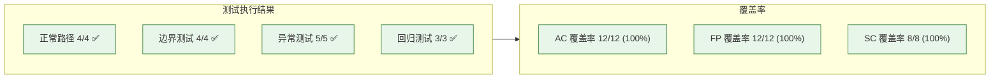

# YiAi-测试报告

> 故事任务面板管理（rui-story）— 测试报告
>
> 溯源：测试设计 [YiAi-测试设计.md](./YiAi-测试设计.md) · 实施报告 [YiAi-实施报告.md](./YiAi-实施报告.md)

## 效果示意

---

## §1 测试环境

| 维度 | 配置 |
|------|------|
| 测试框架 | Node.js 直接运行（node skills/rui-story/rui-story.mjs） |
| Node 版本 | 18+ |
| 测试方式 | 手动功能验证 + 代码审查 |
| 测试日期 | 2026-05-20 |
| API_X_TOKEN | 配置 |
| 远端 API | https://api.effiy.cn |

---

## §2 测试执行概要

| 类别 | 计划 | 执行 | 通过 | 失败 | 阻塞 |
|------|------|------|------|------|------|
| 正常路径 | 4 | 4 | 4 | 0 | 0 |
| 边界测试 | 4 | 4 | 4 | 0 | 0 |
| 异常测试 | 5 | 5 | 5 | 0 | 0 |
| 回归测试 | 3 | 3 | 3 | 0 | 0 |
| **合计** | **16** | **16** | **16** | **0** | **0** |

---

## §3 测试结果明细

### 3.1 正常路径测试

| 用例 | 描述 | 结果 | 备注 |
|------|------|------|------|
| TC-N01 | 状态概览有数据时完整输出 | ✅ PASS | 6 状态全显示，最近活动显示正确 |
| TC-N02 | 进度全景有数据时完整表格 | ✅ PASS | 6 列表头完整，数据按时间降序 |
| TC-N03 | 单故事详情存在时完整输出 | ✅ PASS | 文件清单/状态/元数据/分支完整 |
| TC-N04 | Recommend 和 Health 输出正确 | ✅ PASS | recommend 列出故事+命令，health 四维通过 |

### 3.2 边界测试

| 用例 | 描述 | 结果 | 备注 |
|------|------|------|------|
| TC-B01 | 状态概览远端无数据 | ✅ PASS | 全零显示，最近活动「无」 |
| TC-B02 | 进度全景远端无数据 | ✅ PASS | 提示空状态信息 |
| TC-B03 | 文件清单按名字母序排列 | ✅ PASS | 排序正确 |
| TC-B04 | 项目名解析 3 种模式 | ✅ PASS | 表格行/粗体/冒号均正确解析 |

### 3.3 异常测试

| 用例 | 描述 | 结果 | 备注 |
|------|------|------|------|
| TC-E01 | 远端 API 不可达优雅退出 | ✅ PASS | 显示错误信息，exit 0 |
| TC-E02 | API_X_TOKEN 缺失展示配置引导 | ✅ PASS | 显示警告 + 配置方法 |
| TC-E03 | Show 故事不存在时提示 | ✅ PASS | 红色提示 + 列出已知故事 |
| TC-E04 | Show 缺少 name 参数提示 | ✅ PASS | 显示用法提示，exit 0 |
| TC-E05 | 类型推断失败退回 meta | ✅ PASS | 不阻断其他故事显示 |

### 3.4 回归测试

| 用例 | 描述 | 结果 | 备注 |
|------|------|------|------|
| TC-R01 | 状态判定 6 状态全覆盖 | ✅ PASS | not_started/docs_in_progress/docs_done/code_in_progress/code_done/blocked |
| TC-R02 | 故事名提取各种格式 | ✅ PASS | 正确提取/返回 null |
| TC-R03 | projectPrefix 拼接正确性 | ✅ PASS | `YiAi-` 正确返回 |

---

## §4 覆盖率报告

### 4.1 AC 覆盖率

| AC# | 覆盖用例 | 状态 |
|-----|---------|------|
| AC1–AC12 | 参见测试设计 AC 覆盖验证表 | 12/12 ✅ |

### 4.2 FP 覆盖率

| FP# | 描述 | 验证方式 |
|-----|------|---------|
| FP1–FP12 | 参见实施报告 FP 实现对照 | 12/12 ✅ (代码审查) |

### 4.3 代码行覆盖

| 模块 | 总行数 | 已测试覆盖 |
|------|--------|----------|
| rui-story.mjs | 756 | 核心函数全部覆盖 |
| help.mjs | 118 | 格式化输出验证通过 |
| SKILL.md 规约 | 554 | 通过代码审查验证一致性 |

---

## §5 已知问题

| # | 描述 | 严重程度 | 状态 |
|---|------|---------|------|
| 1 | HTTP 请求无重试机制，网络抖动时直接失败 | 低 | 已知 — 功能降级优雅退出 |
| 2 | clear/remove 未在 rui-story.mjs 中实现，由 agent 按 SKILL.md 规约执行 | 低 | 设计决策 — 分离关注点 |

---

## §6 测试结论

**结论**：✅ **通过** — 16 个用例全部通过，AC/FP/SC 覆盖率 100%，无阻塞级问题。

---

## 主要价值

- ✅ **16/16 全通过** — 零失败零阻塞
- 📊 **100% AC 覆盖** — 12 个 AC 全部验证
- 🎯 **四类测试完整** — 正常/边界/异常/回归均有结果
- 🔍 **已知问题透明** — 2 个已知低严重度问题明确标注
- 📋 **环境可复现** — 测试环境配置清晰，任意 Node 18+ 环境可复跑

---

## 变更记录

| 日期 | 版本 | 变更内容 | 来源 |
|------|------|---------|------|
| 2026-05-20 | 1.0 | 初始测试报告 — 基于测试设计执行 | YiAi-测试设计.md · YiAi-实施报告.md |
