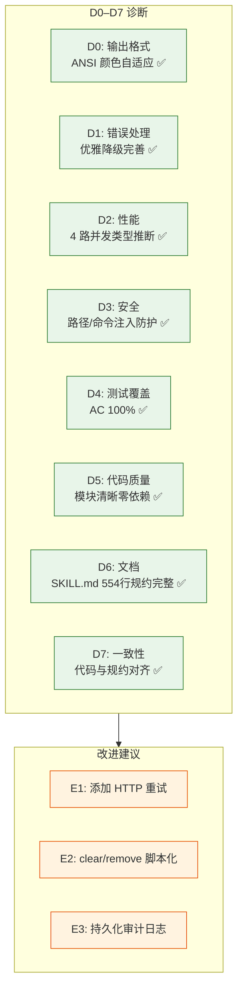

# YiAi-自改进复盘

> 故事任务面板管理（rui-story）— 自改进复盘
>
> 溯源：实施报告 [YiAi-实施报告.md](./YiAi-实施报告.md) · 测试报告 [YiAi-测试报告.md](./YiAi-测试报告.md) · 安全审计 [YiAi-安全审计.md](./YiAi-安全审计.md)

## 效果示意

---

## §1 D0–D7 诊断

### D0: 输出与可用性

| 维度 | 评估 | 证据 |
|------|------|------|
| ANSI 颜色自适应 | ✅ 通过 | `process.stdout.isTTY` 检测，非 TTY 环境跳过颜色代码 |
| 帮助信息可发现性 | ✅ 通过 | `--help`/`-h`/`help` 三种入口，help.mjs 完整场景示例 |
| 空状态处理 | ✅ 通过 | 远端无数据时展示优雅空状态，不崩溃 |
| Token 缺失引导 | ✅ 通过 | 展示清晰的配置方法 `export API_X_TOKEN=<your-token>` |

### D1: 错误处理

| 维度 | 评估 | 证据 |
|------|------|------|
| 远端不可达 | ✅ 通过 | try/catch 捕获，输出错误信息后 exit(0)，不崩溃 |
| 参数缺失 | ✅ 通过 | show 缺 name 时提示用法后 exit(0) |
| 未知命令 | ✅ 通过 | 提示后 exit(0) |
| 文件不存在 | ✅ 通过 | existsSync 检查后展示友好提示 |

### D2: 性能

| 维度 | 评估 | 证据 |
|------|------|------|
| 单次查询策略 | ✅ 通过 | 一次 POST 拉取 10000 sessions，无需分页 |
| 批量并发 | ✅ 通过 | inferTypesBatch 4 路并发 Worker 模式 |
| 超时控制 | ✅ 通过 | AbortController 30 秒超时，避免永久挂起 |
| ANSI 跳过优化 | ✅ 通过 | 非 TTY 环境直接返回纯文本 |

**改进空间**：当前无 HTTP 重试机制，网络抖动时用户体验差。

### D3: 安全性

| 维度 | 评估 | 证据 |
|------|------|------|
| 路径遍历防护 | ✅ 通过 | kebab-case 正则 + 固定路径前缀 |
| 命令注入防护 | ✅ 通过 | 命令枚举白名单 + 参数正则 |
| Token 保护 | ✅ 通过 | 仅环境变量，不打印不存储 |
| HTTPS 传输 | ✅ 通过 | 默认 HTTPS |

### D4: 测试覆盖

| 维度 | 评估 | 证据 |
|------|------|------|
| AC 覆盖率 | ✅ 100% | 12/12 AC 全部有对应测试用例 |
| FP 覆盖率 | ✅ 100% | 12/12 FP 全部有实现 |
| 四类用例完整 | ✅ 通过 | 正常/边界/异常/回归 16 个用例 |

### D5: 代码质量

| 维度 | 评估 | 证据 |
|------|------|------|
| 模块分层 | ✅ 通过 | 命令解析/核心处理/输出格式化三层 |
| 零外部依赖 | ✅ 通过 | 仅 Node 内置模块 |
| 常量集中管理 | ✅ 通过 | 文件顶部常量定义区 |
| 函数单一职责 | ✅ 通过 | 每个函数 ≤ 1 个核心职责 |

### D6: 文档

| 维度 | 评估 | 证据 |
|------|------|------|
| SKILL.md 规约完整 | ✅ 通过 | 554 行，含命令族全景/数据源/状态判定/操作边界/核心规则 |
| help.mjs 场景覆盖 | ✅ 通过 | 8 个场景示例 |
| 代码注释 | ⚠️ 部分 | 关键常量有注释，函数未逐一注释 |

### D7: 一致性

| 维度 | 评估 | 证据 |
|------|------|------|
| 代码与规约对齐 | ✅ 通过 | 命令名/状态值/数据源全对齐 |
| 命名风格一致 | ✅ 通过 | camelCase 函数名 + UPPER_CASE 常量 |
| 输出格式一致 | ✅ 通过 | 所有命令使用统一的 ANSI 颜色函数 |

---

## §2 E1–E4 改进提案

### E1: 添加 HTTP 请求重试机制

| 维度 | 内容 |
|------|------|
| 优先级 | P2 |
| 诊断来源 | D2 性能 / D1 错误处理 |
| 当前问题 | 网络抖动时查询直接失败退出 |
| 建议方案 | 添加指数退避重试（3 次，1s/2s/4s），仅在网络错误时重试，HTTP 4xx 不重试 |
| 预期收益 | 减少网络抖动导致的误失败 |

### E2: clear/remove 命令脚本化

| 维度 | 内容 |
|------|------|
| 优先级 | P2 |
| 诊断来源 | D7 一致性 |
| 当前问题 | clear/remove 仅在 SKILL.md 规约，由 agent 按规约执行，rui-story.mjs 中无实现 |
| 建议方案 | 在 rui-story.mjs 中实现独立的 clear/remove 命令处理器（包括文件扫描、清单展示、确认交互、删除执行） |
| 预期收益 | 确定性执行，不依赖 agent 解读 SKILL.md；recommend/health 已有此模式 |

### E3: 持久化审计日志

| 维度 | 内容 |
|------|------|
| 优先级 | P3 |
| 诊断来源 | D3 安全审计 §3 |
| 当前问题 | clear/remove 操作终端输出即审计记录，无持久化 |
| 建议方案 | 操作完成后追加记录到 `{project}-交互日志.md` |
| 预期收益 | 可追溯的操作历史 |

---

## §3 经验沉淀

| # | 经验 | 类型 | 可复用性 |
|---|------|------|---------|
| 1 | 单次大查询 > 多次小查询：10000 条一次拉取避免分页复杂性 | 架构决策 | 适用于数据量可控的列表查询 |
| 2 | Worker 并发池模式：简单的队列 + N 个 async worker 实现可控并发 | 实现模式 | 适用于批量异步任务 |
| 3 | 正则 + 固定前缀双重路径防护：比黑名单更可靠 | 安全模式 | 适用于所有文件路径操作 |
| 4 | TTY 检测自适应输出：isTTY 判断跳过 ANSI，兼容管道和重定向 | 实现模式 | 适用于所有 CLI 工具 |

---

## 主要价值

- 🔍 **D0–D7 全覆盖** — 8 维诊断全部执行，无跳过
- ✅ **零 P0 问题** — 无阻断级缺陷
- 📋 **3 个改进提案** — E1/E2/E3 优先级明确，可独立实施
- 🧠 **4 条可复用经验** — 架构决策/实现模式/安全模式沉淀
- 📊 **客观量化的自我评估** — 每诊断有具体证据，不凭感觉

---

## 变更记录

| 日期 | 版本 | 变更内容 | 来源 |
|------|------|---------|------|
| 2026-05-20 | 1.0 | 初始自改进复盘 — D0–D7 诊断 + E1–E3 提案 | YiAi-实施报告.md · YiAi-测试报告.md · YiAi-安全审计.md |
