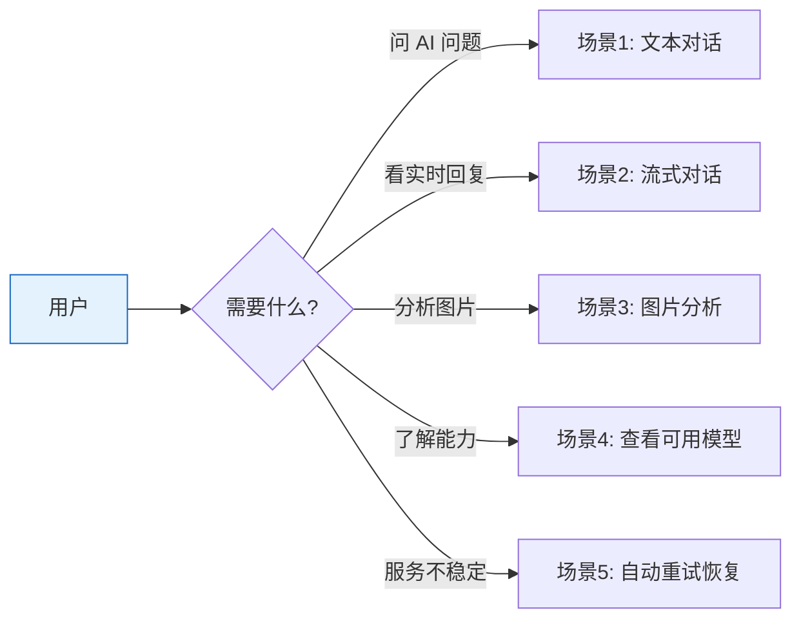

# YiAi-使用场景 — services-ai

> AI 对话服务的使用场景文档。从用户视角描述与 AI 对话、图片分析、模型查询的典型流程。
>
> **来源**：源码分析 `/rui doc --from-code services-ai`
> **证据等级**：B（只读源码 + 静态分析）
> **项目类型**：backend
> **语言约束**：本节禁止包含技术术语（代码路径、API 路由、组件名、数据库驱动名、SDK 名）

---

## 效果示意

---

## 场景 1：文本对话

### 场景描述
用户向 AI 助手发送文本问题，获取智能回复。适用于知识问答、内容生成、代码辅助等场景。

### 前置条件
- AI 服务正常运行
- 用户有可用的对话入口

### 操作步骤

1. **编写问题**：输入想要咨询的内容
2. **（可选）设定角色**：指定 AI 的角色定位（如"你是一个代码审查专家"）
3. **（可选）选择模型**：指定使用哪个 AI 模型（不指定则使用默认模型）
4. **发送请求**：提交对话请求
5. **等待回复**：AI 处理后返回完整回复内容
6. **查看结果**：获取回复文本、使用的模型名称

### 预期结果
- 返回 AI 生成的回复内容
- 标明使用的模型名称
- 回复内容与问题相关

### 异常情况
- AI 服务暂时不可用 → 自动重试两次 → 仍失败则返回"调用失败"和具体原因
- 指定了不存在的模型 → 返回错误信息

---

## 场景 2：流式对话

### 场景描述
用户希望看到 AI 的实时逐字回复，而非等待完整结果后一次性展示。适用于需要即时反馈的交互场景。

### 前置条件
- AI 服务正常运行
- 用户界面支持流式内容展示

### 操作步骤

1. **开启流式模式**：在对话请求中标记为"流式输出"
2. **提交问题**：与场景 1 相同，发送文本问题
3. **实时接收**：AI 开始逐字生成回复，内容分块实时推送到用户界面
4. **完整展示**：所有分块到达后，界面显示完整回复
5. **流结束**：收到结束信号，对话完成

### 预期结果
- 回复内容分多块实时推送
- 每块到达后立即可见
- 最终完整回复与场景 1 非流式结果一致
- 以明确的结束信号标记对话完成

### 异常情况
- 生成过程中发生错误 → 在流中推送错误消息（如"请求失败：连接超时"），然后发送结束信号
- 网络中断 → 流可能提前结束，收到结束信号

---

## 场景 3：图片分析

### 场景描述
用户上传一张图片，让 AI 分析图片内容。支持两种方式：直接上传本地图片（转为文本编码）或提供在线图片地址。

### 前置条件
- AI 服务的视觉模型可用
- 图片内容清晰可辨识

### 操作步骤

#### 3.1 上传本地图片
1. 将图片转为文本编码格式
2. 编写分析需求（如"描述这张图片中的内容"）
3. 提交对话请求（包含图片编码和分析需求）
4. 系统自动切换为视觉模型处理
5. AI 返回图片分析结果

#### 3.2 引用在线图片
1. 准备在线图片的完整访问地址
2. 编写分析需求
3. 提交对话请求（包含图片地址和分析需求）
4. 系统自动下载图片 → 切换视觉模型 → 分析
5. AI 返回图片分析结果

#### 3.3 多张图片同时分析
- 可同时提交多张图片（本地和在线混合）
- 在线图片并发获取（最多 4 张同时下载）
- 系统合并所有图片后统一分析

### 预期结果
- 自动使用视觉模型进行分析
- 回复内容基于图片内容
- 多张图片时综合分析

### 异常情况
- 图片编码格式无效 → 静默跳过该图片，不影响文本对话
- 在线图片地址不可访问 → 跳过该图片，使用其他有效图片继续
- 在线图片不是图片类型（如返回 HTML）→ 跳过该图片
- 在线图片超过大小限制 → 跳过该图片
- 所有图片都无效 → 退化为纯文本对话

---

## 场景 4：查看可用模型

### 场景描述
用户想知道当前 AI 服务有哪些可用的模型，以便选择最适合自己需求的模型。

### 前置条件
- AI 服务正常运行

### 操作步骤

1. **查询模型列表**：发送模型列表查询请求
2. **获取结果**：系统返回所有已安装的 AI 模型清单
3. **选择模型**：根据返回的模型名称，在对话时指定使用的模型

### 预期结果
- 返回模型列表，包含模型名称和相关信息
- 每个模型有明确的名称标识

### 异常情况
- AI 服务不可用 → 返回查询失败和具体错误原因

---

## 场景 5：自动重试恢复

### 场景描述
AI 服务可能出现临时的网络波动或服务繁忙，系统内置自动重试机制，用户无需担心偶发性失败。

### 前置条件
- 用户发起了一次 AI 对话请求

### 操作步骤

1. **首次调用**：系统向 AI 服务发送请求
2. **调用失败**：首次请求因临时问题失败（如服务繁忙、短暂网络抖动）
3. **自动重试**：系统无需用户干预，自动重新发送请求
4. **重试成功**：第二次（或第三次）尝试成功，返回正常结果
5. **用户感知**：整个过程对用户透明，用户只看到最终成功的回复

### 预期结果
- 临时性故障被自动恢复
- 用户体验不受偶发性失败影响

### 异常情况
- 多次重试全部失败 → 返回明确的失败信息，包含最后的错误原因
- 如果是 AI 服务长时间不可用，重试仍会失败 → 提示用户稍后重试

---

### 主要价值

- 💬 **双模式对话** — 一次性返回和流式实时推送两种交互方式，适应不同场景
- 🖼️ **图片智能分析** — 支持本地图片和在线图片，自动切换视觉模型
- 🔄 **自动容错** — 临时故障自动重试，用户无感知
- 📋 **模型透明** — 随时查看可用模型列表，自由选择
- ⚡ **非阻塞处理** — 同步 AI 调用在后台执行，不影响系统响应

---

## 回溯链

| 来源 | 路径 | 证据级别 |
|------|------|---------|
| 故事任务 | `YiAi-故事任务.md` §1 Story 1–3 | A |
| 源码 | `src/services/ai/chat_service.py` | A |

### 变更记录

| 日期 | 版本 | 变更内容 | 来源 |
|------|------|---------|------|
| 2026-05-22 | 1.0.0 | 初始文档基线，从源码反推生成 | /rui doc --from-code services-ai |
