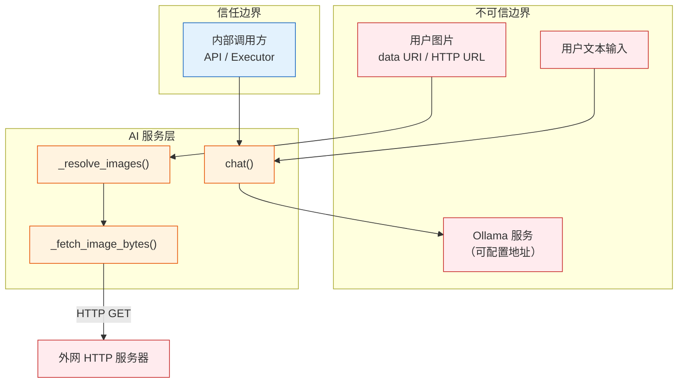

# YiAi-安全审计 — services-ai

> AI 对话服务的独立安全审计文档。覆盖 `chat_service.py`（Ollama 客户端 + 图片处理 + 流式对话）。
>
> **来源**：源码分析 `/rui doc --from-code services-ai`
> **证据等级**：B（只读源码 + 静态分析）
> **项目类型**：backend
> **审计独立性**：由 security agent 独立执行

---

## 效果示意

---

## STRIDE 威胁建模

### S — Spoofing（身份伪造）

| 威胁 | 描述 | 缓解措施 | 评估 |
|------|------|---------|:---:|
| S1 | 伪造 Ollama 服务端响应欺骗 AI 输出 | Ollama 服务地址由配置控制，部署时确保内网隔离 | ⚠️ 运维层面 |
| S2 | 通过伪造模型名称使用未授权的模型 | 无模型名白名单；任何已安装模型均可被调用 | ⚠️ 低风险 |

**S2 建议**：维护允许的模型名称白名单，拒绝调用未授权模型。

---

### T — Tampering（数据篡改）

| 威胁 | 描述 | 缓解措施 | 评估 |
|------|------|---------|:---:|
| T1 | 用户伪造 system prompt 覆盖系统角色设定 | chat() 的 system 参数由调用方完全控制 | ⚠️ 设计如此 |
| T2 | 恶意图片嵌入元数据篡改分析结果 | 图片原样传递到视觉模型，不做元数据剥离 | ⚠️ 低风险 |
| T3 | Ollama 响应被中间人篡改（非 TLS 连接） | 默认连接 `http://localhost:11434`（本地无中间人风险）；远程部署需 HTTPS | ⚠️ 运维层面 |

---

### R — Repudiation（不可否认性）

| 威胁 | 描述 | 缓解措施 | 评估 |
|------|------|---------|:---:|
| R1 | AI 对话无审计日志 | 对话内容和结果不记录，无法追溯谁问了什么问题 | ❌ 未缓解 |
| R2 | 模型列表查询无记录 | 不记录谁在什么时间查询了模型列表 | ❌ 低风险 |

**R1 建议**：在 `chat()` 入口添加对话审计日志（调用方标识、时间戳、模型名、请求摘要），写入独立集合。

---

### I — Information Disclosure（信息泄露）

| 威胁 | 描述 | 缓解措施 | 评估 |
|------|------|---------|:---:|
| I1 | 错误消息泄露 Ollama 服务端内部信息 | generate_response 返回 error 字段为 Ollama 原始异常消息 | ⚠️ 中风险 |
| I2 | 模型列表泄露服务端所有已安装模型 | list_models 设计上就是公开模型列表；不包含敏感信息 | ✅ 低风险 |
| I3 | 通过图片 URL SSRF 探测内网服务（同 RSS 审计 E2） | HTTP 图片获取无内网地址过滤 | ⚠️ 中风险 |
| I4 | 用户上传图片内容可能包含敏感信息 | 图片原样传递到 Ollama 服务，不存储（当前实现） | ✅ 低风险 |

**I1 建议**：生产环境对用户隐藏 Ollama 内部错误细节，返回通用错误消息。
**I3 建议**：在 `_fetch_image_bytes()` 中过滤私有 IP 段、拒绝 `file://`/`localhost`。

---

### D — Denial of Service（拒绝服务）

| 威胁 | 描述 | 缓解措施 | 评估 |
|------|------|---------|:---:|
| D1 | 大量并发对话请求耗尽线程池 | `run_in_executor(None, ...)` 使用默认线程池（无限制） | ⚠️ 中风险 |
| D2 | 超大 base64 图片耗尽内存 | HTTP 图片有 10MB 限制，但 base64 图片无大小限制 | ⚠️ 中风险 |
| D3 | 恶意 HTTP 图片服务器返回无限数据 | 10MB 硬限制 + 15s 超时 | ✅ 已缓解 |
| D4 | 大量 HTTP 图片 URL 并发耗尽连接 | Semaphore(4) 限制并发获取 | ✅ 已缓解 |
| D5 | 流式对话时客户端断开但子线程继续运行 | 无取消机制；子线程会持续到 Ollama 响应结束 | ⚠️ 低风险 |

**D1 建议**：使用有界线程池（如 `ThreadPoolExecutor(max_workers=N)`）。
**D2 建议**：在 `_resolve_images()` 中对 base64 图片也添加大小限制（解码前检查字符串长度）。
**D5 建议**：监听客户端断开事件，取消对应的子线程任务。

---

### E — Elevation of Privilege（权限提升）

| 威胁 | 描述 | 缓解措施 | 评估 |
|------|------|---------|:---:|
| E1 | 通过构造特殊 system prompt 越狱 AI 模型 | 无 prompt 注入过滤；依赖 Ollama 模型自身的安全对齐 | ⚠️ 模型层面 |
| E2 | 通过图片 URL 进行 SSRF 攻击 | 无内网地址过滤（与 RSS 服务同问题） | ⚠️ 中风险 |
| E3 | 通过 executor 动态调用任意 OllamaService 方法 | executor 白名单控制到模块级 | ⚠️ 低风险 |

**E2 建议**：添加 URL 校验，拒绝私有 IP 段和特殊协议。此建议与 RSS 安全审计一致，可考虑提取为公共服务。

---

## 安全评分

| 维度 | 评分 | 说明 |
|------|:---:|------|
| SSRF 防护 | 🔴 缺 | 图片 HTTP 获取无内网地址过滤 |
| DoS 韧性 | 🟡 良 | 图片获取保护完善，但线程池和 base64 无限制 |
| 信息泄露防护 | 🟡 良 | Ollama 内部错误可能泄露，SSRF 可探测内网 |
| 认证授权 | 🟡 良 | 依赖中间件层，模型级授权缺失 |
| 审计日志 | 🔴 缺 | 无对话审计 |
| 数据完整性 | 🟡 良 | 依赖模型安全对齐 |

---

## 改进建议优先级

| # | 建议 | 威胁 | 优先级 | 难度 |
|---|------|------|:---:|:---:|
| 1 | SSRF 防护 — 图片 URL 过滤内网 IP（与 RSS 同问题） | E2, I3 | P0 | 低 |
| 2 | base64 图片大小限制 | D2 | P1 | 低 |
| 3 | 有界线程池（ThreadPoolExecutor max_workers） | D1 | P1 | 低 |
| 4 | 生产环境隐藏 Ollama 内部错误详情 | I1 | P1 | 低 |
| 5 | 流式对话客户端断开取消机制 | D5 | P2 | 中 |
| 6 | AI 对话审计日志 | R1 | P2 | 中 |
| 7 | 模型名称白名单 | S2 | P2 | 低 |

---

### 主要价值

- 🛡️ **图片获取多层防护** — 10MB 限制 + 15s 超时 + Content-Type 白名单 + Semaphore(4)
- 🔍 **SSRF 跨服务风险关联** — 与 RSS 安全审计发现相同的 URL 安全缺口，建议统一修复
- 🎯 **可操作建议** — 7 条按优先级排列的具体改进建议，含难度评估

---

## 回溯链

| 来源 | 路径 | 证据级别 |
|------|------|---------|
| 源码 | `src/services/ai/chat_service.py` (299 lines) | A |
| 技术评审 | `YiAi-技术评审.md` §7 安全设计 | A |

### 变更记录

| 日期 | 版本 | 变更内容 | 来源 |
|------|------|---------|------|
| 2026-05-22 | 1.0.0 | 初始文档基线，从源码反推生成 | /rui doc --from-code services-ai |
