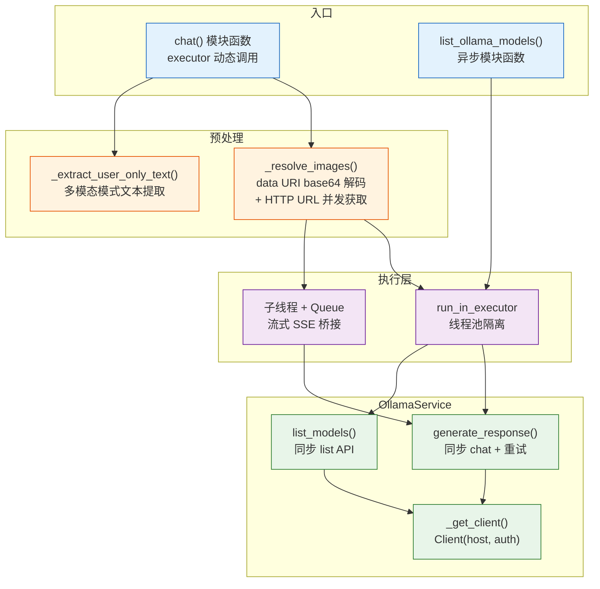
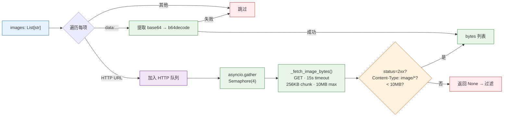
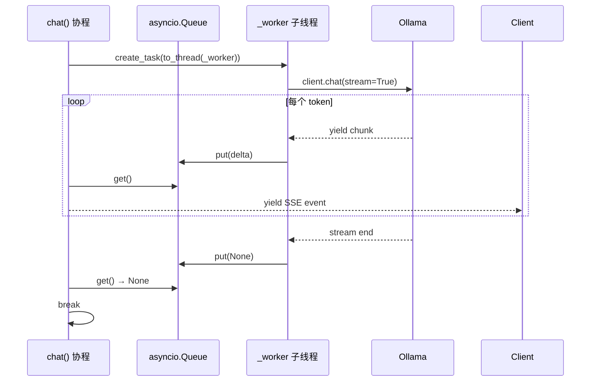

# YiAi-技术评审 — services-ai

> AI 对话服务的技术设计评审文档。覆盖 `chat_service.py`（OllamaService 类 + chat 模块函数）。
>
> **来源**：源码分析 `/rui doc --from-code services-ai`
> **证据等级**：B（只读源码 + 静态分析）
> **项目类型**：backend → 跳过 §4 组件、§5 交互、§6 DOM/事件

---

## 效果示意



---

## §1 架构设计

### 1.1 整体架构

```
chat_service.py
├── 模块级常量           IMAGE_FETCH_CHUNK(256KB) / MAX_BYTES(10MB) / SEMAPHORE(4)
├── _extract_user_only_text()  多模态 text 提取
├── _is_http_url()              URL 协议检查
├── _fetch_image_bytes()        HTTP 图片流式获取
├── _resolve_images()           图片统一解析入口
├── OllamaService                类式 Ollama 客户端
│   ├── _get_client()           认证 + host 配置
│   ├── generate_response()     chat + 重试
│   └── list_models()          模型列表查询
├── chat()                     异步对话入口（executor 调用）
└── list_ollama_models()       异步模型列表入口
```

### 1.2 图片解析管道



### 1.3 流式对话桥接



---

## §2 API / 方法签名

### 2.1 chat — 异步对话入口

| 参数 | 类型 | 必填 | 默认值 | 说明 |
|------|------|:---:|--------|------|
| system | string | — | "你是一个有用的AI助手。" | 系统提示词 |
| user | string | ✓ | "" | 用户输入 |
| model | string | — | qwen3.5（有图片时 qwen3-vl） | 模型名称 |
| stream | bool | — | false | 是否流式输出 |
| images | List[str] | — | — | 图片列表（data URI 或 HTTP URL） |

**非流式响应**：
```json
{"success": true, "model": "qwen3.5", "message": "你好！有什么可以帮助你的？"}
```

**流式响应**（异步生成器）：
```json
{"data": {"message": "你"}}
{"data": {"message": "好"}}
{"data": {"message": "！"}}
```

### 2.2 list_ollama_models — 模型列表查询

无必填参数。

**响应**：
```json
{"success": true, "models": [{"name": "qwen3.5:latest", ...}, ...]}
```

### 2.3 OllamaService.generate_response — 同步对话核心

| 参数 | 类型 | 默认值 | 说明 |
|------|------|--------|------|
| system_prompt | str | "你是一个有用的AI助手。" | 系统提示 |
| user_content | str | "" | 用户输入 |
| model_name | str | "qwen3.5" | 模型名 |
| images | List[bytes] | [] | 图片字节列表 |
| max_retries | int | 2 | 最大重试次数 |

### 2.4 OllamaService._get_client — 认证逻辑

```python
if auth:
    if ':' in auth:
        username, password = auth.split(':', 1)
    else:
        username, password = auth, ""
    return Client(host=url, auth=(username, password))
else:
    return Client(host=url)  # 无认证
```

---

## §3 数据模型

### 3.1 chat() 消息结构

```json
{
  "messages": [
    {"role": "system", "content": "<system_prompt>"},
    {"role": "user", "content": "<user_text>", "images": [<bytes>, ...]}
  ]
}
```

### 3.2 图片源类型

| 格式 | 示例 | 处理方式 |
|------|------|---------|
| data URI | `data:image/png;base64,iVBOR...` | 提取逗号后 base64 → `b64decode(validate=True)` |
| HTTP URL | `https://example.com/img.png` | `_fetch_image_bytes()` 流式下载 |
| 无效/空字符串 | `""` | 跳过 |

---

## §7 安全设计

### 7.1 图片获取安全边界

| 措施 | 实现 | 位置 |
|------|------|------|
| Content-Type 白名单 | 仅 `image/*` 类型 | `_fetch_image_bytes()`:43–45 |
| 大小限制 | 10MB 硬上限 | `_fetch_image_bytes()`:51–52 |
| 超时 | 15 秒 | `_fetch_image_bytes()`:38 |
| 并发限制 | Semaphore(4) | `_resolve_images()`:77 |
| 状态码检查 | 仅 2xx | `_fetch_image_bytes()`:41–42 |
| 静默失败 | 异常/超限/非图片返回 None，不中断对话 | 各异常分支 |

### 7.2 线程安全

- `chat()` 非流式：`run_in_executor(None, partial(...))` — 默认线程池
- `chat()` 流式：`asyncio.create_task(asyncio.to_thread(_worker))` — 独立线程
- `list_ollama_models()`：`run_in_executor(None, service.list_models)` — 默认线程池
- 流式 Queue 桥接：`run_coroutine_threadsafe(queue.put(...), loop)` — 跨线程安全

### 7.3 认证

- 支持 basic auth（`username:password` 格式）
- 配置驱动：`config.yaml` → `ollama.auth`
- 无认证时直接连接（localhost 场景）

---

## §8 性能设计

| 策略 | 实现 | 位置 |
|------|------|------|
| 线程池隔离 | 同步 Ollama 调用通过 run_in_executor 执行 | chat():227 / list_ollama_models():295 |
| 图片并发获取 | Semaphore(4) | chat_service.py:77 |
| 流式分块 | 子线程 yield → Queue → 协程消费 | chat():238–272 |
| 图片流式下载 | 256KB chunk | chat_service.py:47 |
| 重试退避 | 无退避（立即重试），最多 2 次 | generate_response():138–155 |
| 图片获取超时 | 每张图 15s | chat_service.py:38 |

---

### 主要价值

- 🤖 **统一 AI 接口** — 文本/图片/流式/非流式通过同一 `chat()` 入口
- 🔀 **双模执行** — 非流式线程池执行 + 流式子线程 + Queue 桥接
- 🖼️ **智能图片处理** — data URI 解码 + HTTP URL 并发获取，自动切换视觉模型
- 🔒 **多层安全边界** — 图片获取限制 Content-Type/大小/超时/并发数
- 🔄 **透明容错** — 调用失败自动重试 2 次，图片解析失败静默跳过

---

## 回溯链

| 来源 | 路径 | 证据级别 |
|------|------|---------|
| 源码 | `src/services/ai/chat_service.py` (299 lines) | A |
| 故事任务 | `YiAi-故事任务.md` §2 FP1–FP9 | A |
| 使用场景 | `YiAi-使用场景.md` 场景 1–5 | A |
| 配置 | `config.yaml` — ollama.url / ollama.auth | B |

### 变更记录

| 日期 | 版本 | 变更内容 | 来源 |
|------|------|---------|------|
| 2026-05-22 | 1.0.0 | 初始文档基线，从源码反推生成 | /rui doc --from-code services-ai |
