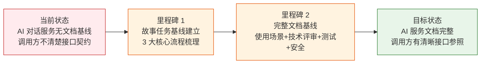

# YiAi-故事任务 — services-ai

> AI 对话服务层故事任务文档。覆盖 `chat_service.py`（Ollama 客户端封装 + 图片解析 + 流式对话）。
>
> **来源**：源码分析 `/rui doc --from-code services-ai`
> **证据等级**：B（只读源码 + 静态分析）
> **项目类型**：backend

---

## 效果示意

---

## §1 Story

### Story 1: 文本对话

| 字段 | 内容 |
|------|------|
| 作为 | 前端用户或自动化系统 |
| 我想要 | 向 AI 模型发送文本消息并获取回复 |
| 以便 | 集成 AI 对话能力到产品中 |
| 优先级 | P0 |
| 范围边界 | 仅支持 Ollama 兼容的模型；非流式模式下在线程池执行同步调用 |
| 依赖 | Ollama 服务可访问，目标模型已安装 |

#### §1.1 User Operations

| # | 操作 | 触发条件 | 操作步骤 | 预期结果 |
|---|------|---------|---------|---------|
| 1 | 发送文本对话（非流式） | 调用 `chat` 传入 user + system(可选) + model(可选) | 构建 messages → 线程池执行 generate_response → 返回结果 | 返回 {success, model, message} |
| 2 | 发送流式对话 | 调用 `chat` 传入 stream=True | 构建 messages → 子线程流式读取 → 通过队列逐块 yield | SSE 事件流，每块 {data: {message: chunk}} |
| 3 | 查询可用模型 | 调用 `list_ollama_models` | 线程池执行 list_models → 返回模型列表 | 返回 {success, models: [...]} |

---

### Story 2: 图片对话（多模态）

| 字段 | 内容 |
|------|------|
| 作为 | 前端用户 |
| 我想要 | 上传图片并让 AI 分析图片内容 |
| 以便 | 获得基于图片的 AI 分析和回答 |
| 优先级 | P1 |
| 范围边界 | 图片支持 data URI（base64）和 HTTP URL 两种格式；最大 10MB/张 |
| 依赖 | Story 1 文本对话能力；qwen3-vl 模型已安装 |

#### §1.1 User Operations

| # | 操作 | 触发条件 | 操作步骤 | 预期结果 |
|---|------|---------|---------|---------|
| 1 | 上传 base64 图片对话 | 调用 `chat` 传入 images=[data:image/...] | 解码 base64 → 切换模型为 qwen3-vl → 发送带图片的消息 | AI 返回图片分析结果 |
| 2 | 引用 HTTP 图片对话 | 调用 `chat` 传入 images=[https://...] | 并发 HTTP 获取图片（最多 4 并发）→ 切换模型 → 发送 | AI 返回图片分析结果 |
| 3 | 混合图片源对话 | 同时传入 data URI 和 HTTP URL 图片 | 混合解析 → 合并图片列表 → 发送 | AI 返回综合分析结果 |

---

### Story 3: 对话容错

| 字段 | 内容 |
|------|------|
| 作为 | 系统可靠性保障 |
| 我想要 | AI 调用失败时自动重试，不因单次失败中断服务 |
| 以便 | 提高 AI 对话的可用性 |
| 优先级 | P1 |
| 范围边界 | 仅对 Ollama 调用失败重试，不处理参数校验错误 |
| 依赖 | Story 1 对话能力 |

#### §1.1 User Operations

| # | 操作 | 触发条件 | 操作步骤 | 预期结果 |
|---|------|---------|---------|---------|
| 1 | 自动重试成功 | Ollama 调用失败（网络抖动/模型加载中） | 自动重试（最多 2 次）→ 任一次成功即返回 | 返回成功结果 |
| 2 | 重试耗尽 | 连续 max_retries+1 次均失败 | 记录最后一个错误 → 返回 success=false | 返回 {success: false, error: "..."} |

---

## §2 Requirements

### 功能点

| FP# | 描述 | 输入 | 输出 | 错误行为 | 优先级 |
|-----|------|------|------|---------|--------|
| FP1 | 文本对话 — 构建 system+user messages，调用 Ollama chat API | system_prompt + user_content + model_name | {success, model, message} | Ollama 调用失败 → 重试 → 最终失败返回 error | P0 |
| FP2 | 流式对话 — 子线程流式读取，通过 asyncio.Queue 逐块传递 | FP1 参数 + stream=True | SSE 异步生成器 | 子线程异常通过 queue 传递错误消息 | P0 |
| FP3 | 图片解析 — data URI base64 解码 + HTTP URL 并发获取 | images 列表 | List[bytes] | 解码失败跳过；HTTP 非 200/非 image 类型/超限 跳过 | P1 |
| FP4 | HTTP 图片获取 — 流式分块读取，256KB chunk，10MB 上限，15s 超时 | url 字符串 | bytes 或 None | 非 200 Content-Type 非 image/超限 → None | P1 |
| FP5 | 多模态自动切换 — 有图片参数时自动切换为 qwen3-vl 模型 | images 参数非空 | model_name = "qwen3-vl" | — | P1 |
| FP6 | 用户文本提取 — 多模态时从 user_content 中提取纯文本部分 | user_content（含 ## 当前消息 标记） | 提取后的纯文本 | 无标记时返回原文本 | P2 |
| FP7 | 模型列表查询 — 调用 Ollama list API | — | {success, models: [...]} | 调用失败返回 success=false + error | P1 |
| FP8 | 重试机制 — Ollama 调用失败自动重试，默认最多 2 次 | max_retries=2 | 同 FP1 | 全部重试失败返回 success=false | P1 |
| FP9 | 线程池隔离 — 同步 Ollama 调用在线程池执行，避免阻塞事件循环 | — | — | — | P1 |

### 业务规则

| R# | 描述 | 校验方式 | 证据级别 |
|----|------|---------|---------|
| R1 | 有图片参数时自动切换为 qwen3-vl 模型，忽略用户指定的 model | `chat()`:221–222 — `if has_images_param: model_name = "qwen3-vl"` | A |
| R2 | HTTP 图片获取限制：Content-Type 必须为 image/*，否则返回 None | `_fetch_image_bytes()`:43–45 | A |
| R3 | 每张图片最大 10MB，超限静默丢弃（返回 None） | `_fetch_image_bytes()`:51–52 | A |
| R4 | HTTP 图片并发上限 4，通过 Semaphore 控制 | `_IMAGE_FETCH_SEMAPHORE = 4` (:14) | A |
| R5 | Ollama 认证支持 basic auth（username:password 格式） | `OllamaService._get_client()`:106–111 | A |
| R6 | 同步 Ollama 调用必须在线程池中执行（run_in_executor） | `chat()`:227 / `list_ollama_models()`:295 | A |
| R7 | 流式模式下错误通过 queue 传递，不抛异常 | `_worker()`:260 — `queue.put(f"请求失败：{e}")` | A |
| R8 | base64 解码失败静默跳过（不阻断其他图片） | `_resolve_images()`:72–74 — try/except continue | A |

### 数据约束

| 约束 | 类型 | 范围/格式 | 来源 |
|------|------|----------|------|
| ollama_url | string | 有效 HTTP URL，默认 `http://localhost:11434` | config.yaml ollama.url |
| ollama_auth | string | `username:password` 格式或空 | config.yaml ollama.auth |
| model_name | string | 默认 `qwen3.5`；有图片时 `qwen3-vl` | `chat()`:215,222 |
| max_retries | int | 默认 2 | `generate_response()`:120 |
| IMAGE_FETCH_MAX_BYTES | int | 10,485,760 (10MB) | `chat_service.py`:13 |
| IMAGE_FETCH_CHUNK | int | 262,144 (256KB) | `chat_service.py`:12 |
| IMAGE_FETCH_SEMAPHORE | int | 4 | `chat_service.py`:14 |
| image timeout | float | 15.0 秒 | `_fetch_image_bytes()`:34 |

---

## §3 成功标准

| SC# | 描述 | 度量方式 | 目标值 | 优先级 | 关联 FP# |
|-----|------|---------|--------|--------|---------|
| SC1 | 用户可发送文本并获得 AI 回复 | 调用 chat(user="你好") → 检查返回 | success=true, message 非空 | P0 | FP1 |
| SC2 | 流式对话实时返回分块内容 | 调用 chat(user="你好", stream=True) → 迭代生成器 | 多块 SSE 事件，最终 None 结束 | P0 | FP2 |
| SC3 | AI 调用失败自动重试并成功 | mock Ollama 第一次失败第二次成功 | success=true（第二次成功） | P1 | FP8 |
| SC4 | 带图片的对话成功获取分析结果 | 传入有效 base64 图片 → chat | success=true, model="qwen3-vl" | P1 | FP3–FP5 |
| SC5 | 模型列表成功返回 | 调用 list_ollama_models() | success=true, models 为列表 | P1 | FP7 |

---

## §4 范围边界

### 范围内

| # | 条目 | 关联 FP# | 边界说明 |
|---|------|---------|---------|
| 1 | Ollama chat API 调用（文本 + 图片） | FP1, FP2, FP5 | 封装 Ollama Python 客户端 |
| 2 | 图片预处理（base64 解码 + HTTP 获取） | FP3, FP4 | data URI + HTTP URL 两种来源 |
| 3 | 流式响应（SSE 异步生成器） | FP2 | 子线程 + asyncio.Queue 桥接 |
| 4 | 模型列表查询 | FP7 | Ollama list API |
| 5 | 容错重试 | FP8 | 最多 2 次重试 |

### 范围外

| # | 条目 | 排除原因 | 替代方案 |
|---|------|---------|---------|
| 1 | 对话历史管理 | 由前端或上层服务管理 | 调用方自行维护 messages 列表 |
| 2 | Token 计数和计费 | 当前版本不涉及计费 | 后续可集成 |
| 3 | 模型下载和管理 | 由 Ollama 服务端管理 | `ollama pull` CLI |
| 4 | 非 Ollama 的 AI 提供商 | 当前仅集成 Ollama | 通过 OllamaService 扩展 |

---

## §5 AC

| AC# | Given | When | Then | 门禁 |
|-----|-------|------|------|------|
| AC1 | Ollama 服务可用，qwen3.5 模型已安装 | 调用 chat(user="你好") | 返回 success=true, message 非空 | Gate A |
| AC2 | Ollama 服务可用 | 调用 chat(user="你好", stream=True) | 返回异步生成器，逐块 yield SSE 格式数据 | Gate A |
| AC3 | 提供有效 data:image/png;base64,... 图片 | 调用 chat(user="分析图片", images=[base64data]) | model 自动切换为 qwen3-vl，返回分析结果 | Gate A |
| AC4 | Ollama 第一次调用失败 | 调用 chat（触发重试） | 自动重试，最终返回 success=true（若第二次成功） | Gate A |
| AC5 | Ollama 全部重试失败 | 调用 chat（Ollama 服务不可用） | 返回 success=false, error 含错误信息 | Gate A |
| AC6 | Ollama 服务可用 | 调用 list_ollama_models() | 返回 success=true, models 列表非空 | Gate A |

---

## §6 风险与假设

| # | 风险/假设 | 类型 | 可能性 | 影响 | 缓解/验证策略 | 关联 FP# |
|---|----------|------|--------|------|-------------|---------|
| 1 | Ollama 服务不可用导致所有 AI 功能瘫痪 | 风险 | M | H | 重试 2 次 + 返回明确错误信息而非崩溃 | FP8 |
| 2 | 恶意图片 URL（内网 SSRF）被用于探测内部服务 | 风险 | M | H | 当前无 URL 过滤（与 RSS 服务同问题） | FP4 |
| 3 | 超大 base64 图片导致内存溢出 | 风险 | L | M | 当前仅对 HTTP 图片有 10MB 限制，base64 无限制 | FP3 |
| 4 | 同步 Ollama 调用阻塞事件循环 | 风险 | M | H | 所有同步调用通过 run_in_executor 线程池执行 | FP9 |
| 5 | 图片 HTTP 获取超时导致对话卡住 | 风险 | M | M | 15s 超时 + 失败静默跳过（不阻断文本对话） | FP4 |
| 6 | Ollama 服务正常运行且目标模型已安装 | 假设 | — | — | 模型安装由运维负责；不存在的模型 Ollama 返回错误 | FP1 |

---

### 主要价值

- 🤖 **统一 AI 对话接口** — 文本和图片对话通过同一个 `chat()` 入口，自动切换模型
- 📡 **流式响应** — SSE 实时推送，子线程 + asyncio.Queue 桥接，不阻塞事件循环
- 🖼️ **多模态支持** — data URI 和 HTTP URL 双图片源，并发获取（最多 4 路）
- 🔄 **自动容错** — Ollama 调用失败自动重试最多 2 次，提高可用性
- 🛡️ **安全边界** — 图片 HTTP 获取限制 10MB + 15s 超时 + Content-Type 白名单

---

## 回溯链

| 来源 | 路径 | 证据级别 |
|------|------|---------|
| 源码 | `src/services/ai/chat_service.py` (299 lines) | A |
| 配置 | `config.yaml` — ollama.url / ollama.auth | B |

### 变更记录

| 日期 | 版本 | 变更内容 | 来源 |
|------|------|---------|------|
| 2026-05-22 | 1.0.0 | 初始文档基线，从源码反推生成 | /rui doc --from-code services-ai |
