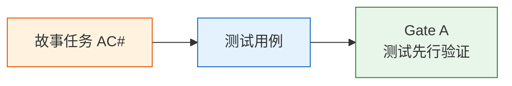

# YiAi-测试设计 — services-ai

> AI 对话服务的测试设计文档。覆盖 `chat_service.py` 全部公共函数 + OllamaService 类。
>
> **来源**：源码分析 `/rui doc --from-code services-ai`
> **证据等级**：B（只读源码 + 静态分析）
> **项目类型**：backend
>
> **注意**：`generate_response()` 和 `chat()` 依赖 Ollama 服务，测试时需 mock `ollama.Client` 或使用真实 Ollama 实例。

---

## 效果示意

---

## 测试用例

### TC1: chat — 非流式文本对话

| 字段 | 内容 |
|------|------|
| 关联 AC# | AC1 |
| 关联 FP# | FP1, FP9 |
| 前置条件 | mock OllamaService.generate_response 返回 {success: true, message: "你好"} |
| 输入 | `chat({user: "你好", system: "你是助手"})` |
| 预期 | 返回 {success: true, model: "qwen3.5", message: "你好"} |
| 验证点 | run_in_executor 被调用；参数正确传递 |

### TC2: chat — 默认参数

| 字段 | 内容 |
|------|------|
| 关联 AC# | AC1 |
| 关联 FP# | FP1 |
| 前置条件 | mock generate_response |
| 输入 | `chat({user: "你好"})`（不传 system/model） |
| 预期 | system="你是一个有用的AI助手。", model="qwen3.5" |
| 验证点 | 默认值生效 |

### TC3: chat — 流式对话

| 字段 | 内容 |
|------|------|
| 关联 AC# | AC2 |
| 关联 FP# | FP2 |
| 前置条件 | mock Ollama chat 流式返回 yield 3 个 chunk |
| 输入 | `chat({user: "你好", stream: True})` |
| 预期 | 异步生成器 yield 3 个 SSE event + None 结束 |
| 验证点 | 每个 chunk 格式为 {data: {message: str}} |

### TC4: chat — 流式错误处理

| 字段 | 内容 |
|------|------|
| 关联 AC# | AC2 |
| 关联 FP# | FP2, FP7(R7) |
| 前置条件 | mock Ollama 流式抛出异常 |
| 输入 | `chat({user: "你好", stream: True})` |
| 预期 | 生成器 yield 错误消息 {data: {message: "请求失败：..."}} → None |
| 验证点 | 错误消息通过 queue 传递；不抛未捕获异常 |

### TC5: chat — 图片对话自动切换模型

| 字段 | 内容 |
|------|------|
| 关联 AC# | AC3 |
| 关联 FP# | FP3, FP5 |
| 前置条件 | mock _resolve_images 返回 [b'imgdata'] |
| 输入 | `chat({user: "分析", images: ["data:image/png;base64,abcd"]})` |
| 预期 | model_name="qwen3-vl"；user_content 经 _extract_user_only_text 提取 |
| 验证点 | 模型自动切换；文本提取执行 |

### TC6: _resolve_images — data URI base64 解码

| 字段 | 内容 |
|------|------|
| 关联 AC# | AC3 |
| 关联 FP# | FP3 |
| 前置条件 | 提供有效 base64 图片字符串 |
| 输入 | `_resolve_images(["data:image/png;base64,iVBORw0KGgo="])` |
| 预期 | 返回 [bytes] 列表，内容为解码后的图片字节 |
| 验证点 | 逗号后内容被正确提取并 b64decode |

### TC7: _resolve_images — 无效 base64 跳过

| 字段 | 内容 |
|------|------|
| 关联 AC# | — |
| 关联 FP# | FP3 |
| 前置条件 | 提供无效 base64 |
| 输入 | `_resolve_images(["data:image/png;base64,!!!!invalid!!!!"])` |
| 预期 | 返回空列表（该图片被跳过） |
| 验证点 | base64.b64decode(validate=True) 抛异常 → 捕获 → continue |

### TC8: _resolve_images — HTTP URL 获取

| 字段 | 内容 |
|------|------|
| 关联 AC# | AC3 |
| 关联 FP# | FP3, FP4 |
| 前置条件 | mock _fetch_image_bytes 返回 b'imgdata' |
| 输入 | `_resolve_images(["https://example.com/img.png"])` |
| 预期 | 返回 [b'imgdata'] |
| 验证点 | HTTP URL 被正确识别并获取 |

### TC9: _resolve_images — 混合源

| 字段 | 内容 |
|------|------|
| 关联 AC# | AC3 |
| 关联 FP# | FP3 |
| 前置条件 | mock _fetch_image_bytes 返回 b'remote'；base64 解码返回 b'local' |
| 输入 | `_resolve_images(["data:image/png;base64,abcd", "https://example.com/img.png"])` |
| 预期 | 返回 [b'local', b'remote'] |
| 验证点 | 本地和远程图片合并返回 |

### TC10: _resolve_images — 空输入

| 字段 | 内容 |
|------|------|
| 关联 AC# | — |
| 关联 FP# | FP3 |
| 前置条件 | 无 |
| 输入 | `_resolve_images([])` 或 `_resolve_images(None)` |
| 预期 | 返回 [] |
| 验证点 | 空输入优雅处理 |

### TC11: _fetch_image_bytes — 正常获取

| 字段 | 内容 |
|------|------|
| 关联 AC# | — |
| 关联 FP# | FP4 |
| 前置条件 | mock aiohttp 返回 status=200, Content-Type=image/png, body=<10MB |
| 输入 | `_fetch_image_bytes("https://example.com/img.png")` |
| 预期 | 返回 bytes（图片内容） |
| 验证点 | 流式读取正确累积 |

### TC12: _fetch_image_bytes — 非 2xx 状态码

| 字段 | 内容 |
|------|------|
| 关联 AC# | — |
| 关联 FP# | FP4 |
| 前置条件 | mock aiohttp 返回 status=404 |
| 输入 | `_fetch_image_bytes("https://example.com/missing.png")` |
| 预期 | 返回 None |
| 验证点 | 非 2xx 静默返回 None |

### TC13: _fetch_image_bytes — Content-Type 非 image

| 字段 | 内容 |
|------|------|
| 关联 AC# | — |
| 关联 FP# | FP4, R2 |
| 前置条件 | mock aiohttp 返回 status=200, Content-Type=text/html |
| 输入 | `_fetch_image_bytes("https://example.com/page.html")` |
| 预期 | 返回 None |
| 验证点 | Content-Type 白名单过滤 |

### TC14: _fetch_image_bytes — 内容超 10MB

| 字段 | 内容 |
|------|------|
| 关联 AC# | — |
| 关联 FP# | FP4, R3 |
| 前置条件 | mock aiohttp 流式返回 >10MB 数据 |
| 输入 | `_fetch_image_bytes("https://example.com/huge.jpg")` |
| 预期 | 返回 None |
| 验证点 | 累积字节超限时中断并返回 None |

### TC15: _fetch_image_bytes — 超时

| 字段 | 内容 |
|------|------|
| 关联 AC# | — |
| 关联 FP# | FP4 |
| 前置条件 | mock aiohttp 触发 TimeoutError |
| 输入 | `_fetch_image_bytes("https://slow.example.com/img.png")` |
| 预期 | 返回 None（异常被 _resolve_images 的 _task 捕获） |
| 验证点 | 15s 超时配置；超时不阻断整体流程 |

### TC16: generate_response — 成功响应

| 字段 | 内容 |
|------|------|
| 关联 AC# | AC1 |
| 关联 FP# | FP1 |
| 前置条件 | mock ollama.Client.chat 返回 {message: {content: "Hi"}} |
| 输入 | `service.generate_response(user_content="Hello")` |
| 预期 | {success: true, model: "qwen3.5", message: "Hi"} |
| 验证点 | 响应格式正确 |

### TC17: generate_response — 重试成功

| 字段 | 内容 |
|------|------|
| 关联 AC# | AC4 |
| 关联 FP# | FP8 |
| 前置条件 | mock ollama.Client.chat 第一次抛异常、第二次返回成功 |
| 输入 | `service.generate_response(user_content="Hello", max_retries=2)` |
| 预期 | {success: true, message: "Hi"} |
| 验证点 | 第二次调用成功；共调用 2 次 |

### TC18: generate_response — 全部重试失败

| 字段 | 内容 |
|------|------|
| 关联 AC# | AC5 |
| 关联 FP# | FP8 |
| 前置条件 | mock ollama.Client.chat 连续 3 次抛异常 |
| 输入 | `service.generate_response(user_content="Hello", max_retries=2)` |
| 预期 | {success: false, error: "最后一次错误信息", model: "qwen3.5"} |
| 验证点 | 重试 3 次（attempt=0,1,2）后返回失败 |

### TC19: list_models — 成功

| 字段 | 内容 |
|------|------|
| 关联 AC# | AC6 |
| 关联 FP# | FP7 |
| 前置条件 | mock ollama.Client.list 返回 {models: [{name: "qwen3.5"}]} |
| 输入 | `service.list_models()` |
| 预期 | {success: true, models: [{name: "qwen3.5"}]} |
| 验证点 | 响应格式正确；兼容 dict 和对象两种格式 |

### TC20: list_models — 失败

| 字段 | 内容 |
|------|------|
| 关联 AC# | — |
| 关联 FP# | FP7 |
| 前置条件 | mock ollama.Client.list 抛异常 |
| 输入 | `service.list_models()` |
| 预期 | {success: false, error: "..."} |
| 验证点 | 异常被捕获并转为结构化错误 |

### TC21: _get_client — 无认证

| 字段 | 内容 |
|------|------|
| 关联 AC# | — |
| 关联 FP# | — |
| 前置条件 | ollama_auth 为空 |
| 输入 | `OllamaService(host="http://localhost:11434", auth="")._get_client()` |
| 预期 | Client(host="http://localhost:11434") 无 auth 参数 |
| 验证点 | 无认证场景正确处理 |

### TC22: _get_client — basic auth

| 字段 | 内容 |
|------|------|
| 关联 AC# | — |
| 关联 FP# | R5 |
| 前置条件 | ollama_auth="user:pass" |
| 输入 | `OllamaService(host="http://ollama:11434", auth="user:pass")._get_client()` |
| 预期 | Client(host=..., auth=("user", "pass")) |
| 验证点 | username:password 正确拆分 |

### TC23: _get_client — auth 仅用户名

| 字段 | 内容 |
|------|------|
| 关联 AC# | — |
| 关联 FP# | R5 |
| 前置条件 | ollama_auth="token123"（无冒号） |
| 输入 | `OllamaService(auth="token123")._get_client()` |
| 预期 | Client(auth=("token123", "")) |
| 验证点 | 无冒号时 password="" |

### TC24: _extract_user_only_text — 正常文本

| 字段 | 内容 |
|------|------|
| 关联 AC# | — |
| 关联 FP# | FP6 |
| 前置条件 | user_content 无 "## 当前消息" 标记 |
| 输入 | `_extract_user_only_text("分析这张图片")` |
| 预期 | "分析这张图片"（原样返回） |
| 验证点 | 无标记时不修改 |

---

## Gate A 交接信号

| 检查项 | 状态 | 说明 |
|--------|:---:|------|
| 测试用例覆盖全部 AC# | ✓ | AC1–AC6 均有 ≥1 TC |
| 测试用例覆盖全部公共函数 | ✓ | chat / list_ollama_models / generate_response / list_models / _resolve_images / _fetch_image_bytes / _extract_user_only_text / _get_client |
| 重试机制测试 | ✓ | TC17（重试成功）/ TC18（全部失败） |
| 图片管道测试 | ✓ | TC5–TC15（完整覆盖解析/获取/异常/限制） |
| 流式测试 | ✓ | TC3（正常）/ TC4（错误） |
| 安全边界测试 | ✓ | TC12（非 2xx）/ TC13（非 image）/ TC14（超 10MB）/ TC15（超时） |
| 认证测试 | ✓ | TC21（无认证）/ TC22（basic auth）/ TC23（仅用户名） |

---

### 主要价值

- ✅ **AC 全覆盖** — 24 个测试用例覆盖全部 6 个验收条件
- 🖼️ **图片管道完备** — 从解析到获取到异常处理全覆盖
- 🔄 **容错路径充分** — 重试成功/失败/图片跳过/流式错误全覆盖
- 🔒 **安全边界明确** — Content-Type/大小/超时/状态码四层验证

---

## 回溯链

| 来源 | 路径 | 证据级别 |
|------|------|---------|
| 故事任务 | `YiAi-故事任务.md` §5 AC1–AC6 | A |
| 使用场景 | `YiAi-使用场景.md` 场景 1–5 | A |
| 技术评审 | `YiAi-技术评审.md` §2 API 签名 | A |
| 源码 | `src/services/ai/chat_service.py` | A |

### 变更记录

| 日期 | 版本 | 变更内容 | 来源 |
|------|------|---------|------|
| 2026-05-22 | 1.0.0 | 初始文档基线，从源码反推生成 | /rui doc --from-code services-ai |
