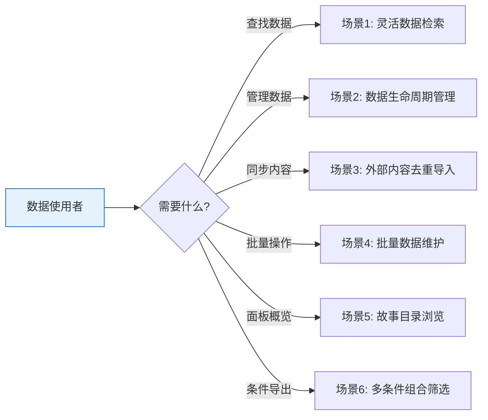

# YiAi-使用场景 — services-database

> 数据服务层的用户使用场景文档。从用户视角描述数据查询和管理的典型操作流程。
>
> **来源**：源码分析 `/rui doc --from-code services-database`
> **证据等级**：B（只读源码 + 静态分析）
> **项目类型**：backend
> **语言约束**：本节禁止包含技术术语（代码路径、API 路由、组件名、数据库驱动名）

---

## 效果示意

---

## 场景 1：灵活数据检索

### 场景描述
数据分析人员需要从系统中检索特定条件的数据，支持多种过滤方式：关键词搜索、日期范围、数值区间、分类筛选等。检索结果需要分页展示，并且可以指定只看某些字段。

### 前置条件
- 系统中已有数据集合
- 用户知晓要查询的数据类型（如文章、会话记录、状态快照等）

### 操作步骤

1. **确定数据范围**：用户指定要查询的数据类型名称
2. **设置过滤条件**（可组合）：
   - 输入关键词进行模糊搜索（多个关键词用逗号分隔）
   - 选择日期范围筛选
   - 设置数值区间（如价格、数量等）
   - 按分类标签精确筛选
3. **配置显示选项**：指定需要返回的字段列表，或指定不需要的字段
4. **设置分页**：指定页码和每页条数（最多 8000 条）
5. **执行查询**：提交查询请求
6. **查看结果**：获取数据列表、总条数、总页数

### 预期结果
- 返回符合所有过滤条件的数据列表
- 每条数据包含唯一标识
- 返回分页信息（当前页码、每页条数、总条数、总页数）
- 会话类数据自动隐藏大文本内容，仅返回元数据

### 异常情况
- 数据类型名称为空 → 提示"必须提供数据类型名称"
- 分页参数无效（非数字）→ 提示"分页参数必须是有效的整数"
- 查询的数据类型不存在 → 返回空列表（不报错）

---

## 场景 2：数据生命周期管理

### 场景描述
内容管理员需要完整管理一条数据从创建到删除的全过程：新增数据、查看详情、修改内容、删除废弃数据。

### 前置条件
- 用户有数据管理权限
- 目标数据类型已存在

### 操作步骤

#### 2.1 新增数据
1. 指定数据类型名称
2. 填写数据内容（标题、描述、标签等）
3. 提交创建请求
4. 系统自动生成唯一标识、创建时间、排序号
5. 返回新数据的唯一标识

#### 2.2 查看详情
1. 提供数据唯一标识
2. 提交查询请求
3. 获取完整数据内容（会话类数据自动隐藏大文本）

#### 2.3 修改数据
1. 提供数据唯一标识
2. 修改需要变更的字段内容
3. 提交更新请求
4. 系统自动刷新更新时间
5. 数据标识和创建时间保持不变

#### 2.4 删除数据
1. 提供数据唯一标识
2. 确认删除操作
3. 提交删除请求
4. 数据从系统中永久移除

### 预期结果
- 新增 → 数据入库，返回唯一标识
- 查看 → 返回完整数据内容
- 修改 → 仅变更指定字段，更新时间刷新
- 删除 → 数据被永久移除

### 异常情况
- 创建时数据为空 → 提示"创建数据不能为空"
- 更新/删除时标识不存在 → 提示"未找到数据"
- 更新时尝试修改系统字段（标识、创建时间）→ 系统自动忽略，不会被修改

---

## 场景 3：外部内容去重导入

### 场景描述
内容运营人员从外部来源（如 RSS 订阅、第三方平台）导入内容到系统，需要确保相同来源的内容不会重复导入。

### 前置条件
- 系统中已配置内容来源类型
- 外部内容具有唯一来源链接

### 操作步骤

1. **准备导入数据**：收集外部内容的标题、摘要、来源链接等信息
2. **创建内容记录**：提交数据到系统
3. **系统自动检查**：
   - 检查来源链接是否已存在
   - 如果链接已存在，拒绝创建并提示重复
   - 如果链接不存在，创建新记录
4. **更新已有内容**：如果是更新已存在的内容（而非新建），检查新链接是否与其他内容冲突
5. **自动生成指纹**：更新内容时，系统自动根据内容生成数字指纹，用于后续变更检测

### 预期结果
- 新链接 → 成功创建，返回唯一标识
- 重复链接 → 拒绝创建，明确提示"来源链接已存在"
- 更新内容 → 链接冲突时提示"已被其他记录使用"

### 异常情况
- 并发导入相同链接 → 数据库层面拦截重复，提示"唯一性约束冲突"
- 链接字段为空 → 跳过重复检查，正常创建

---

## 场景 4：批量数据维护

### 场景描述
运维人员需要对一批数据进行批量更新或条件性插入。对于已存在的数据更新；对于不存在的数据自动创建。

### 前置条件
- 明确批量操作的筛选条件
- 准备好要更新或新建的数据内容

### 操作步骤

1. **设定筛选条件**：指定哪些数据需要被更新（如按标签、状态等）
2. **准备更新内容**：指定要修改的字段和新值
3. **执行条件更新**：提交操作请求
4. **系统处理**：
   - 匹配筛选条件的数据 → 执行更新
   - 不匹配的数据 → 自动创建新记录
5. **查看结果**：返回匹配了多少条、修改了多少条、是否创建了新记录

### 预期结果
- 已存在且匹配 → 更新字段内容，更新时间为当前时间
- 不存在 → 创建新记录，自动生成标识、创建时间
- 返回统计信息：匹配数、修改数、新建标识

### 异常情况
- 筛选条件为空 → 提示"筛选条件是必需的"
- 更新数据为空 → 提示"更新数据是必需的"
- 数据类型名称为空 → 提示"数据类型名称是必需的"

---

## 场景 5：故事目录浏览

### 场景描述
项目管理者需要查看当前系统中所有活跃的项目故事目录，了解每个项目下有哪些故事任务、各有多少相关会话记录。

### 前置条件
- 系统中已有会话记录，且会话记录中标注了项目和故事名称

### 操作步骤

1. **打开故事面板概览**：访问故事目录列表接口
2. **查看目录清单**：系统返回按项目分组的目录列表，每项包含：
   - 项目名称
   - 故事名称
   - 目录路径
   - 关联会话数量
   - 最近活动时间
3. **按项目筛选**（可选）：指定项目名称，仅查看该项目的故事目录
4. **分页浏览**（可选）：当目录较多时翻页查看

### 预期结果
- 返回去重后的故事目录列表（相同项目和故事组合只出现一次）
- 按项目名称字母序排列，同一项目内按故事名称排列
- 每个目录项显示会话数量和最近活动时间

### 异常情况
- 系统中无会话记录 → 返回空列表，总数为 0
- 项目名称不存在 → 返回空列表

---

## 场景 6：多条件组合筛选

### 场景描述
高级用户需要组合多种过滤条件进行精确数据筛选，如"查找本月发布的、包含特定关键词的、阅读量在 1000-5000 之间的文章"。

### 前置条件
- 数据类型中存在可过滤的字段（日期、数值、文本等）
- 用户了解可用字段名称

### 操作步骤

1. **设置文本过滤**：输入关键词（支持逗号分隔的多个关键词，满足任一即匹配）
2. **设置日期过滤**：指定日期范围（开始日期 到 结束日期）
3. **设置数值区间**：指定数值字段的范围 [最小值, 最大值]
4. **设置分类过滤**：指定分类标签列表
5. **组合条件执行**：所有条件同时生效（AND 逻辑），执行查询
6. **查看筛选结果**

### 预期结果
- 返回同时满足所有条件的记录
- 文本搜索按"或"逻辑匹配（任一关键词命中）
- 数值和日期按"与"逻辑组合（必须在范围内）

### 异常情况
- 日期格式不正确 → 跳过日期过滤条件，不影响其他条件
- 数值格式错误 → 跳过该数值过滤条件
- 所有过滤条件都为空 → 返回全部数据（受分页限制）

---

### 主要价值

- 🔍 **一个接口查所有** — 无需为每种查询需求开发专用接口，组合过滤条件即可满足
- 📋 **完整数据生命周期** — 从创建到删除的全流程覆盖，操作可预期
- 🔒 **自动去重保护** — 导入外部内容时自动检测重复，避免数据污染
- 📊 **故事面板可见性** — 随时了解各项目的活跃故事和会话数量
- ⚡ **大字段自动优化** — 会话内容等大文本自动隐藏，列表查询快速响应

---

## 回溯链

| 来源 | 路径 | 证据级别 |
|------|------|---------|
| 故事任务 | `YiAi-故事任务.md` §1 Story 1–4 | A |
| 源码 | `src/services/database/data_service.py` | A |
| 源码 | `src/services/database/mongo_store.py` | A |

### 变更记录

| 日期 | 版本 | 变更内容 | 来源 |
|------|------|---------|------|
| 2026-05-22 | 1.0.0 | 初始文档基线，从源码反推生成 | /rui doc --from-code services-database |
