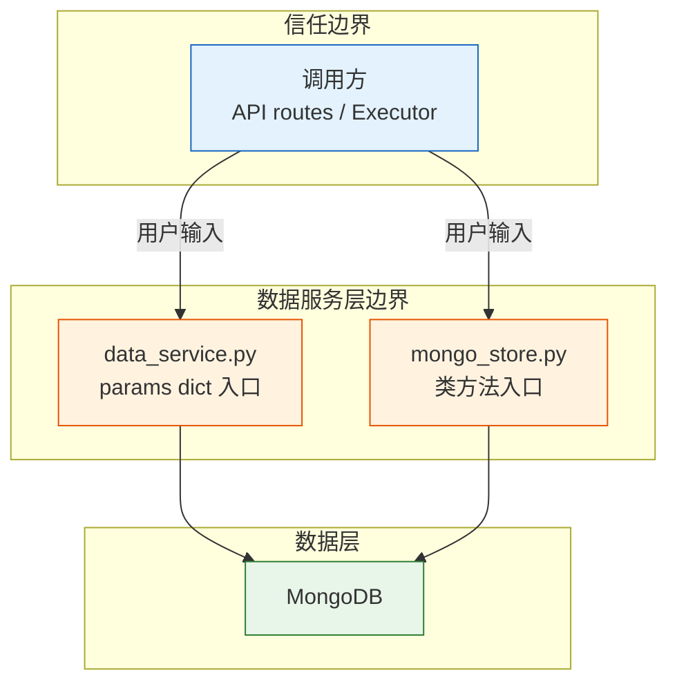

# YiAi-安全审计 — services-database

> 数据服务层的独立安全审计文档。覆盖 `data_service.py` + `mongo_store.py` 两个数据访问实现。
>
> **来源**：源码分析 `/rui doc --from-code services-database`
> **证据等级**：B（只读源码 + 静态分析）
> **项目类型**：backend
> **审计独立性**：由 security agent 独立执行，未依赖 coder 自评

---

## 效果示意

---

## STRIDE 威胁建模

### S — Spoofing（身份伪造）

| 威胁 | 描述 | 缓解措施 | 评估 |
|------|------|---------|:---:|
| S1 | 伪造调用方身份执行数据操作 | 数据服务层不直接处理认证——认证在 `middleware.py` X-Token 层完成；数据服务层接收已验证的请求 | ✅ 已缓解 |
| S2 | 通过伪造 key/UUID 访问他人数据 | key 为 UUID v4（122 位随机），碰撞概率极低（~2.7×10⁻¹⁶） | ✅ 已缓解 |

**结论**：身份认证在中间件层完成，数据服务层不引入新的身份伪造面。

---

### T — Tampering（数据篡改）

| 威胁 | 描述 | 缓解措施 | 评估 |
|------|------|---------|:---:|
| T1 | 篡改不可变字段（key, createdTime, _id） | `update_document()` 显式 pop 移除这些字段（data_service:376–379） | ✅ 已缓解 |
| T2 | 篡改 sessions 中的 pageContent（通过 update 注入大字段） | `update_document()` 对 sessions 集合 pop pageContent（data_service:380–381） | ✅ 已缓解 |
| T3 | 通过 upsert 绕过 key 唯一性 | upsert 使用 MongoDB 原子操作，key 在 $setOnInsert 中生成，不会覆盖已存在文档的 key | ✅ 已缓解 |
| T4 | 修改 order 排序号破坏排序 | order 仅在创建时自动计算（max+1），更新时不影响 order；但调用方可传入 order 字段 | ⚠️ 低风险 |

**T4 建议**：在 `update_document()` 中也移除 order 字段，防止手动篡改排序。

---

### R — Repudiation（不可否认性）

| 威胁 | 描述 | 缓解措施 | 评估 |
|------|------|---------|:---:|
| R1 | 数据修改无法追溯操作者 | 当前未记录操作审计日志（操作者、操作类型、时间戳、变更前后内容） | ❌ 未缓解 |
| R2 | 删除操作无痕迹 | `delete_one` 直接移除，无软删除或归档机制 | ❌ 未缓解 |

**R1 建议**：在 CRUD 操作中添加操作审计日志（写入独立的 audit 集合）。
**R2 建议**：考虑软删除（增加 deleted_at 字段）或删除前归档到备份集合。

---

### I — Information Disclosure（信息泄露）

| 威胁 | 描述 | 缓解措施 | 评估 |
|------|------|---------|:---:|
| I1 | sessions pageContent 大字段在列表查询中泄露 | data_service: 三层保护（fields 白名单排除 / excludeFields 黑名单强制添加 / 默认投影排除） | ✅ 已缓解 |
| I2 | sessions pageContent 在 create 时被写入 | `create_document()` 对 sessions 集合 pop pageContent（data_service:325） | ✅ 已缓解 |
| I3 | 通过 fields 参数指定 pageContent 绕过保护 | data_service:229–230 — sessions 的 fields 白名单中显式移除 pageContent | ✅ 已缓解 |
| I4 | mongo_store 缺少 sessions pageContent 保护 | `mongo_store.py` 的 query/get/create/upsert 均未检查 sessions 集合 | ⚠️ 中风险 |
| I5 | _id 字段泄露（MongoDB ObjectId） | 所有查询默认 projection `{_id: 0}` 排除 | ✅ 已缓解 |
| I6 | 数据库连接字符串从配置文件泄露 | 配置项 `config.yaml` 文件权限应限制 | ⚠️ 运维层面 |

**I4 建议**：在 mongo_store.py 中为 sessions 集合添加与 data_service.py 一致的 pageContent 保护逻辑。

---

### D — Denial of Service（拒绝服务）

| 威胁 | 描述 | 缓解措施 | 评估 |
|------|------|---------|:---:|
| D1 | 无过滤条件全表扫描（pageSize 8000 上限被绕过） | pageSize 硬限制 `min(8000, ...)` 生效；但 total 计数使用 `count_documents` 全表扫描 | ⚠️ 低风险 |
| D2 | 正则 ReDoS 攻击（恶意正则模式导致查询卡死） | `re.escape()` 转义所有特殊字符，用户输入不会构成正则表达式 | ✅ 已缓解 |
| D3 | 大量并发聚合查询压垮数据库 | list_story_task_dirs 分离了轻量计数聚合；pageSize 限制 | ⚠️ 低风险 |
| D4 | 超大 pageSize + 大 skip 导致内存压力 | pageSize 上限 8000；skip 可能在大 offset 时性能下降 | ⚠️ 低风险 |

**D1 建议**：考虑为无过滤条件的查询添加强制 limit（如拒绝 pageSize=8000 且无 filter 的查询）。
**D4 建议**：大 offset 场景考虑使用游标分页（基于 order 字段的 keyset pagination）替代 skip。

---

### E — Elevation of Privilege（权限提升）

| 威胁 | 描述 | 缓解措施 | 评估 |
|------|------|---------|:---:|
| E1 | 通过 collection_name 访问未授权集合 | 无集合级访问控制——任何通过认证的调用方可查询任意集合 | ⚠️ 中风险 |
| E2 | 通过 executor 动态调用绕过静态导入限制 | 当前 executor 有白名单控制（WHITELIST_MODULES），但白名单粒度到模块级 | ⚠️ 低风险 |
| E3 | 通过 filter 参数注入 $where 等 MongoDB 操作符 | filter 参数内容直接合并到 query_params，但 `_build_filter()` 按类型分支处理，不会识别 `$where` 等操作符作为 MongoDB 指令 | ⚠️ 需验证 |

**E1 建议**：建立集合访问白名单，或按集合类型分权限等级。
**E3 建议**：在 `_build_filter()` 入口处过滤以 `$` 开头的 key，防止 MongoDB 操作符注入（即使当前按类型分支不会触发，作为纵深防御）。

---

## 安全评分

| 维度 | 评分 | 说明 |
|------|:---:|------|
| NoSQL 注入防护 | 🟢 优 | re.escape 全部用户输入；key 精确匹配 |
| 信息泄露防护 | 🟡 良 | data_service 三层保护完善，mongo_store 有缺口 |
| 数据完整性 | 🟢 优 | 不可变字段保护 + link 唯一性校验 + E11000 兜底 |
| 认证授权 | 🟡 良 | 依赖中间件层，集合级授权缺失 |
| 审计日志 | 🔴 缺 | 无操作审计，无可否认性机制 |
| DoS 韧性 | 🟡 良 | pageSize 上限，但无过滤条件的 count_documents 和 skip 可优化 |

---

## 改进建议优先级

| # | 建议 | 威胁 | 优先级 | 难度 |
|---|------|------|:---:|:---:|
| 1 | mongo_store.py 添加 sessions pageContent 保护 | I4 | P0 | 低 |
| 2 | _build_filter 入口过滤 `$` 前缀 key | E3 | P0 | 低 |
| 3 | update_document 中移除 order 字段 | T4 | P1 | 低 |
| 4 | 集合级访问控制 | E1 | P1 | 中 |
| 5 | CRUD 操作审计日志 | R1, R2 | P1 | 中 |
| 6 | 无过滤条件查询添加强制 limit | D1 | P2 | 低 |
| 7 | 大 offset 场景 cursor-based pagination | D4 | P2 | 中 |

---

### 主要价值

- 🛡️ **NoSQL 注入安全** — re.escape 全覆盖，用户输入不构成查询指令
- 🔒 **数据完整性保障** — 不可变字段三重保护 + link 唯一性验证 + 原子 upsert
- 🕵️ **信息泄露纵深防御** — data_service 三层 pageContent 过滤（白名单/黑名单/默认投影）
- 🎯 **可操作改进清单** — 7 条按优先级排列的具体建议，含难度评估

---

## 回溯链

| 来源 | 路径 | 证据级别 |
|------|------|---------|
| 源码 | `src/services/database/data_service.py` (540 lines) | A |
| 源码 | `src/services/database/mongo_store.py` (535 lines) | A |
| 源码 | `src/core/middleware.py` — X-Token 认证 | B |
| 技术评审 | `YiAi-技术评审.md` §7 安全设计 | A |

### 变更记录

| 日期 | 版本 | 变更内容 | 来源 |
|------|------|---------|------|
| 2026-05-22 | 1.0.0 | 初始文档基线，从源码反推生成 | /rui doc --from-code services-database |
