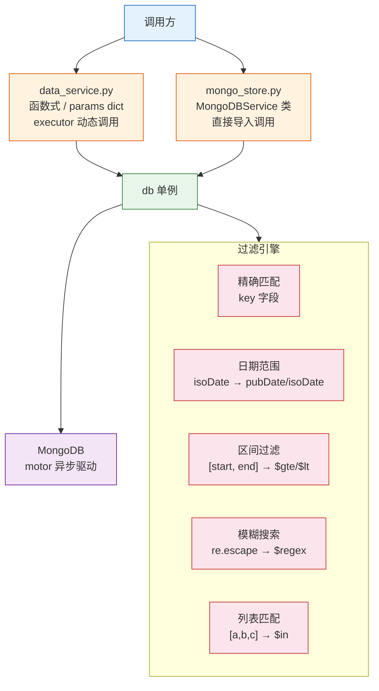
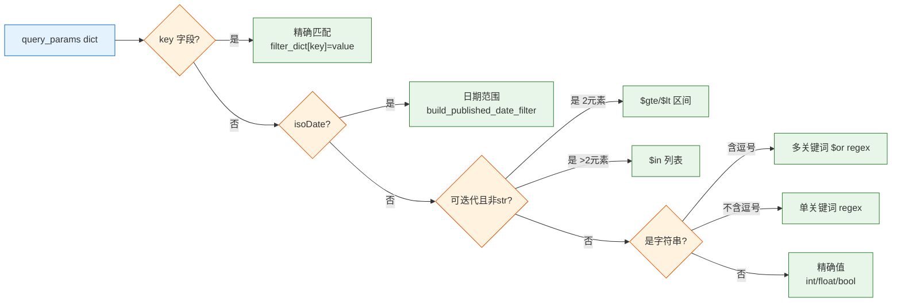
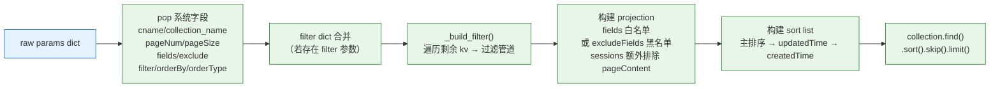

# YiAi-技术评审 — services-database

> 数据服务层的技术设计评审文档。覆盖 `data_service.py` 函数式接口 + `mongo_store.py` 类式封装的双实现。
>
> **来源**：源码分析 `/rui doc --from-code services-database`
> **证据等级**：B（只读源码 + 静态分析）
> **项目类型**：backend → 跳过 §4 组件、§5 交互、§6 DOM/事件

---

## 效果示意



---

## §1 架构设计

### 1.1 整体架构

数据服务层提供两套接口风格相同的实现，底层共享同一个 `db` 单例（`src/core/database.py` — `MongoDB` 类）。

| 文件 | 接口风格 | 调用方式 | 使用场景 |
|------|---------|---------|---------|
| `data_service.py` | 模块级 async 函数，参数通过 `params: Dict` 传递 | executor 动态调用（`module_name.method_name`） | API 路由 `/execution` 通用模块执行 |
| `mongo_store.py` | `MongoDBService` 类实例方法，参数显式类型化 | 直接 `import` 调用 | 业务模块内部调用（RSS 调度器等） |

### 1.2 过滤引擎管道



### 1.3 排序链策略

```
主排序字段 → updatedTime DESC → createdTime DESC
(当主排序为 'order' 时固定升序)
```

---

## §2 API / 方法签名

> 以 `data_service.py` 为主接口（executor 调用入口），`mongo_store.py` 为补充。

### 2.1 query_documents

```
POST /execution
{
  "module_name": "src.services.database.data_service",
  "method_name": "query_documents",
  "params": {
    "collection_name": "rss",
    "title": "AI,机器学习",
    "isoDate": "2026-01-01,2026-05-22",
    "pageNum": 1,
    "pageSize": 20,
    "fields": "title,link,pubDate"
  }
}
```

**参数说明**：

| 参数 | 类型 | 必填 | 默认值 | 说明 |
|------|------|:---:|--------|------|
| collection_name / cname | string | ✓ | — | MongoDB 集合名 |
| pageNum / page | int | — | 1 | 页码（≥1） |
| pageSize / limit | int | — | 2000 | 每页条数（1–8000） |
| fields / select | string | — | — | 逗号分隔的返回字段 |
| excludeFields / exclude | string | — | — | 逗号分隔的排除字段 |
| orderBy | string | — | order（apis 用 timestamp） | 排序字段 |
| orderType | string | — | asc | asc/desc |
| filter | dict | — | — | 额外过滤条件（合并到 query_params） |
| 其他任意字段 | any | — | — | 作为过滤条件（见 §1.2 过滤管道） |

**响应**：
```json
{
  "list": [...],
  "total": 1234,
  "pageNum": 1,
  "pageSize": 20,
  "totalPages": 62
}
```

### 2.2 get_document_detail

| 参数 | 类型 | 必填 | 说明 |
|------|------|:---:|------|
| collection_name / cname | string | ✓ | 集合名 |
| id | string | ✓ | 文档 key |

### 2.3 create_document

| 参数 | 类型 | 必填 | 说明 |
|------|------|:---:|------|
| collection_name / cname | string | ✓ | 集合名 |
| data | dict | — | 文档数据（未提供时用 params 其余字段） |

自动生成：`key`（UUID v4）、`createdTime`、`updatedTime`、`order`（max+1）。

### 2.4 update_document

| 参数 | 类型 | 必填 | 说明 |
|------|------|:---:|------|
| collection_name / cname | string | ✓ | 集合名 |
| data | dict | ✓（含 key） | 更新数据 |

受保护字段（自动移除）：`_id`、`key`、`createdTime`。sessions 额外移除 `pageContent`。

### 2.5 upsert_document

| 参数 | 类型 | 必填 | 说明 |
|------|------|:---:|------|
| collection_name / cname | string | ✓ | 集合名 |
| filter | dict | ✓ | MongoDB 查询条件 |
| update | dict | ✓ | 更新操作（含 $set/$setOnInsert） |

### 2.6 delete_document

| 参数 | 类型 | 必填 | 说明 |
|------|------|:---:|------|
| collection_name / cname | string | ✓ | 集合名 |
| key / id | string | ✓ | 文档标识 |

### 2.7 list_story_task_dirs

| 参数 | 类型 | 必填 | 默认值 | 说明 |
|------|------|:---:|--------|------|
| project_name / projectName | string | — | — | 按项目名过滤 |
| pageNum / page_num | int | — | 1 | 页码 |
| pageSize / page_size | int | — | 2000 | 每页条数 |

MongoDB aggregation pipeline: `$match` → `$group(projectName+storyName)` → `$sort` → `$skip` → `$limit`。

### 2.8 双实现差异对照

| 方法 | data_service.py | mongo_store.py | 差异 |
|------|:---:|:---:|------|
| query_documents | params dict | cname + query_params | 参数格式不同，语义相同 |
| get_document_detail | params dict | cname + id | mongo_store 不排除 sessions pageContent |
| create_document | params dict | cname + data | mongo_store 不排除 sessions pageContent |
| update_document | key-based | key OR link-based | mongo_store 支持 link 匹配 + contentHash 生成 |
| upsert_document | params dict | cname + filter + update | 参数格式不同，mongo_store 不处理 sessions |
| delete_document | params dict | cname + id | 参数格式不同，语义相同 |
| list_story_task_dirs | ✓ | — | data_service 独有 |

---

## §3 数据模型

### 3.1 查询参数流



### 3.2 文档创建字段

| 字段 | 来源 | 说明 |
|------|------|------|
| key | `str(uuid.uuid4())` | 全局唯一标识 |
| createdTime | `get_current_time()` | 创建时间 UTC |
| updatedTime | `get_current_time()` | 更新时间 UTC |
| order | `max_order + 1` | 自增排序号 |
| contentHash | `hashlib.md5(content)` | 仅 mongo_store 在 RSS 更新时生成 |
| 其他字段 | 用户提供的 data | 透传写入 |

---

## §7 安全设计

### 7.1 NoSQL 注入防护

```python
# _handle_string_search_filter() — data_service.py:127
filter_dict[key] = re.compile(f'.*{re.escape(value)}.*', re.IGNORECASE)
```

所有用户输入的搜索字符串均通过 `re.escape()` 转义后再构建正则表达式。`$regex` / `$where` / `$ne` 等 MongoDB 操作符不会被解析为查询指令，而是作为字面量字符串匹配。

**验证**：传入 `test.*$(`) → `re.escape` → `test\.\*\$\(` → 正则匹配字面量 `test.*$(`。

### 7.2 RSS Link 唯一性校验

- **create**：`find_one({'link': link})` → 存在则抛 `ValueError`
- **update (mongo_store)**：`find_one({'link': new_link})` → 存在且 key 不同则抛 `ValueError`
- **数据库层兜底**：`E11000 duplicate key error` 捕获并转换为用户友好错误

### 7.3 sessions pageContent 信息泄露防护

三层保护（data_service.py）：
1. `fields` 白名单模式 → 排除 pageContent
2. `excludeFields` 黑名单模式 → 强制添加 pageContent
3. 默认无 fields 参数 → 投影 `{pageContent: 0}`

mongo_store.py 缺少此保护，调用方需自行注意。

---

## §8 性能设计

| 策略 | 实现 | 位置 |
|------|------|------|
| 分页上限 | `pageSize = min(8000, max(1, ...))` | query_documents:213 |
| sessions 大字段排除 | projection 默认排除 pageContent | query_documents:240–241 |
| 连接池复用 | motor `AsyncIOMotorClient` 连接池 min=10, max=50 | core/database.py |
| 正则预编译 | `re.compile()` 复用 | _handle_string_search_filter |
| 聚合管道计数 | 分离 count aggregation（轻量） | list_story_task_dirs:524–531 |
| 排序链优化 | 固定后缀排序（updatedTime + createdTime） | _build_sort_list |

---

### 主要价值

- 🏗️ **双接口适配** — 函数式（executor 动态调用）+ 类式（直接 import）满足不同调用场景
- 🔍 **智能过滤管道** — 5 种过滤类型自动识别，调用方无需关心底层 MongoDB 查询语法
- 🛡️ **深度安全防护** — re.escape 防注入 + link 唯一性校验 + pageContent 三级防泄露
- 📄 **字段投影优化** — sessions 大字段自动排除，减少网络传输和反序列化开销
- 📊 **聚合统计能力** — list_story_task_dirs 用 MongoDB aggregation pipeline 高效去重

---

## 回溯链

| 来源 | 路径 | 证据级别 |
|------|------|---------|
| 源码 | `src/services/database/data_service.py` (540 lines) | A |
| 源码 | `src/services/database/mongo_store.py` (535 lines) | A |
| 故事任务 | `YiAi-故事任务.md` §2 FP1–FP13 | A |
| 使用场景 | `YiAi-使用场景.md` 场景 1–6 | A |
| 依赖 | `src/core/database.py` — db 单例 | B |
| 依赖 | `src/core/utils.py` — get_current_time, is_valid_date, is_number | B |

### 变更记录

| 日期 | 版本 | 变更内容 | 来源 |
|------|------|---------|------|
| 2026-05-22 | 1.0.0 | 初始文档基线，从源码反推生成 | /rui doc --from-code services-database |
