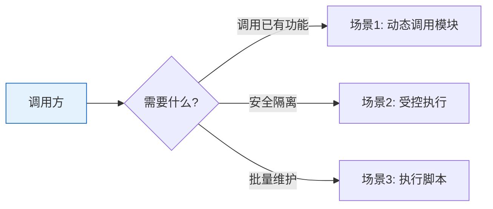

# YiAi-使用场景 — services-execution

> 受控模块执行器的使用场景文档。从用户视角描述动态调用、安全隔离、脚本执行的典型流程。
>
> **来源**：源码分析 `/rui doc --from-code services-execution`
> **证据等级**：B
> **项目类型**：backend

---

## 效果示意

---

## 场景 1：动态调用模块函数

### 场景描述
前端或其他服务需要调用某个已注册的服务方法（如查询数据、解析 RSS、AI 对话），通过统一的执行入口传入模块名和函数名即可调用。

### 前置条件
- 目标模块和函数已在允许列表中注册
- 已知模块的完整名称和函数名

### 操作步骤

1. **确定目标**：指定模块名称和要调用的函数名
2. **准备参数**：将参数打包为键值对
3. **提交执行**：通过统一入口提交请求
4. **系统处理**：白名单验证 → 参数解析 → 动态加载模块 → 在安全容器中执行
5. **获取结果**：返回函数的执行结果

### 预期结果
- 函数被正确执行
- 返回结果与直接调用一致
- 执行过程被自动记录（耗时、状态、摘要）

### 异常情况
- 模块或函数不在允许列表 → 拒绝执行并提示
- 参数格式错误（非键值对格式）→ 提示参数格式错误
- 模块不存在或加载失败 → 提示模块未找到
- 执行出现异常 → 返回具体错误信息

---

## 场景 2：受控安全执行

### 场景描述
系统管理员需要确保动态调用的模块在执行时受到多层安全保护：执行范围可配置、递归调用有深度限制、文件和网络访问有边界。

### 前置条件
- 安全策略已配置
- 安全组件已启用

### 操作步骤

1. **正常调用**：通过统一入口调用模块函数
2. **权限校验**：系统自动检查该模块+函数是否在允许范围内
3. **深度保护**：如果函数内部再次触发统一入口调用（递归），深度计数器递增
4. **资源限制**：执行过程中文件读写、网络访问受安全容器约束
5. **结果记录**：每次执行的结果自动存档（成功/失败、耗时、错误信息）

### 预期结果
- 允许范围内的调用正常执行
- 超出允许范围被拒绝
- 递归过深时被拦截（防止无限循环）
- 文件/网络操作在安全边界内

### 异常情况
- 递归调用超过最大深度 → 拦截并报错
- 安全容器组件不可用 → 降级为无额外保护模式继续执行
- 执行记录组件不可用 → 静默跳过，不影响执行

---

## 场景 3：执行脚本

### 场景描述
运维人员需要执行一个 Python 脚本（如数据迁移、批量处理），通过系统提交脚本路径即可运行。

### 前置条件
- 脚本文件存在于服务器上
- 脚本有执行权限

### 操作步骤

1. **指定脚本**：提供脚本文件的完整路径
2. **（可选）设置超时**：默认 5 分钟（300 秒）
3. **提交执行**：系统启动独立进程运行脚本
4. **等待结果**：脚本运行完成或超时
5. **获取输出**：返回标准输出、标准错误、退出码

### 预期结果
- 脚本成功执行 → 返回标准输出和退出码 0
- 脚本执行失败 → 返回标准错误和非零退出码

### 异常情况
- 执行超时 → 强制终止进程，返回超时错误
- 脚本路径不存在 → 返回执行失败和错误信息

---

### 主要价值

- 🔌 **一个入口调所有** — 无需为每个服务模块编写独立路由
- 🔒 **多层安全** — 允许列表 + 深度限制 + 资源隔离
- 📊 **自动记录** — 每次调用自动存档执行状态和性能

---

## 回溯链

| 来源 | 路径 | 证据级别 |
|------|------|---------|
| 故事任务 | `YiAi-故事任务.md` §1 Story 1–3 | A |
| 源码 | `src/services/execution/executor.py` | A |

### 变更记录

| 日期 | 版本 | 变更内容 | 来源 |
|------|------|---------|------|
| 2026-05-22 | 1.0.0 | 初始文档基线 | /rui doc --from-code services-execution |
