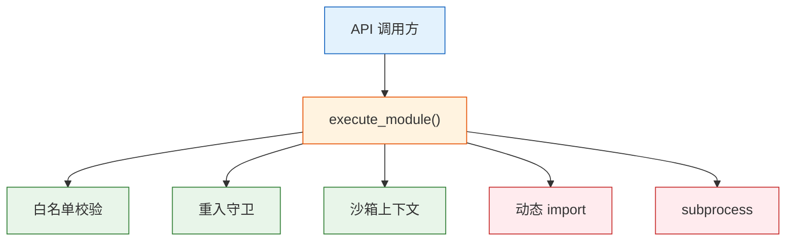

# YiAi-安全审计 — services-execution

> 受控模块执行器的独立安全审计。覆盖 `executor.py`。
>
> **来源**：源码分析 | **证据等级**：B | **审计独立性**：独立 security agent 执行

---

## 效果示意

---

## STRIDE 威胁建模

### S — Spoofing
| 威胁 | 缓解 | 评估 |
|------|------|:---:|
| 伪造调用方身份 | 认证在中间件层 | ✅ |

### T — Tampering
| 威胁 | 缓解 | 评估 |
|------|------|:---:|
| 篡改白名单配置 | 配置文件由管理员控制 | ⚠️ 运维层面 |
| 参数注入绕过白名单 | parse_parameters 强制 dict/JSON object | ✅ |

### R — Repudiation
| 威胁 | 缓解 | 评估 |
|------|------|:---:|
| 执行无审计 | SkillRecorder 记录每次执行 | ✅ best-effort |

### I — Information Disclosure
| 威胁 | 缓解 | 评估 |
|------|------|:---:|
| 错误消息泄露模块路径 | 异常消息含 module_path | ⚠️ 低风险 |
| 执行记录泄露参数 | 截断 500 字符 | ✅ |

### D — Denial of Service
| 威胁 | 缓解 | 评估 |
|------|------|:---:|
| 无限递归调用 | 重入守卫 max_depth 限制 | ✅ |
| 脚本执行资源耗尽 | 默认 300s 超时 + kill | ✅ |
| 恶意模块通过 import 加载 | 白名单限制 | ✅ |

### E — Elevation of Privilege
| 威胁 | 描述 | 缓解 | 评估 |
|------|------|------|:---:|
| E1 | `*` 通配符允许执行任意模块 | `*` 为紧急恢复手段，生产环境不应使用 | ⚠️ 中风险 |
| E2 | subprocess 命令注入 | 使用 `create_subprocess_exec('python3', script_path)` 非 shell 模式 | ✅ |
| E3 | importlib 动态导入任意模块 | 白名单限制，`*` 模式下可加载任意模块 | ⚠️ 同 E1 |

**E1 建议**：生产环境移除 `*` 通配符，或添加额外开关（如 `allow_wildcard=false`）。

---

## 安全评分

| 维度 | 评分 |
|------|:---:|
| 访问控制 | 🟢 优（白名单+守卫+沙箱三层） |
| 命令注入 | 🟢 优（subprocess 非 shell） |
| DoS | 🟢 优（深度限制+超时 kill） |
| 审计 | 🟡 良（best-effort 记录） |
| 通配符风险 | 🟡 良（生产环境避免 `*`） |

---

## 改进建议

| # | 建议 | 优先级 | 难度 |
|---|------|:---:|:---:|
| 1 | 生产环境禁止 `*` 通配符 | P1 | 低 |
| 2 | 错误消息脱敏（隐藏模块路径） | P2 | 低 |

---

## 回溯链

| 来源 | 路径 |
|------|------|
| 源码 | `src/services/execution/executor.py` |
| 技术评审 | `YiAi-技术评审.md` §7 |

### 变更记录

| 日期 | 版本 | 变更内容 |
|------|------|---------|
| 2026-05-22 | 1.0.0 | 初始 /rui doc --from-code |
