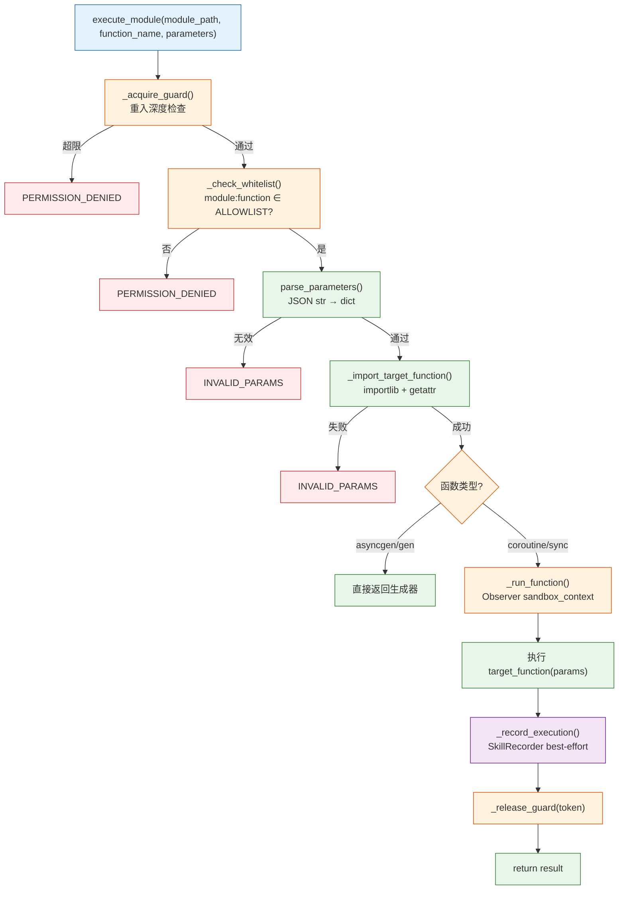
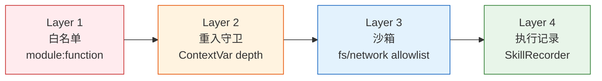

# YiAi-技术评审 — services-execution

> 受控模块执行器的技术评审。覆盖 `executor.py`（execute_module 主流程 + 白名单/沙箱/守卫/记录集成）。
>
> **来源**：源码分析 `/rui doc --from-code services-execution`
> **证据等级**：B
> **项目类型**：backend → 跳过 §4/§5/§6

---

## 效果示意



---

## §1 架构设计

### 1.1 执行管道

```
execute_module()
├── _acquire_guard()      ① 重入守卫（ContextVar 计数）
├── _check_whitelist()    ② 白名单验证（EXEC_ALLOWLIST set）
├── parse_parameters()    ③ 参数解析（dict/JSON string）
├── _import_target_function() ④ 动态导入（importlib + getattr）
├── 函数类型检测             ⑤ asyncgen/gen/coroutine/sync
│   ├── asyncgen/gen → 直接返回生成器
│   └── others → _run_function()
│       └── sandbox_context (fs_allowlist + network_allowlist)
├── _record_execution()   ⑥ best-effort 执行记录
└── _release_guard()      ⑦ 释放重入 token
```

### 1.2 安全层序



---

## §2 API / 方法签名

### 2.1 execute_module — 主入口

| 参数 | 类型 | 必填 | 说明 |
|------|------|:---:|------|
| module_path | str | ✓ | Python 模块路径 |
| function_name | str | ✓ | 目标函数名 |
| parameters | dict/str | ✓ | 函数参数 |

### 2.2 run_script — 脚本执行

| 参数 | 类型 | 默认值 | 说明 |
|------|------|--------|------|
| script_path | str | ✓ | 脚本路径 |
| timeout | int | 300 | 超时秒数 |

**实现**：`asyncio.create_subprocess_exec('python3', script_path, ...)` 而非 shell 字符串，防命令注入。

### 2.3 parse_parameters — 参数解析

```python
parse_parameters({"key": "val"})     # → {"key": "val"}
parse_parameters('{"key": "val"}')   # → {"key": "val"}
parse_parameters("bad json")         # → BusinessException(INVALID_PARAMS)
parse_parameters("[1,2,3]")          # → BusinessException(INVALID_PARAMS)
```

### 2.4 辅助函数

| 函数 | 作用 |
|------|------|
| `_check_whitelist(m, f)` | 校验在 `EXEC_ALLOWLIST` 或 `"*"` 通配 |
| `_import_target_function(m, f)` | importlib import + getattr |
| `_acquire_guard()` | ContextVar 递增，超限抛异常 |
| `_release_guard(token)` | ContextVar 恢复 |
| `_run_function(fn, params)` | 可选 sandbox_context 包裹 |
| `_record_execution(...)` | SkillRecorder best-effort 记录 |

---

## §3 数据模型

### 3.1 执行记录格式

```json
{
  "skill_name": "src.services.database.data_service:query_documents",
  "status": "success",
  "duration_ms": 45.2,
  "input_summary": "{'collection_name': 'rss', 'pageSize': 10, ...}",
  "output_summary": "{'list': [...], 'total': 1234, ...}",
  "error_message": ""
}
```

截断长度：500 字符。

---

## §7 安全设计

| 层 | 机制 | 阻断方式 | 降级 |
|----|------|---------|------|
| 白名单 | `module:function` set 匹配 | PERMISSION_DENIED | `*` 通配符 |
| 重入守卫 | ContextVar 深度计数器 | SERVER_ERROR(reentrancy) | guard disabled 时跳过 |
| 沙箱 | fs_allowlist + network_allowlist | Observer 异常 | sandbox disabled 时跳过 |
| 参数解析 | JSON decode + type check | INVALID_PARAMS | — |
| 脚本执行 | `create_subprocess_exec` 不经过 shell | — | — |

---

### 主要价值

- 🔒 **四层安全** — 白名单/重入守卫/沙箱/参数校验
- 🔌 **动态调用** — importlib + inspect 统一入口
- 📊 **全链路观测** — 每次执行自动记录耗时+状态+摘要

---

## 回溯链

| 来源 | 路径 | 证据级别 |
|------|------|---------|
| 源码 | `src/services/execution/executor.py` (255 lines) | A |

### 变更记录

| 日期 | 版本 | 变更内容 | 来源 |
|------|------|---------|------|
| 2026-05-22 | 1.0.0 | 初始文档基线 | /rui doc --from-code services-execution |
