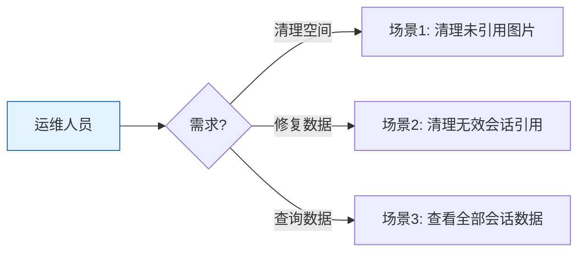

# YiAi-使用场景 — services-maintenance

> 系统维护子系统的使用场景文档。覆盖图片清理和会话数据访问。
>
> **来源**：源码分析 `/rui doc --from-code services-maintenance`
> **证据等级**：B | **项目类型**：backend

---

## 效果示意

---

## 场景 1：清理未引用图片

### 场景描述
系统中 sessions 文档通过 Markdown 或 HTML 引用了 static 目录下的图片。随着内容更新，部分图片不再被任何文档引用，但仍占用磁盘空间。需要识别并清理这些未引用图片。

### 操作步骤
1. 调用 cleanup API（默认 dry_run=true 预览模式）
2. 系统扫描 static 目录下所有图片文件
3. 系统从 sessions 集合中提取所有图片引用（Markdown/HTML/路径）
4. 比对两份清单，找出未被引用的图片
5. 返回未引用图片列表和大小统计
6. 确认无误后，使用 dry_run=false 执行实际删除

### 异常情况
- static 目录不存在 → 返回空图片集
- 删除单个文件失败 → 记录日志，继续处理其他文件

---

## 场景 2：清理无效会话引用

### 场景描述
某些 sessions 文档引用了已被删除的图片，产生无效引用。需要清理这些 sessions 以保持数据一致性。

### 操作步骤
1. 调用 cleanup API 时指定 cleanup_sessions=true
2. 系统逐条检查每个 session 的所有图片引用
3. 若引用的图片在 static 目录中不存在，标记该 session
4. 预览模式下仅统计，非预览模式实际删除 session

### 异常情况
- session 无 key 字段 → 跳过该条
- 删除 session 失败 → 记录日志，继续处理

---

## 场景 3：查看全部会话数据

### 场景描述
维护操作需要获取所有 sessions 文档的完整内容，用于引用分析和数据迁移。

### 操作步骤
1. 调用 get_all_sessions 获取全部文档
2. 返回内存中的文档列表
3. 上层服务遍历文档提取信息

### 异常情况
- 数据库未初始化 → 自动初始化
- 集合为空 → 返回空列表

---

### 主要价值

- 🧹 **磁盘释放** — 自动识别未引用图片，安全预览后清理
- 🔍 **智能解析** — 3 种正则覆盖 Markdown/HTML/路径引用格式
- 🛡️ **安全优先** — 默认 dry_run，双重确认再执行
- 📊 **完整报告** — 文件数/大小/释放空间/清理 session 数

---

## 回溯链

| 来源 | 路径 |
|------|------|
| 故事任务 | `YiAi-故事任务.md` §1 Story 1–2 |
| 源码 | `src/api/routes/maintenance.py` |

### 变更记录

| 日期 | 版本 | 变更内容 |
|------|------|---------|
| 2026-05-22 | 1.0.0 | 初始 /rui doc --from-code |
