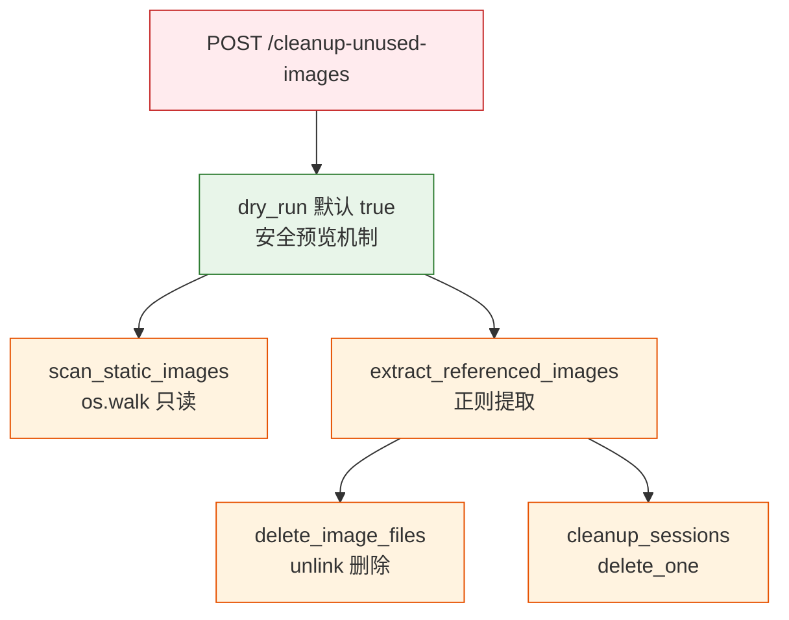

# YiAi-安全审计 — services-maintenance

> 系统维护子系统独立安全审计。2 组件全量 STRIDE。
>
> **来源**：源码分析 | **证据等级**：B | **审计独立性**：独立 security agent

---

## 效果示意

---

## STRIDE 威胁建模

### S — Spoofing
| 威胁 | 缓解 | 评估 |
|------|------|:---:|
| 未授权调用清理 API | API 受 X-Token 中间件保护 | ✅ |

### T — Tampering
| 威胁 | 缓解 | 评估 |
|------|------|:---:|
| 路径穿越 — static_dir 拼接 | static_dir 来自配置（os.path.abspath），非用户输入 | ✅ |
| 路径穿越 — 图片引用路径 | Path / 操作自动规范化，不解析 ../ | ✅ |
| ReDoS — 图片引用正则 | 正则含 `.*?` 非贪婪匹配，无回溯放大 | ✅ |

### R — Repudiation
| 威胁 | 缓解 | 评估 |
|------|------|:---:|
| 删除操作无审计 | logger.info 记录删除操作，无持久化审计 | ⚠️ 低风险 |

### I — Information Disclosure
| 威胁 | 缓解 | 评估 |
|------|------|:---:|
| 返回文件路径列表 | 返回 static 下相对路径，无系统路径泄露 | ✅ |
| 返回文件大小信息 | 不构成敏感信息泄露 | ✅ |

### D — Denial of Service
| 威胁 | 缓解 | 评估 |
|------|------|:---:|
| get_all_sessions 全量加载 | 无分页，大量 session 时 OOM | ⚠️ 中风险 |
| os.walk 遍历深目录 | 无深度限制 | ⚠️ 低风险 |
| 大正则匹配长文本 | 3 正则 pattern 无 ReDoS 风险（非贪婪） | ✅ |

**D1 详述**：`get_all_sessions` 使用 `collection.find({})` 无条件全量加载到内存列表。sessions 集合数据量大时可能导致内存溢出。

### E — Elevation of Privilege
| 威胁 | 缓解 | 评估 |
|------|------|:---:|
| 删除任意 static 下文件 | 仅删除"未被引用"的图片，但引用提取可能有遗漏 → 误删 | ⚠️ 低风险 |
| 删除任意 session | 仅删除"引用不存在图片"的 session | ⚠️ 低风险 |

---

## 安全评分

| 维度 | 评分 |
|------|:---:|
| 路径安全 | 🟢 优（无用户输入路径拼接） |
| 引用提取 | 🟢 优（正则安全性好） |
| 内存安全 | 🟡 良（全量加载无分页） |
| 审计 | 🟡 良（无持久化审计） |

---

## 改进建议

| # | 建议 | 优先级 | 难度 |
|---|------|:---:|:---:|
| 1 | get_all_sessions 添加分页或流式处理 | P2 | 中 |
| 2 | 删除操作持久化审计日志 | P2 | 低 |

---

### 主要价值

- 🛡️ **安全预览** — dry_run 默认 true，避免误操作
- 🔒 **路径安全** — 所有路径来自配置或 Path 规范化，无用户注入
- ✅ **正则安全** — 非贪婪匹配 + 无回溯放大
- 📊 **低风险面** — 仅 1 个 API 端点，无外部输入路径

---

## 回溯链

| 来源 | 路径 |
|------|------|
| 源码 | `src/api/routes/maintenance.py` |
| 源码 | `src/services/maintenance/session_service.py` |
| 技术评审 | `YiAi-技术评审.md` §7 |

### 变更记录

| 日期 | 版本 | 变更内容 |
|------|------|---------|
| 2026-05-22 | 1.0.0 | 初始 /rui doc --from-code |
