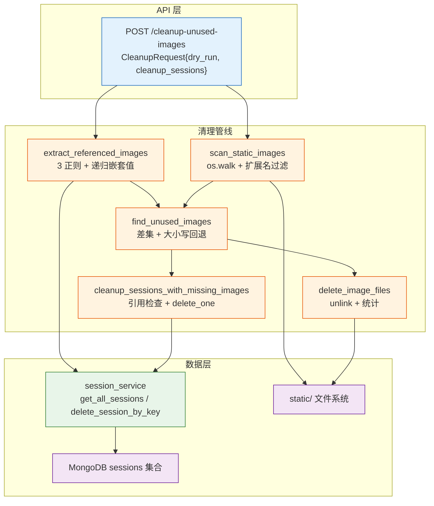
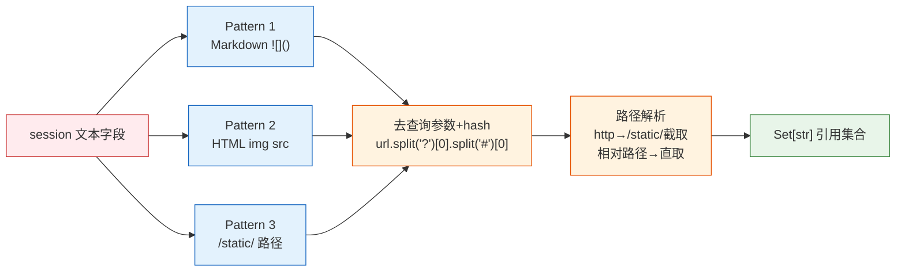

# YiAi-技术评审 — services-maintenance

> 系统维护子系统技术评审。2 组件架构与接口设计。
>
> **来源**：源码分析 | **证据等级**：B | **项目类型**：backend → 跳过 §4/§5/§6

---

## 效果示意



---

## §1 架构设计

### 1.1 组件关系

| 组件 | 层级 | 激活方式 | 配置驱动 |
|------|------|---------|---------|
| session_service | 数据访问 | maintenance API 调用 | collection_sessions |
| maintenance API | 路由层 | HTTP POST | static_base_dir |

### 1.2 图片引用提取管线



### 1.3 嵌套值递归

`_extract_refs_from_value` 递归处理三种类型：
- `str` → 直接提取引用
- `list` → 遍历递归
- `dict` → 遍历 values 递归

---

## §2 API / 方法签名

### cleanup-unused-images

```
POST /cleanup-unused-images
POST /maintenance/cleanup-unused-images  (备选路径)
```

| 参数 | 类型 | 默认值 | 说明 |
|------|------|--------|------|
| dry_run | bool | True | 预览模式，不实际删除 |
| cleanup_sessions | bool | False | 是否清理无效 sessions |

返回值：
```json
{
  "dry_run": true,
  "summary": {
    "total_images_found": N,
    "total_images_referenced": N,
    "unused_images_count": N,
    "unused_images_size_mb": N,
    "deleted_count": N,
    "freed_space_mb": N,
    "cleaned_sessions_count": N
  },
  "unused_images": [{"path": "...", "size_bytes": N, "size_kb": N}]
}
```

### session_service

```python
await get_all_sessions() -> List[Dict[str, Any]]
await delete_session_by_key(session_key: str) -> int
```

---

## §3 数据设计

### 图片扩展名白名单

| 扩展名 | 说明 |
|--------|------|
| .png/.jpg/.jpeg | 常规图片 |
| .gif | 动图 |
| .webp | 现代格式 |
| .svg | 矢量图 |
| .bmp | 位图 |
| .ico | 图标 |

### 引用正则模式

| 模式 | 匹配示例 |
|------|---------|
| `!\[.*?\]\((.*?)\)` | `` |
| `]+src=["'](.*?)["']` | `` |
| `(?:https?://[^/]+)?/static/([^\s"'>]+)` | `/static/img.png` |

---

### 主要价值

- 🧹 **清理管线** — 6 步管线：扫描→提取→比对→删除图片→清理session→统计
- 🔍 **3 正则引用提取** — Markdown/HTML/路径全覆盖 + 递归嵌套值
- 🛡️ **安全预览** — dry_run 默认 true，零风险预览
- 📊 **详细统计** — 文件数/大小/MB/清理数完整报告

---

## 回溯链

| 来源 | 路径 |
|------|------|
| 源码 | `src/api/routes/maintenance.py` (271 行) |
| 源码 | `src/services/maintenance/session_service.py` (27 行) |
| 故事任务 | `YiAi-故事任务.md` |

### 变更记录

| 日期 | 版本 | 变更内容 |
|------|------|---------|
| 2026-05-22 | 1.0.0 | 初始 /rui doc --from-code |
