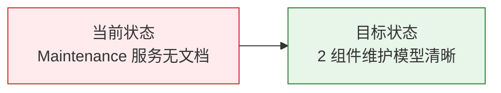

# YiAi-故事任务 — services-maintenance

> 系统维护子系统故事任务。覆盖 session 数据访问 (session_service) 和图片清理 (maintenance API) 2 个组件。
>
> **来源**：源码分析 `/rui doc --from-code services-maintenance`
> **证据等级**：B（只读源码 + 静态分析）
> **项目类型**：backend

---

## 效果示意

---

## §1 Story

### Story 1: Session 数据访问（session_service）

| 字段 | 内容 |
|------|------|
| 作为 | 维护 API 路由 |
| 我想要 | 封装 sessions 集合的查询和删除操作 |
| 以便 | 维护功能（如图片清理）能简洁地操作会话数据 |
| 优先级 | P1 |
| 范围边界 | sessions 集合的 find({}) 和 delete_one |

#### §1.1 User Operations

| # | 操作 | 触发条件 | 操作步骤 | 预期结果 |
|---|------|---------|---------|---------|
| 1 | 获取全部会话 | 图片清理流程启动 | db.initialize → collection.find({}) → 遍历 cursor → 返回列表 | List[Dict] 全部 sessions 文档 |
| 2 | 按 key 删除会话 | 发现无效引用会话 | delete_one({'key': key}) → 返回 deleted_count | 0 或 1 |

---

### Story 2: 图片清理（maintenance API）

| 字段 | 内容 |
|------|------|
| 作为 | 系统运维人员 |
| 我想要 | 扫描并清理未被引用的静态图片和关联的无效 sessions |
| 以便 | 释放磁盘空间，保持静态文件目录整洁 |
| 优先级 | P1 |
| 范围边界 | static 目录图片扫描 → sessions 引用提取 → 差异比对 → 清理 |

#### §1.1 User Operations

| # | 操作 | 触发条件 | 操作步骤 | 预期结果 |
|---|------|---------|---------|---------|
| 1 | 预览未使用图片 | 运维执行 cleanup API (dry_run=true) | 扫描 static → 提取引用 → 差集 → 统计大小 | 返回未使用图片列表和统计 |
| 2 | 实际删除图片 | 运维执行 cleanup API (dry_run=false) | 同上 + unlink 每个未使用文件 | 返回删除数量和释放空间 |
| 3 | 清理无效 sessions | 运维开启 cleanup_sessions=true | 逐 session 检查图片引用是否存在 → 删除无效 session | 返回清理的 session 数 |

---

## §2 Requirements

### 功能点

| FP# | 描述 | 组件 | 优先级 |
|-----|------|------|:---:|
| FP1 | 获取全部 sessions — find({}) 遍历 cursor | session_service | P1 |
| FP2 | 按 key 删除 session — delete_one | session_service | P1 |
| FP3 | 扫描 static 图片 — os.walk + 扩展名过滤 | maintenance | P1 |
| FP4 | 提取图片引用 — 3 正则 + 递归嵌套值 | maintenance | P1 |
| FP5 | 差异比对 — 大小写不敏感回退 | maintenance | P1 |
| FP6 | 删除未使用图片 — unlink + 统计 | maintenance | P1 |
| FP7 | 清理无效 session — 图片引用逐条检查 | maintenance | P2 |
| FP8 | dry_run 模式 — 默认不实际删除 | maintenance | P1 |

### 业务规则

| R# | 描述 | 证据级别 |
|----|------|:---:|
| R1 | 支持 8 种图片扩展名：.png/.jpg/.jpeg/.gif/.webp/.svg/.bmp/.ico | A |
| R2 | 图片引用提取用 3 种正则模式：Markdown 、HTML img、/static/ 路径 | A |
| R3 | URL 引用自动去查询参数和 hash | A |
| R4 | 大小写不敏感回退：精确匹配失败后 lower() 二次比对 | A |
| R5 | 最多返回 100 条未使用图片详情（防 OOM） | A |
| R6 | 删除图片时单个失败不阻断，仅 logger.error | A |

---

## §3 成功标准

| SC# | 描述 | 优先级 |
|-----|------|:---:|
| SC1 | 扫描正确识别所有 static 目录下的图片文件 | P1 |
| SC2 | 从 sessions 中正确提取 Markdown/HTML/路径引用 | P1 |
| SC3 | dry_run=true 时不删除任何文件 | P0 |
| SC4 | 未引用图片被正确识别和统计 | P1 |

---

## §4 范围边界

**范围内**：static 图片清理 + sessions 维护数据访问
**范围外**：其他文件类型清理、自动定时清理

---

## §5 AC

| AC# | Given | When | Then | 门禁 |
|-----|-------|------|------|------|
| AC1 | static 目录有 3 张图，sessions 只引用 1 张 | POST /cleanup-unused-images dry_run=true | unused_images_count=2，deleted_count=0 | Gate A |
| AC2 | static 目录有未引用图片 | POST dry_run=false | 图片文件被删除，freed_space > 0 | Gate A |
| AC3 | session 引用不存在的图片 | POST cleanup_sessions=true | 该 session 被删除 | Gate A |
| AC4 | 引用含 URL query 参数 ?v=2 | extract_referenced_images | 正确剥离参数，提取路径 | Gate A |

---

### 主要价值

- 🧹 **磁盘清理** — 自动识别和删除未引用图片，释放空间
- 🔍 **智能引用提取** — 3 正则模式覆盖 Markdown/HTML/路径三种引用
- 🛡️ **安全预览** — dry_run 默认开启，先看再删
- 📊 **详细统计** — 返回文件数/大小/MB/删除数完整报告

---

## 回溯链

| 来源 | 路径 | 证据级别 |
|------|------|---------|
| 源码 | `src/services/maintenance/session_service.py` (27 行) | A |
| 源码 | `src/api/routes/maintenance.py` (271 行) | A |
| 依赖 | `src/core/config.py` — static_base_dir | B |

### 变更记录

| 日期 | 版本 | 变更内容 | 来源 |
|------|------|---------|------|
| 2026-05-22 | 1.0.0 | 初始文档基线 | /rui doc --from-code services-maintenance |
