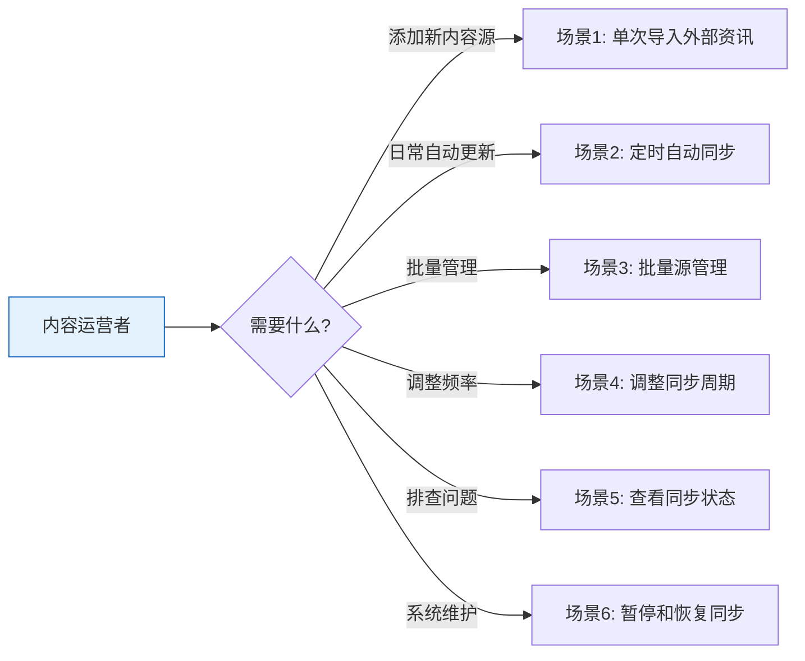

# YiAi-使用场景 — services-rss

> RSS 订阅服务的用户使用场景文档。从用户视角描述内容订阅和定时更新的典型操作流程。
>
> **来源**：源码分析 `/rui doc --from-code services-rss`
> **证据等级**：B（只读源码 + 静态分析）
> **项目类型**：backend
> **语言约束**：本节禁止包含技术术语（代码路径、API 路由、组件名、数据库驱动名）

---

## 效果示意

---

## 场景 1：单次导入外部资讯

### 场景描述
内容运营人员发现一个新的优质资讯源，希望立即将其内容导入系统，无需等待定时任务触发。

### 前置条件
- 已获得资讯源的访问地址
- 该地址返回有效的订阅格式内容

### 操作步骤

1. **准备源地址**：获取资讯源的完整访问地址
2. **执行导入**：提交导入请求，传入源地址和可选的源名称
3. **等待处理**：系统自动完成以下步骤：
   - 连接到外部资讯源（最长等待 60 秒）
   - 检查内容大小是否合规（超过 10MB 会拒绝）
   - 分块读取内容
   - 解析文章列表
   - 逐条检查是否已存在（按来源链接去重）
4. **查看结果**：返回处理统计 —— 新增了多少条、更新了多少条、总共处理了多少条

### 预期结果
- 新增的内容自动分配唯一标识和创建时间
- 已存在的内容保留原有标识，仅更新标题、摘要等字段
- 返回明确的处理统计数字

### 异常情况
- 源地址无法访问 → 提示"获取订阅源失败"和具体原因
- 源地址返回非 200 状态 → 提示 HTTP 状态码
- 内容超过 10MB → 提示"订阅源过大，超过限制"
- 源格式无法解析 → 提示"解析订阅源失败"（但格式警告不阻断处理）

---

## 场景 2：定时自动同步

### 场景描述
系统管理员希望已配置的资讯源能定期自动同步，无需每天手动操作。系统启动后自动开始定时更新。

### 前置条件
- 系统中已配置至少一个启用的资讯源
- 系统支持定时任务功能

### 操作步骤

1. **系统启动**：服务器启动时，系统自动检查定时同步开关
2. **自动恢复**：如果有启用的源且开关打开，自动启动定时任务
3. **后台运行**：定时任务按配置的周期在后台静默执行：
   - 查询所有启用的资讯源
   - 同时拉取（最多 3 个并发）
   - 每个源的条目按链接去重入库
4. **日志记录**：每次执行完成后记录成功和失败数量

### 预期结果
- 服务器启动后自动开始定时同步
- 每次定时触发时自动拉取所有启用源
- 单个源失败不影响其他源
- 执行结果记录在系统日志中

### 异常情况
- 定时任务启动失败 → 仅记录警告，不影响其他系统功能
- 所有源都未启用 → 不做任何操作，返回空结果
- 某个源拉取失败 → 记录失败，继续处理下一个源

---

## 场景 3：批量源管理

### 场景描述
运营人员管理着数十个资讯源，需要一次性对所有启用的源执行同步，而非逐个操作。

### 前置条件
- 系统中已配置资讯源并标记为启用状态
- 资讯源列表中至少有一个条目

### 操作步骤

1. **触发批量同步**：执行"同步所有启用的资讯源"操作
2. **系统查询源列表**：自动查找所有启用的源（排除已禁用的和没有地址的）
3. **并发处理**：同时处理最多 3 个源，避免对目标网站造成过大访问压力
4. **汇总结果**：返回处理统计 —— 总共多少个源、成功几个、失败几个、每个源的详细结果

### 预期结果
- 所有启用的源被并发处理
- 返回完整的执行报告（每个源的成功/失败状态和条目统计）
- 失败的源不影响成功的源

### 异常情况
- 没有启用的源 → 返回总计 0，不报错
- 查询源列表失败 → 返回空列表，不阻断后续流程

---

## 场景 4：调整同步周期

### 场景描述
运维人员发现默认的同步频率太高或太低，需要调整定时任务的执行周期，调整后立即生效无需重启服务器。

### 前置条件
- 定时同步任务已在运行
- 了解可用的两种模式：固定间隔和定时表达式

### 操作步骤

#### 4.1 设置固定间隔
1. 选择"间隔模式"
2. 设置间隔秒数（最少 60 秒）
3. 提交配置 → 系统验证间隔值 → 停止当前任务 → 以新间隔启动 → 立即生效

#### 4.2 设置定时表达式
1. 选择"定时模式"
2. 设置秒、分、时、日、月、周几的具体值
3. 提交配置 → 系统验证每个字段的范围 → 停止当前任务 → 以新定时规则启动 → 立即生效

### 预期结果
- 配置提交后立即生效，无需手动重启
- 可通过状态查询验证新配置是否已应用

### 异常情况
- 间隔 < 60 秒 → 提示"定时器间隔不能小于 60 秒"
- 秒字段设置为 99 → 提示"秒必须在 0-59 之间"
- 其他字段范围同理

---

## 场景 5：查看同步状态

### 场景描述
运维人员需要了解当前定时同步的运行状态：是否在运行、使用什么模式、周期是多少。

### 前置条件
- 系统已部署运行

### 操作步骤

1. **查询状态**：调用状态查询接口
2. **获取信息**：系统返回以下状态：
   - 是否启用（运行中 / 已停止）
   - 当前模式（间隔模式 / 定时模式）
   - 间隔模式的间隔秒数
   - 定时模式的详细时间规则
3. **辅助决策**：根据状态信息决定是否需要调整配置

### 预期结果
- 返回完整的运行状态快照
- 状态信息准确反映当前调度器实际状态

### 异常情况
- 调度器未初始化 → 返回默认配置和"未启用"状态

---

## 场景 6：暂停和恢复同步

### 场景描述
系统维护期间需要暂停定时同步，维护完成后再恢复。

### 前置条件
- 定时同步任务正在运行

### 操作步骤

1. **暂停同步**：执行停止操作 → 调度器关闭 → 正在进行的任务被中断 → 状态变为"未启用"
2. **执行维护**：进行数据库维护、服务器重启等操作
3. **恢复同步**：执行启动操作 → 调度器重新创建 → 按当前配置添加新任务 → 开始按周期执行
4. **验证恢复**：查询状态确认任务已恢复运行

### 预期结果
- 暂停后不再触发新的同步任务
- 恢复后按原配置或新配置重新开始执行
- 暂停和恢复操作均可重复执行（重复暂停不报错）

### 异常情况
- 已暂停时再次暂停 → 仅记录警告"已在运行"，不报错
- 启动失败 → 记录警告日志，不阻断其他系统功能

---

### 主要价值

- 📡 **一键导入** — 提供外部资讯地址即可自动抓取、解析、去重入库
- ⏰ **自动化运行** — 服务器启动后自动恢复定时任务，无需干预
- 🔧 **动态配置** — 修改同步周期后即时生效，无需重启服务
- 🛡️ **安全可靠** — 10MB 限制防内存溢出，单源失败不拖累全局
- 📊 **全程可见** — 每次同步返回详细统计，状态随时可查

---

## 回溯链

| 来源 | 路径 | 证据级别 |
|------|------|---------|
| 故事任务 | `YiAi-故事任务.md` §1 Story 1–3 | A |
| 源码 | `src/services/rss/feed_service.py` | A |
| 源码 | `src/services/rss/rss_scheduler.py` | A |

### 变更记录

| 日期 | 版本 | 变更内容 | 来源 |
|------|------|---------|------|
| 2026-05-22 | 1.0.0 | 初始文档基线，从源码反推生成 | /rui doc --from-code services-rss |
