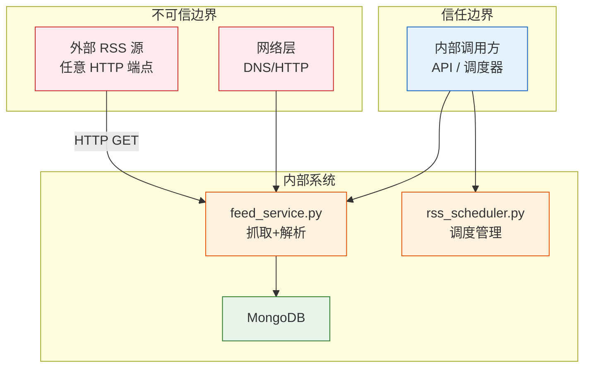

# YiAi-安全审计 — services-rss

> RSS 订阅服务的独立安全审计文档。覆盖 `feed_service.py`（网络抓取） + `rss_scheduler.py`（定时调度）。
>
> **来源**：源码分析 `/rui doc --from-code services-rss`
> **证据等级**：B（只读源码 + 静态分析）
> **项目类型**：backend
> **审计独立性**：由 security agent 独立执行

---

## 效果示意

---

## STRIDE 威胁建模

### S — Spoofing（身份伪造）

| 威胁 | 描述 | 缓解措施 | 评估 |
|------|------|---------|:---:|
| S1 | 攻击者伪造 RSS 源域名，诱导系统抓取恶意内容 | 系统不验证 RSS 源域名所有权，任何 URL 均可被抓取 | ⚠️ 中风险 |
| S2 | DNS 劫持将合法 RSS URL 指向恶意服务器 | 无 TLS 证书固定或 DNSSEC 验证 | ⚠️ 低风险 |

**S1 建议**：维护 RSS 源域名白名单，仅允许预注册的域名。或通过 seeds 集合的 `enabled` 字段控制，用户只能抓取已注册的源。

---

### T — Tampering（数据篡改）

| 威胁 | 描述 | 缓解措施 | 评估 |
|------|------|---------|:---:|
| T1 | RSS 源内容被中间人篡改（HTTP 明文传输） | aiohttp 默认跟随 HTTPS；未对 HTTP URL 强制升级 | ⚠️ 低风险 |
| T2 | RSS 条目 link 被篡改为指向恶意网站 | link 字段直接存入数据库，不做安全扫描 | ⚠️ 低风险 |
| T3 | 调度器配置被篡改为极小间隔导致资源耗尽 | `set_config()` 强制 `interval >= 60`，但 Cron 模式可设置每秒执行 | ⚠️ 低风险 |

**T1 建议**：对 HTTP URL 记录警告日志，建议用户使用 HTTPS 源。
**T3 建议**：Cron 模式下也添加上下限检查（如 second 为 null 时不允许每分钟以上频率）。

---

### R — Repudiation（不可否认性）

| 威胁 | 描述 | 缓解措施 | 评估 |
|------|------|---------|:---:|
| R1 | RSS 抓取操作无审计日志 | `process_feed_from_url()` 仅返回统计结果，不记录操作审计 | ❌ 未缓解 |
| R2 | 调度器启停和配置变更无审计 | `start/stop/set_config` 仅记录 info/warning 日志 | ❌ 未缓解 |

**建议**：在关键操作（启停调度器、配置变更、RSS 源抓取）写入审计日志到独立集合，含时间戳、操作者、操作类型、参数、结果。

---

### I — Information Disclosure（信息泄露）

| 威胁 | 描述 | 缓解措施 | 评估 |
|------|------|---------|:---:|
| I1 | RSS 抓取错误消息泄露内部 URL | `fetch_rss_feed()` 异常消息含 URL 字符串；`process_feed_from_url()` 返回 error 字段含 URL | ⚠️ 低风险 |
| I2 | RSS 源完整内容被存入数据库后可通过 data_service 查询 | 依赖 data_service 的字段投影和认证中间件控制访问 | ✅ 已缓解 |
| I3 | 调度器状态信息暴露内部配置 | `get_status()` 返回的是公开配置信息，不包含密钥 | ✅ 低风险 |

**I1 建议**：生产环境下对外部用户隐藏详细 URL（仅返回错误类型，不返回完整 URL）。

---

### D — Denial of Service（拒绝服务）

| 威胁 | 描述 | 缓解措施 | 评估 |
|------|------|---------|:---:|
| D1 | 恶意 RSS 源返回无限大内容耗尽内存 | 双阶段检查：Content-Length 预检 + 流式累积 10MB 硬限制 | ✅ 已缓解 |
| D2 | 恶意 RSS 源极慢响应占用连接 | 60s 总超时（aiohttp.ClientTimeout） | ✅ 已缓解 |
| D3 | 同时请求大量 RSS 源耗尽连接池 | Semaphore(3) 并发限制 | ✅ 已缓解 |
| D4 | 恶意 RSS 源返回"压缩炸弹"（zip bomb 等价物） | 未检测 Content-Encoding；流式读取原始字节不自动解压 | ⚠️ 低风险 |
| D5 | Cron second=0 导致每秒触发一次调度 | Cron 字段范围校验通过（0-59），但 second=0 时每秒触发合法 | ⚠️ 低风险 |
| D6 | 调度器重复 start 导致任务堆积 | start() 检查 `if self._running: return`；先 `remove_all_jobs()` 再添加 | ✅ 已缓解 |

**D4 建议**：限制响应 Content-Encoding 或设置解压后大小上限。
**D5 建议**：Cron 模式下 second 字段的合法但过高频率（如 `*/1` 不支持但 `0` 支持）应添加最小间隔检查。

---

### E — Elevation of Privilege（权限提升）

| 威胁 | 描述 | 缓解措施 | 评估 |
|------|------|---------|:---:|
| E1 | 通过 RSS 条目注入恶意脚本（XSS via stored content） | RSS 内容原样存入数据库；前端渲染时需转义 | ⚠️ 下游责任 |
| E2 | 通过 RSS URL 进行 SSRF 攻击（访问内网服务） | 无 URL 白名单或内网地址过滤 | ⚠️ 中风险 |
| E3 | 通过 executor 动态调用任意调度器方法 | executor 白名单控制模块级，但方法级无限制 | ⚠️ 低风险 |

**E2 建议**：在 `fetch_rss_feed()` 中添加 URL 校验——拒绝私有 IP 段（10.x, 172.16-31.x, 192.168.x, 127.x）、拒绝 `file://` 协议、拒绝 `localhost`。

---

## 安全评分

| 维度 | 评分 | 说明 |
|------|:---:|------|
| DoS 韧性 | 🟢 优 | 10MB 双检查 + 60s 超时 + Semaphore(3) |
| 信息泄露防护 | 🟡 良 | 依赖下游认证，URL 在错误消息中暴露 |
| 数据完整性 | 🟡 良 | HTTP 明文风险 + 无内容安全扫描 |
| SSRF 防护 | 🔴 缺 | 无内网地址过滤，可被利用访问内部服务 |
| 审计日志 | 🔴 缺 | 无操作审计 |
| 认证授权 | 🟡 良 | 依赖中间件层 |

---

## 改进建议优先级

| # | 建议 | 威胁 | 优先级 | 难度 |
|---|------|------|:---:|:---:|
| 1 | SSRF 防护 — 拒绝内网 IP + 私有地址段 | E2 | P0 | 低 |
| 2 | Cron 模式最小间隔检查（如 ≥ 60s 等效频率） | D5, T3 | P1 | 低 |
| 3 | RSS 源域名白名单校验 | S1 | P1 | 中 |
| 4 | HTTP URL 安全警告（建议升级 HTTPS） | T1 | P2 | 低 |
| 5 | 关键操作审计日志 | R1, R2 | P2 | 中 |
| 6 | RSS 内容安全扫描（XSS 过滤） | E1 | P2 | 中 |

---

### 主要价值

- 🛡️ **DoS 深度防护** — 10MB 双阶段检查 + 超时 + 并发限流三重保护
- 🔍 **SSRF 风险识别** — 发现无内网地址过滤的关键缺口，建议 P0 修复
- 📡 **外部数据安全** — RSS 内容作为不可信数据处理，全链路风险评估
- 🎯 **可操作建议** — 6 条按优先级排列的具体改进建议，含难度评估

---

## 回溯链

| 来源 | 路径 | 证据级别 |
|------|------|---------|
| 源码 | `src/services/rss/feed_service.py` (175 lines) | A |
| 源码 | `src/services/rss/rss_scheduler.py` (331 lines) | A |
| 技术评审 | `YiAi-技术评审.md` §7 安全设计 | A |

### 变更记录

| 日期 | 版本 | 变更内容 | 来源 |
|------|------|---------|------|
| 2026-05-22 | 1.0.0 | 初始文档基线，从源码反推生成 | /rui doc --from-code services-rss |
