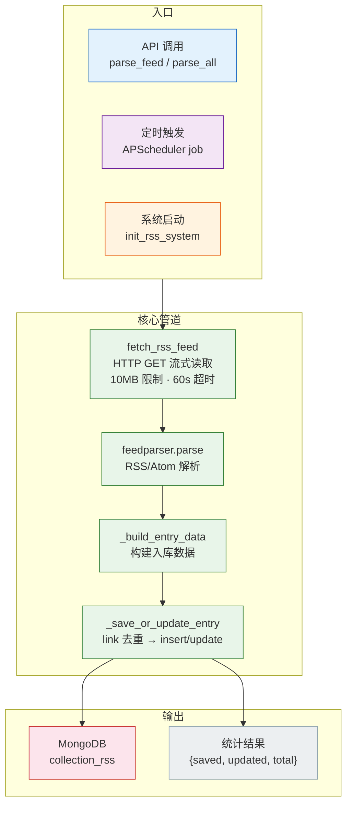
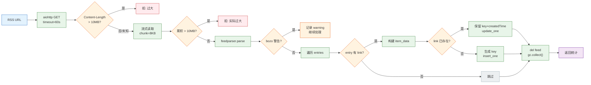
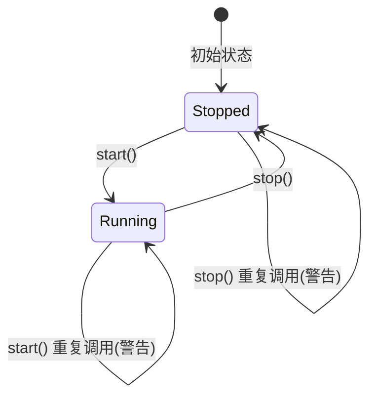

# YiAi-技术评审 — services-rss

> RSS 订阅服务的技术设计评审文档。覆盖 `feed_service.py`（抓取解析管道） + `rss_scheduler.py`（APScheduler 调度管理）。
>
> **来源**：源码分析 `/rui doc --from-code services-rss`
> **证据等级**：B（只读源码 + 静态分析）
> **项目类型**：backend → 跳过 §4 组件、§5 交互、§6 DOM/事件

---

## 效果示意



---

## §1 架构设计

### 1.1 整体架构

```
feed_service.py (抓取+解析+入库)
├── fetch_rss_feed()      HTTP 流式抓取 + 解析
├── _build_entry_data()   数据转换
├── _save_or_update_entry() link 去重保存
├── process_feed_from_url() 完整单源处理管道
└── parse_feed()          对外 API 接口

rss_scheduler.py (调度管理)
├── RSSSchedulerManager    类式调度器管理器
│   ├── parse_all_sources()  批量并发解析
│   ├── start() / stop()     启停控制
│   ├── set_config()         动态配置 + 热重启
│   └── get_status()         状态查询
└── 模块级兼容函数          (executor 动态调用)
```

### 1.2 数据流管道



### 1.3 调度器状态机



---

## §2 API / 方法签名

### 2.1 parse_feed — 解析单个 RSS 源

| 参数 | 类型 | 必填 | 说明 |
|------|------|:---:|------|
| url | string | ✓ | RSS 源地址 |
| name | string | — | 源名称（可选，不传时用 feed title） |

**响应**：
```json
{
  "success": true,
  "url": "https://example.com/rss",
  "source": "示例资讯源",
  "saved_count": 5,
  "updated_count": 2,
  "total_items": 7,
  "error": null
}
```

### 2.2 parse_all_enabled_rss_sources — 批量解析

无必填参数（从 seeds 集合自动查询启用的源）。

**响应**：
```json
{
  "total_sources": 5,
  "success_count": 4,
  "failed_count": 1,
  "results": [
    {"url": "...", "success": true, "saved_count": 3, ...},
    {"url": "...", "success": false, "error": "Connection timeout"}
  ]
}
```

### 2.3 start_rss_scheduler — 启动调度器

无参数。如果已在运行则警告不报错。

### 2.4 stop_rss_scheduler — 停止调度器

无参数。`shutdown(wait=False)` → 置空调度器实例 → `_running = False`。

### 2.5 set_scheduler_config — 动态配置

| 参数 | 类型 | 必填 | 说明 |
|------|------|:---:|------|
| config.type | string | ✓ | `interval` 或 `cron` |
| config.interval | int | type=interval 时 | 间隔秒数（≥60） |
| config.cron | dict | type=cron 时 | {second, minute, hour, day, month, day_of_week} |

配置变更后自动 stop → start 热重启。

### 2.6 get_scheduler_status_info — 状态查询

无参数。返回 `{enabled: bool, type: str, interval: int, cron: dict}`。

### 2.7 初始化与关闭

| 函数 | 触发时机 | 行为 |
|------|---------|------|
| `init_rss_system()` | 服务器启动 | 检查 `is_rss_scheduler_enabled()` → 启动调度器，失败仅 warning |
| `shutdown_rss_system()` | 服务器关闭 | 检查开关 → 停止调度器，失败仅 warning |

---

## §3 数据模型

### 3.1 RSS 条目数据字段

| 字段 | 来源 | 说明 |
|------|------|------|
| title | `entry.get('title')` | 文章标题 |
| link | `entry.get('link')` | 文章链接（去重键） |
| description | `entry.get('description')` or `summary` | 文章摘要 |
| tags | 构建时传入 | 标签列表（默认 [source_name]） |
| source_name | 构建时传入 | RSS 源名称 |
| source_url | 构建时传入 | RSS 源 URL |
| published | `entry.get('published')` | 原文发布时间 |
| published_parsed | `entry.get('published_parsed')` | 解析后的时间结构 |
| author | `entry.get('author')` | 作者（可选） |
| content | `entry.content[0].value` | 全文内容（可选） |
| key | UUID v4 | 系统唯一标识 |
| createdTime | `get_current_time()` | 入库时间 |
| updatedTime | `get_current_time()` | 最后更新时间 |

### 3.2 调度器配置模型

```json
{
  "type": "interval",
  "interval": 3600,
  "cron": {
    "second": null,
    "minute": null,
    "hour": null,
    "day": null,
    "month": null,
    "day_of_week": null
  }
}
```

---

## §7 安全设计

### 7.1 内存溢出防护（双阶段检查）

```python
# 阶段1: Content-Length 头预检
MAX_RSS_SIZE = 10 * 1024 * 1024  # 10MB
if content_length and int(content_length) > MAX_RSS_SIZE:
    raise BusinessException(...)

# 阶段2: 流式累积检查（兜底 Content-Length 不可信的情况）
content = bytearray()
async for chunk in response.content.iter_chunked(RSS_CHUNK_SIZE):  # 8KB chunk
    content.extend(chunk)
    if len(content) > MAX_RSS_SIZE:
        raise BusinessException(...)
```

### 7.2 网络超时保护

- `aiohttp.ClientTimeout(total=60)` — 60 秒总超时
- `aiohttp.ClientError` 捕获 → 转为 BusinessException

### 7.3 并发限流

```python
_PARSE_CONCURRENCY = 3
sem = asyncio.Semaphore(_PARSE_CONCURRENCY)  # 最多 3 个并发请求
```

### 7.4 内存清理

```python
del feed
gc.collect()  # 处理大 feed 后强制回收
```

---

## §8 性能设计

| 策略 | 实现 | 位置 |
|------|------|------|
| 流式分块读取 | 8KB chunk 逐块累积 | `feed_service.py`:53 |
| 并发控制 | Semaphore(3) 限制同时解析数 | `rss_scheduler.py`:73 |
| 连接复用 | aiohttp.ClientSession（单次请求内） | `feed_service.py`:34 |
| 超时控制 | 60s 总超时 | `feed_service.py`:36 |
| 内存释放 | del feed + gc.collect() | `feed_service.py`:130–131 |
| 异步批量 | asyncio.gather 并行处理 | `rss_scheduler.py`:85 |
| 调度器轻量 | APScheduler AsyncIOScheduler，非阻塞 | `rss_scheduler.py`:54 |

---

### 主要价值

- 🔄 **完整抓取管道** — HTTP GET → 流式读取 → feedparser 解析 → 去重入库一气呵成
- 🛡️ **三层安全防护** — Content-Length 预检 + 流式累积检查 + 并发限流
- ⏱️ **灵活调度** — 间隔/Cron 双模式 + 热配置更新 + 优雅启停
- 📡 **批量并发处理** — Semaphore(3) 控制并发，单源失败隔离
- 🧹 **内存友好** — 8KB 分块 + 主动 gc 回收大 feed 对象

---

## 回溯链

| 来源 | 路径 | 证据级别 |
|------|------|---------|
| 源码 | `src/services/rss/feed_service.py` (175 lines) | A |
| 源码 | `src/services/rss/rss_scheduler.py` (331 lines) | A |
| 故事任务 | `YiAi-故事任务.md` §2 FP1–FP10 | A |
| 使用场景 | `YiAi-使用场景.md` 场景 1–6 | A |
| 依赖 | `src/core/config.py` — collection_rss / collection_seeds / rss_scheduler_interval | B |

### 变更记录

| 日期 | 版本 | 变更内容 | 来源 |
|------|------|---------|------|
| 2026-05-22 | 1.0.0 | 初始文档基线，从源码反推生成 | /rui doc --from-code services-rss |
