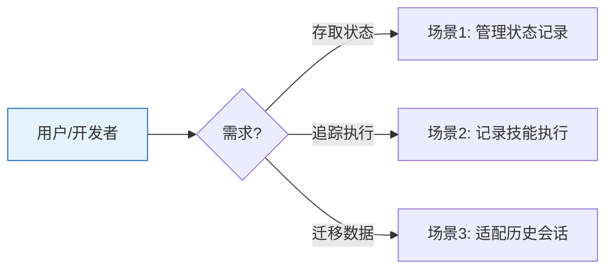

# YiAi-使用场景 — services-state

> 结构化状态存储子系统的使用场景文档。覆盖状态 CRUD、技能执行记录、会话适配。
>
> **来源**：源码分析 `/rui doc --from-code services-state`
> **证据等级**：B | **项目类型**：backend

---

## 效果示意

---

## 场景 1：管理状态记录

### 场景描述
系统的不同模块需要持久化结构化状态数据（如执行历史、配置快照、处理结果），需要统一的存取接口，支持多维度查询和分页。

### 操作步骤
1. 调用方构造包含 record_type 等字段的记录字典
2. 系统自动生成唯一标识并补充时间戳
3. 记录持久化到数据库
4. 后续可通过类型、标签、标题关键词、时间范围等条件组合查询
5. 支持按唯一标识获取单条、更新内容、删除记录

### 异常情况
- 更新或删除不存在的记录 → 返回错误提示
- 查询数量超过上限时自动截断

---

## 场景 2：记录技能执行

### 场景描述
每次技能（如 AI 对话、RSS 抓取、模块执行）运行完毕后，自动记录执行状态、耗时和摘要信息，用于后续分析和排错。

### 操作步骤
1. 技能执行完成，获得状态、耗时、输入输出摘要
2. 系统构造包含技能名、状态（成功/失败/超时/取消）、耗时等信息的记录
3. 通过后台任务写入数据库，不阻塞主流程
4. 记录失败时仅输出日志，不影响业务

### 异常情况
- 数据库不可用 → 记录丢失但不影响技能执行结果
- 参数验证失败 → Pydantic 校验报错

---

## 场景 3：适配历史会话

### 场景描述
系统中存在旧版 sessions 集合，字段命名和结构不同于新版 SessionState 模型。需要在不修改原数据的前提下，将遗留文档转换为新模型以便查询和展示。

### 操作步骤
1. 从 sessions 集合读取原始文档
2. 系统自动映射字段名（如 pageContent → page_content）
3. 非标准字段放入扩展元数据区
4. 对单个文档进行模型验证，验证失败时宽松构造
5. 批量处理时统计成功和失败数量，记录错误明细

### 异常情况
- 文档格式严重异常 → 宽松回退仍失败则计入失败列表
- 批量处理中断 → 已处理的统计不丢失

---

### 主要价值

- 📊 **统一存取** — 单一服务提供完整 CRUD，避免各模块重复实现
- 🔥 **异步非阻塞** — 记录写入不阻塞业务主流程
- 🔄 **平滑迁移** — 遗留数据适配无需修改原始集合
- 🛡️ **容错优先** — 记录失败不影响业务，适配失败有回退

---

## 回溯链

| 来源 | 路径 |
|------|------|
| 故事任务 | `YiAi-故事任务.md` §1 Story 1–3 |
| 源码 | `src/services/state/` |

### 变更记录

| 日期 | 版本 | 变更内容 |
|------|------|---------|
| 2026-05-22 | 1.0.0 | 初始 /rui doc --from-code |
