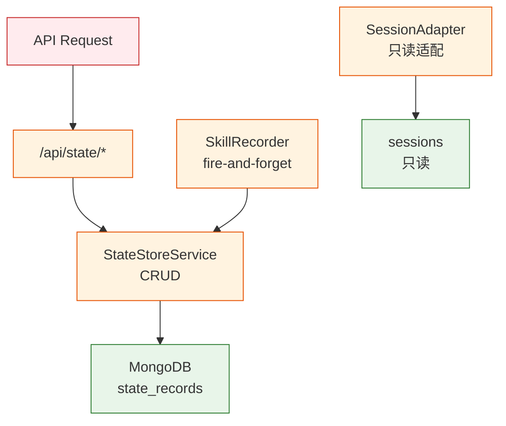

# YiAi-安全审计 — services-state

> State 存储子系统独立安全审计。3 组件全量 STRIDE。
>
> **来源**：源码分析 | **证据等级**：B | **审计独立性**：独立 security agent

---

## 效果示意

---

## STRIDE 威胁建模

### S — Spoofing
| 威胁 | 缓解 | 评估 |
|------|------|:---:|
| 伪造 key 访问他人记录 | key 为 UUID，不可猜测 | ✅ |
| 批量查询绕过权限 | 无行级权限控制，所有记录全局可见 | ⚠️ 设计如此 |

### T — Tampering
| 威胁 | 缓解 | 评估 |
|------|------|:---:|
| 覆盖 key 字段 | update 中 pop("key", None) 防护 | ✅ |
| 覆盖 created_time | update 中 pop("created_time", None) 防护 | ✅ |
| 注入 MongoDB 操作符 | motor 驱动参数化查询，非字符串拼接 | ✅ |

**T3 评估**：title_contains 使用 `$regex` 构造 `f".*{user_input}.*"` — 用户输入直接拼接进正则表达式，存在 ReDoS 风险。MongoDB 的 `$regex` 不支持回溯断言和反向引用，风险有限但建议加输入长度限制。

### R — Repudiation
| 威胁 | 缓解 | 评估 |
|------|------|:---:|
| 删除操作无审计 | delete 仅有 logger 输出，无结构化审计 | ⚠️ 低风险 |
| 更新操作无历史 | $set 直接覆盖，无 versioning/change log | ⚠️ 低风险 |

### I — Information Disclosure
| 威胁 | 缓解 | 评估 |
|------|------|:---:|
| 查询泄露跨类型记录 | 无行级 ACL，任何调用方可查询所有 record_type | ⚠️ 设计如此 |
| 错误信息泄露 key | ValueError 直接返回用户提供的 key | ⚠️ 低风险 |

### D — Denial of Service
| 威胁 | 缓解 | 评估 |
|------|------|:---:|
| 大 page_size 拖垮查询 | max_limit(8000) 上限约束 | ✅ |
| title_contains ReDoS | 无输入长度限制 + 直接拼接正则 | ⚠️ 中风险 |
| 批量适配内存溢出 | batch_size 仅用于日志，无内存限制 | ⚠️ 低风险 |

**D2 建议**：对 `title_contains` 参数添加最大长度限制（如 200 字符），或使用 `re.escape()` 转义特殊字符后再构造正则。

### E — Elevation of Privilege
| 威胁 | 缓解 | 评估 |
|------|------|:---:|
| 通过 update 注入字段提权 | 无字段白名单，任意字段可写入 | ⚠️ 低风险 |
| 适配器修改原始数据 | SessionAdapter 只读 cursor，不写回 | ✅ |

---

## 安全评分

| 维度 | 评分 |
|------|:---:|
| 数据完整性 | 🟢 优（key/created_time 保护） |
| 注入防护 | 🟡 良（$regex 直接拼接） |
| 访问控制 | 🟡 良（无行级权限） |
| 审计 | 🟡 良（无持久化审计日志） |

---

## 改进建议

| # | 建议 | 优先级 | 难度 |
|---|------|:---:|:---:|
| 1 | title_contains 添加长度限制 + re.escape 转义 | P1 | 低 |
| 2 | 删除/更新操作结构化审计日志 | P2 | 低 |

---

---

### 主要价值

- 🔒 **字段保护** — key/created_time 不可通过 update 覆盖
- 🛡️ **注入防护** — motor 参数化查询，无字符串拼接注入
- 📊 **DoS 约束** — max_limit 上限 + batch_size 进度控制
- 🔄 **只读适配** — SessionAdapter 不修改原始数据

---

## 回溯链

| 来源 | 路径 |
|------|------|
| 源码 | `src/services/state/` |
| 技术评审 | `YiAi-技术评审.md` §7 |

### 变更记录

| 日期 | 版本 | 变更内容 |
|------|------|---------|
| 2026-05-22 | 1.0.0 | 初始 /rui doc --from-code |
