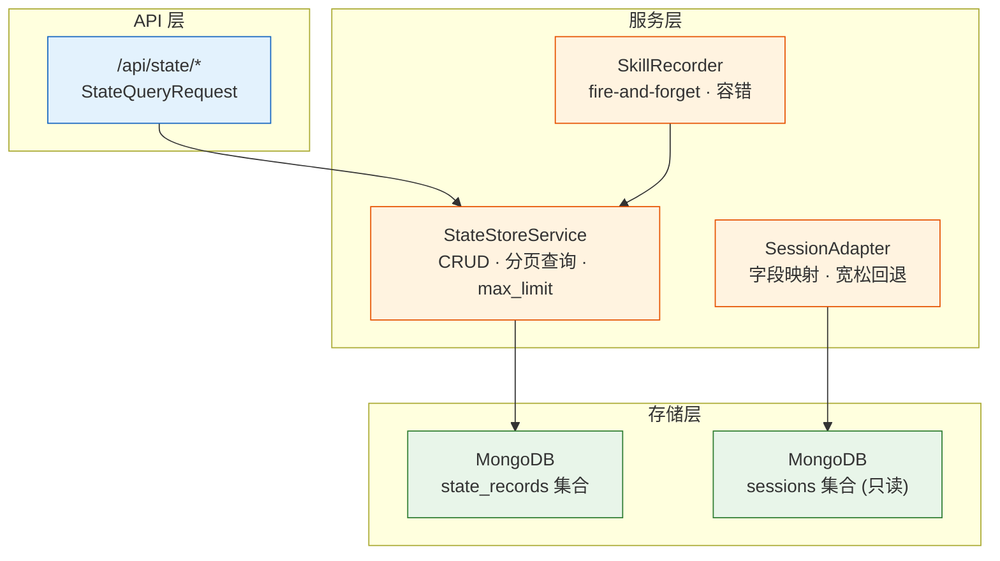
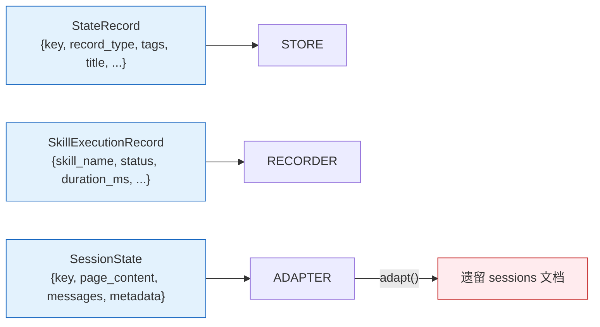

# YiAi-技术评审 — services-state

> 结构化状态存储子系统技术评审。3 组件架构与接口设计。
>
> **来源**：源码分析 | **证据等级**：B | **项目类型**：backend → 跳过 §4/§5/§6

---

## 效果示意



---

## §1 架构设计

### 1.1 组件关系

| 组件 | 层级 | 激活方式 | 配置驱动 |
|------|------|---------|---------|
| StateStoreService | 服务层 | API 路由 / 其他服务注入 | collection_state_records / state_store_query_max_limit |
| SkillRecorder | 服务层 | executor._record_execution() | — |
| SessionAdapter | 适配层 | 查询/迁移模块调用 | — |

### 1.2 数据模型



### 1.3 查询引擎

支持的过滤维度：

| 维度 | 实现 | 说明 |
|------|------|------|
| record_type | 精确匹配 | `{"record_type": type}` |
| tags | `$in` 数组匹配 | 命中任一标签即返回 |
| title_contains | `$regex` 模糊匹配 | 大小写不敏感 |
| created_after | `$gte` 时间范围 | ISO 8601 字符串比较 |
| created_before | `$lt` 时间范围 | 同上 |

---

## §2 API / 方法签名

### StateStoreService

```python
service = StateStoreService()

await service.create(record: Dict) -> Dict[str, str]
await service.query(record_type=, tags=, title_contains=,
                    created_after=, created_before=,
                    page_num=1, page_size=2000) -> Dict[str, Any]
await service.get(key: str) -> Optional[Dict[str, Any]]
await service.update(key: str, data: Dict) -> Dict[str, Any]
await service.delete(key: str) -> Dict[str, Any]
```

| 参数 | 默认值 | 说明 |
|------|--------|------|
| page_size | 2000 | 受 max_limit(8000) 上限约束 |
| page_num | 1 | 从 1 开始 |

### SkillRecorder

```python
recorder = SkillRecorder(state_service)

await recorder.record(skill_name, status, duration_ms,
                      input_summary="", output_summary="", error_message="")
recorder.record_async(skill_name, status, duration_ms, **kwargs)  # fire-and-forget

get_recorder() -> SkillRecorder  # 全局单例
```

### SessionAdapter

```python
SessionAdapter.adapt(document: Dict) -> SessionState

await SessionAdapter.adapt_batch(cursor: AsyncIterator, batch_size=100) -> AdaptationResult
```

---

## §3 数据设计

### state_records 集合

| 字段 | 类型 | 说明 |
|------|------|------|
| key | string | UUID 主键 |
| record_type | string | 记录类型（如 skill_execution） |
| tags | string[] | 标签列表 |
| title | string | 标题 |
| created_time | string | ISO 8601 创建时间 |
| updated_time | string | ISO 8601 更新时间 |

### SkillExecutionRecord 额外字段

| 字段 | 类型 | 约束 |
|------|------|------|
| skill_name | string | min_length=1 |
| status | string | 枚举：success/failed/timeout/cancelled |
| duration_ms | float | ge=0 |
| input_summary | string | max_length=2000 |
| output_summary | string | max_length=2000 |
| error_message | string | max_length=4000 |

---

## §7 安全设计

| 组件 | 安全策略 |
|------|---------|
| StateStoreService | 更新保护 key/created_time 不可变 |
| SkillRecorder | 异常全部捕获，不抛给调用方 |
| SessionAdapter | 只读适配，不修改原始 sessions 集合 |

---

### 主要价值

- 📊 **统一状态模型** — 3 组件分层清晰：存储 / 记录 / 适配
- 🔍 **多维查询** — 5 维度组合过滤 + 分页
- 🛡️ **容错隔离** — 记录失败不传播，适配失败有回退
- 🔄 **向下兼容** — SessionAdapter 平滑桥接新旧数据格式

---

## 回溯链

| 来源 | 路径 |
|------|------|
| 源码 | `src/services/state/` (3 文件) |
| 故事任务 | `YiAi-故事任务.md` |

### 变更记录

| 日期 | 版本 | 变更内容 |
|------|------|---------|
| 2026-05-22 | 1.0.0 | 初始 /rui doc --from-code |
