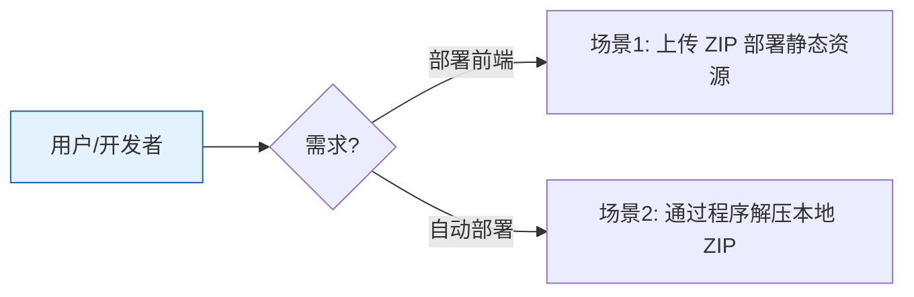

# YiAi-使用场景 — services-static

> 静态文件管理子系统的使用场景文档。覆盖 ZIP 上传解压和本地解压。
>
> **来源**：源码分析 `/rui doc --from-code services-static`
> **证据等级**：B | **项目类型**：backend

---

## 效果示意

---

## 场景 1：上传 ZIP 部署静态资源

### 场景描述
前端项目构建产物为 ZIP 文件，需要上传到服务器并解压到指定静态文件目录，以便通过 HTTP 直接访问。上传过程需要安全检查防止路径穿越和恶意文件。

### 操作步骤
1. 用户选择 ZIP 文件通过 API 上传
2. 系统校验文件格式（必须是 .zip）和大小限制
3. 可选指定目标项目目录，系统校验目录名安全性
4. 系统将 ZIP 写入临时文件
5. 检测 ZIP 内是否共享单一根目录，若是则自动剥离
6. 逐文件安全解压，跳过路径不安全的条目
7. 清理临时文件，返回解压统计

### 异常情况
- 非 ZIP 格式 → 返回错误"只支持ZIP格式文件"
- 文件超大 → 返回错误含大小限制信息
- ZIP 内含路径穿越条目 → 自动跳过不解压
- 解压个别文件失败 → 仅输出日志，不阻断其他文件

---

## 场景 2：通过程序解压本地 ZIP

### 场景描述
自动化部署流程中，ZIP 文件已在服务器本地（如通过其他方式下载或生成），需要通过 execute_module 接口调用解压功能。

### 操作步骤
1. 调用 execute_module 指定 archive_service.unzip_from_path
2. 传入本地 ZIP 文件绝对路径和可选的项目名
3. 系统校验文件是否存在
4. 按项目名或 ZIP 文件名确定目标目录
5. 创建目标目录后全部解压

### 异常情况
- 文件路径为空 → 返回错误提示
- 文件不存在 → 返回错误提示
- 解压过程异常 → 返回错误信息

---

### 主要价值

- 📦 **一键部署** — ZIP 上传自动解压，无需手动操作
- 🔒 **安全解压** — 路径穿越自动检测和拦截
- 🧹 **自动清理** — 临时文件 finally 块保证删除
- 🔄 **双入口** — HTTP 上传 + execute_module 程序化调用

---

## 回溯链

| 来源 | 路径 |
|------|------|
| 故事任务 | `YiAi-故事任务.md` §1 Story 1–2 |
| 源码 | `src/services/static/` |

### 变更记录

| 日期 | 版本 | 变更内容 |
|------|------|---------|
| 2026-05-22 | 1.0.0 | 初始 /rui doc --from-code |
