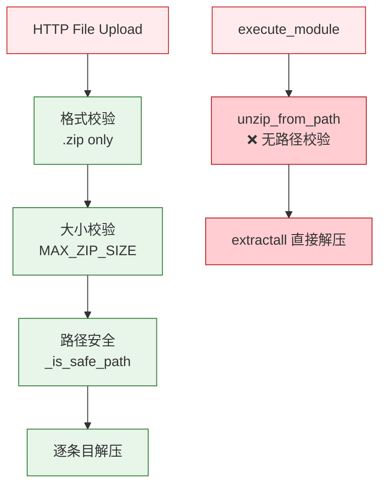

# YiAi-安全审计 — services-static

> 静态文件管理子系统独立安全审计。2 组件全量 STRIDE。
>
> **来源**：源码分析 | **证据等级**：B | **审计独立性**：独立 security agent

---

## 效果示意

---

## STRIDE 威胁建模

### S — Spoofing
| 威胁 | 缓解 | 评估 |
|------|------|:---:|
| 伪造 ZIP 文件头 | 仅检查 .zip 后缀名，未验证 magic bytes | ⚠️ 低风险 |

### T — Tampering
| 威胁 | 缓解 | 评估 |
|------|------|:---:|
| ZIP 内路径穿越 (../) | _is_safe_path: normpath + .. 检测 + 前缀匹配 | ✅ |
| ZIP 内绝对路径 (/etc/passwd) | _is_safe_path: startswith('/') 拒绝 | ✅ |
| ZIP 炸弹 (压缩比炸弹) | 仅检查压缩文件大小，未限制解压后大小 | ⚠️ 中风险 |
| project_id 路径穿越 | _resolve_target_dir 调用 _is_safe_path | ✅ |

**T3 建议**：限制解压后总大小或条目数，防止 ZIP 炸弹（如 1KB 压缩 → 1GB 解压）。

### R — Repudiation
| 威胁 | 缓解 | 评估 |
|------|------|:---:|
| 解压操作无审计 | 返回 extracted_files_count 但无持久化日志 | ⚠️ 低风险 |

### I — Information Disclosure
| 威胁 | 缓解 | 评估 |
|------|------|:---:|
| 错误信息泄露内部路径 | target_dir 返回给客户端 | ⚠️ 低风险 |
| 临时文件残留 | finally unlink，失败时 warning | ✅ |

### D — Denial of Service
| 威胁 | 缓解 | 评估 |
|------|------|:---:|
| 超大文件上传 | MAX_ZIP_SIZE 硬限制 | ✅ |
| ZIP 炸弹 | 无解压后大小限制 | ⚠️ 中风险 |
| 大量小文件条目 | 无条目数限制 | ⚠️ 低风险 |

### E — Elevation of Privilege
| 威胁 | 缓解 | 评估 |
|------|------|:---:|
| **unzip_from_path 任意路径解压** | **无任何路径校验，直接将 file_path 参数用于 extractall** | 🔴 P0 |
| 通过 project_id 写入任意目录 | unzip_from_path 直接 join base_dir + project_id 无校验 | 🔴 P0 |

**E1–E2 详述**：`unzip_from_path` 缺少 `_is_safe_path` 校验。攻击者通过 `execute_module` 调用此函数可传入任意 `file_path`。虽需先有本地文件，但结合其他上传功能可能形成攻击链。此外 `project_id` 参数未经过路径安全校验，可能穿越到 base_dir 之外。

---

## 安全评分

| 维度 | 评分 |
|------|:---:|
| 路径安全 (upload) | 🟢 优（四层校验链） |
| 路径安全 (archive) | 🔴 危险（零校验） |
| DoS 防护 | 🟡 良（缺 ZIP 炸弹防护） |
| 审计 | 🟡 良（无持久化审计） |

---

## 改进建议

| # | 建议 | 优先级 | 难度 |
|---|------|:---:|:---:|
| 1 | unzip_from_path 添加 _is_safe_path 校验 | P0 | 低 |
| 2 | unzip_from_path 添加 project_id 路径安全校验 | P0 | 低 |
| 3 | 添加解压后大小/条目数限制防 ZIP 炸弹 | P1 | 低 |
| 4 | 校验 ZIP magic bytes (PK\x03\x04) | P2 | 低 |
| 5 | 修复 `from yiai.core.config import settings` 错误导入路径 | P2 | 低 |

---

### 主要价值

- 🔒 **upload_and_unzip 四层防护** — 格式→大小→路径→编码，纵深防御
- 🔴 **P0: archive_service 零校验** — unzip_from_path 无任何路径安全措施
- 📊 **ZIP 炸弹风险** — 两个组件均未限制解压后大小
- 🛡️ **execute_module 攻击面** — archive_service 通过模块执行接口暴露，扩大攻击面

---

## 回溯链

| 来源 | 路径 |
|------|------|
| 源码 | `src/services/static/` |
| 技术评审 | `YiAi-技术评审.md` §7 |

### 变更记录

| 日期 | 版本 | 变更内容 |
|------|------|---------|
| 2026-05-22 | 1.0.0 | 初始 /rui doc --from-code |
