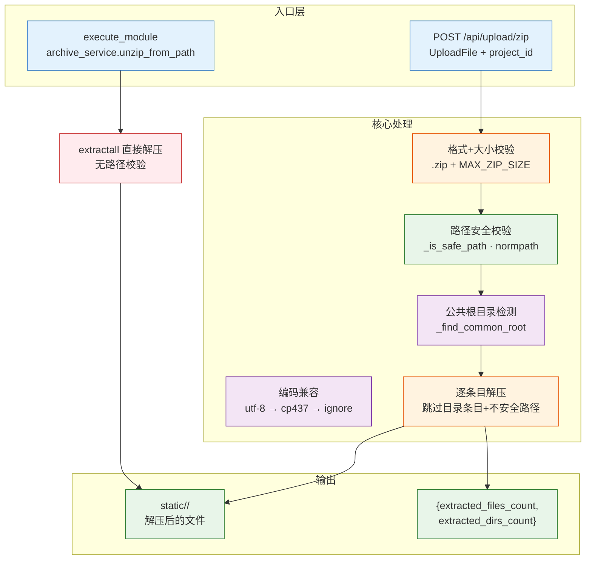
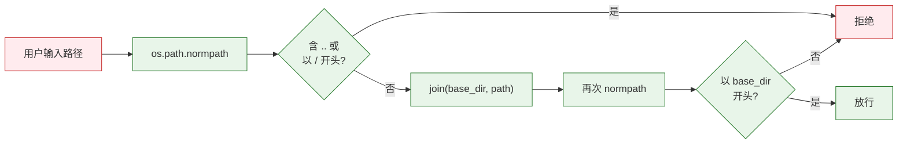
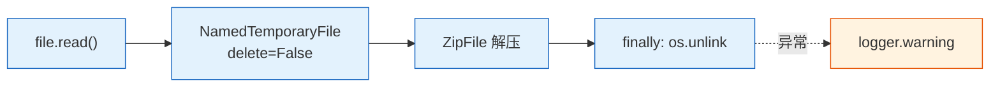

# YiAi-技术评审 — services-static

> 静态文件管理子系统技术评审。2 组件架构与接口设计。
>
> **来源**：源码分析 | **证据等级**：B | **项目类型**：backend → 跳过 §4/§5/§6

---

## 效果示意



---

## §1 架构设计

### 1.1 组件关系

| 组件 | 激活方式 | 安全校验 | 配置驱动 |
|------|---------|:---:|---------|
| upload_and_unzip | HTTP 文件上传 API | 格式+大小+路径+编码 | static_base_dir / static_max_zip_size |
| unzip_from_path | execute_module 调用 | 文件存在检查 | static_base_dir |

### 1.2 路径安全模型



**注意**：unzip_from_path 未使用此安全模型，直接 `os.path.join(base_dir, project_id)` + `extractall`。

### 1.3 临时文件生命周期



---

## §2 API / 方法签名

### upload_and_unzip

```python
async def upload_and_unzip(
    file: UploadFile,
    project_id: Optional[str] = None
) -> Dict[str, Any]
```

| 参数 | 类型 | 说明 |
|------|------|------|
| file | UploadFile | ZIP 文件 |
| project_id | Optional[str] | 目标子目录名 |

返回值：`{filename, target_dir, extracted_files_count, extracted_dirs_count, project_id}`

### unzip_from_path

```python
async def unzip_from_path(params: Dict[str, Any]) -> Dict[str, Any]
```

| 参数 | 类型 | 说明 |
|------|------|------|
| file_path | str (必填) | 本地 ZIP 绝对路径 |
| project_id | str (可选) | 目标子目录名 |

---

## §3 数据设计

### 配置项

| 配置 | 说明 |
|------|------|
| static_base_dir | 静态文件根目录 |
| static_max_zip_size | ZIP 文件大小上限（字节） |

### 编码回退链

```
bytes → utf-8 decode
  ↓ 失败
cp437 bytes → utf-8 decode
  ↓ 失败
原始字符串（或 ignore 解码）
```

---

### 主要价值

- 📦 **ZIP 部署** — 上传自动解压，干净的文件级结果
- 🔒 **路径安全** — 4 步校验链：格式→大小→路径→编码
- 🧹 **资源管理** — 临时文件 finally 清理，单文件解压异常不阻断
- 🌐 **编码鲁棒** — 多平台 ZIP 文件名自动适配

---

## 回溯链

| 来源 | 路径 |
|------|------|
| 源码 | `src/services/static/static_files.py` |
| 源码 | `src/services/static/archive_service.py` |
| 故事任务 | `YiAi-故事任务.md` |

### 变更记录

| 日期 | 版本 | 变更内容 |
|------|------|---------|
| 2026-05-22 | 1.0.0 | 初始 /rui doc --from-code |
