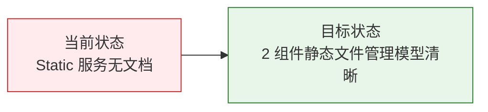

# YiAi-故事任务 — services-static

> 静态文件管理子系统故事任务。覆盖 ZIP 上传解压 (static_files) 和本地解压 (archive_service) 2 个组件。
>
> **来源**：源码分析 `/rui doc --from-code services-static`
> **证据等级**：B（只读源码 + 静态分析）
> **项目类型**：backend

---

## 效果示意

---

## §1 Story

### Story 1: ZIP 上传解压（static_files）

| 字段 | 内容 |
|------|------|
| 作为 | 前端用户/运维人员 |
| 我想要 | 上传 ZIP 文件并安全解压到指定静态目录 |
| 以便 | 批量部署前端静态资源到项目目录 |
| 优先级 | P0 |
| 范围边界 | HTTP 文件上传 → 安全校验 → 解压到 static/ 目录 |

#### §1.1 User Operations

| # | 操作 | 触发条件 | 操作步骤 | 预期结果 |
|---|------|---------|---------|---------|
| 1 | 上传解压 | 用户通过 API 上传 ZIP | 校验格式(.zip) → 校验大小(MAX_ZIP_SIZE) → 路径安全校验 → 临时文件写入 → 检测公共根目录 → 逐文件安全解压 → 清理临时文件 | 返回 extracted_files_count/extracted_dirs_count |
| 2 | 指定项目目录 | 传入 project_id | _resolve_target_dir 校验 project_id 安全 → 解压到 static/<project_id>/ | 文件在指定子目录下 |
| 3 | 自动剥离根目录 | ZIP 内所有文件共享单一根目录 | _find_common_root 检测 → 解压时剥离前缀 | 文件直接位于目标目录而非额外嵌套 |
| 4 | 编码兼容 | ZIP 含非 UTF-8 文件名 | _decode_filename: 先 utf-8 → cp437→utf-8 → 忽略错误 | 文件名正确解码 |

---

### Story 2: 本地 ZIP 解压（archive_service）

| 字段 | 内容 |
|------|------|
| 作为 | 模块执行管线 |
| 我想要 | 通过 execute_module 接口解压本地路径的 ZIP 文件 |
| 以便 | 自动化部署流程可编程控制解压 |
| 优先级 | P2 |
| 范围边界 | execute_module 调用入口，接受 file_path + project_id |

#### §1.1 User Operations

| # | 操作 | 触发条件 | 操作步骤 | 预期结果 |
|---|------|---------|---------|---------|
| 1 | 本地解压 | execute_module 调用 unzip_from_path | 校验 file_path 必填 → 校验文件存在 → 构造目标目录 → extractall | 返回 success + target_directory + 文件数 |
| 2 | 自动命名 | 未传 project_id | 取 ZIP 文件名（无后缀）作为目录名 | 解压到 static/<zip_name>/ |

---

## §2 Requirements

### 功能点

| FP# | 描述 | 组件 | 优先级 |
|-----|------|------|:---:|
| FP1 | ZIP 格式校验 — 仅 .zip 后缀 | static_files | P0 |
| FP2 | 文件大小限制 — MAX_ZIP_SIZE 硬上限 | static_files | P0 |
| FP3 | 路径安全校验 — _is_safe_path: normpath + .. 检测 + 前缀匹配 | static_files | P0 |
| FP4 | 公共根目录检测 — _find_common_root: 自动剥离 | static_files | P1 |
| FP5 | ZIP 文件名编码兼容 — _decode_filename: utf-8 → cp437 回退 | static_files | P1 |
| FP6 | 临时文件清理 — finally 块 unlink | static_files | P1 |
| FP7 | 本地路径解压 — execute_module 入口 | archive_service | P2 |
| FP8 | 自动目录命名 — 无 project_id 时按文件名 | archive_service | P2 |

### 业务规则

| R# | 描述 | 证据级别 |
|----|------|:---:|
| R1 | _is_safe_path 拒绝含 .. 或以 / 开头的路径 | A |
| R2 | ZIP 解压中跳过以 / 结尾的目录条目，仅解压文件 | A |
| R3 | 解压异常不阻断其他文件，仅 logger.warning | A |
| R4 | _decode_filename 先尝试 utf-8 解码，失败则 cp437→utf-8 | A |
| R5 | Python 3.11+ 使用 metadata_encoding='utf-8' 参数 | A |
| R6 | archive_service 使用 extractall 直接解压，无路径校验 | A |

---

## §3 成功标准

| SC# | 描述 | 优先级 |
|-----|------|:---:|
| SC1 | 上传非 ZIP 文件时返回错误 | P0 |
| SC2 | 上传含 ../ 路径的 ZIP 时自动跳过危险条目 | P0 |
| SC3 | ZIP 含公共根目录时自动剥离 | P1 |
| SC4 | 超大小文件上传时拒绝 | P0 |

---

## §4 范围边界

**范围内**：ZIP 上传解压 + 本地路径解压
**范围外**：单个文件上传（属于 upload API）、压缩文件生成

---

## §5 AC

| AC# | Given | When | Then | 门禁 |
|-----|-------|------|------|------|
| AC1 | 上传 .txt 文件 | upload_and_unzip(file) | BusinessException("只支持ZIP格式文件") | Gate A |
| AC2 | ZIP 内含 ../../etc/passwd 条目 | _is_safe_path 校验 | 该条目被跳过不解压 | Gate A |
| AC3 | ZIP 大小 > MAX_ZIP_SIZE | upload_and_unzip(file) | BusinessException(超限提示) | Gate A |
| AC4 | ZIP 内所有文件在 foo/ 下 | 解压 | 剥离 foo/ 前缀，文件直接在目标目录 | Gate A |

---

### 主要价值

- 📦 **批量部署** — ZIP 上传一键解压，自动剥离根目录
- 🔒 **路径安全** — normpath + .. 检测 + 前缀匹配三层防护
- 🌐 **编码兼容** — utf-8 → cp437 回退链处理多平台 ZIP
- 🧹 **资源清理** — finally 块保证临时文件删除

---

## 回溯链

| 来源 | 路径 | 证据级别 |
|------|------|---------|
| 源码 | `src/services/static/static_files.py` (152 行) | A |
| 源码 | `src/services/static/archive_service.py` (64 行) | A |
| 依赖 | `src/core/config.py` — static_base_dir/static_max_zip_size | B |

### 变更记录

| 日期 | 版本 | 变更内容 | 来源 |
|------|------|---------|------|
| 2026-05-22 | 1.0.0 | 初始文档基线 | /rui doc --from-code services-static |
