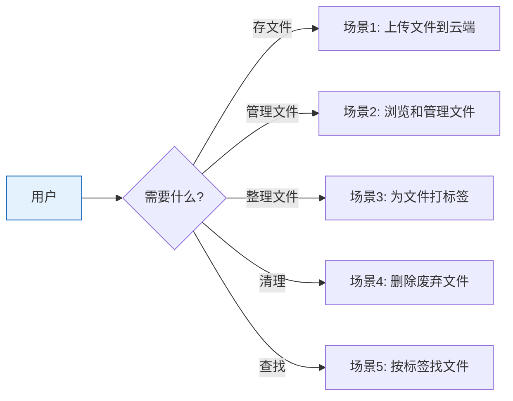

# YiAi-使用场景 — services-storage

> OSS 存储服务的使用场景文档。从用户视角描述文件上传、管理、标签的典型操作流程。
>
> **来源**：源码分析 `/rui doc --from-code services-storage`
> **证据等级**：B（只读源码 + 静态分析）
> **项目类型**：backend
> **语言约束**：本节禁止包含技术术语

---

## 效果示意

---

## 场景 1：上传文件到云端

### 场景描述
用户需要将本地图片上传到云端存储，获得一个可公开访问的地址。

### 前置条件
- 云端存储服务已配置且可用
- 用户准备上传的文件是允许的类型

### 操作步骤

1. **选择文件**：从本地选择要上传的文件
2. **（可选）指定目录**：指定文件存放的目录路径
3. **提交上传**：发起上传请求
4. **系统校验**：自动检查文件类型和大小
5. **生成存储路径**：基于时间戳自动生成唯一文件名
6. **获取地址**：返回文件的公开访问地址

### 预期结果
- 文件成功存入云端
- 返回完整的访问地址、文件名和存储路径

### 异常情况
- 文件类型不支持 → 提示不支持的文件类型
- 文件过大 → 提示文件太大
- 存储服务配置不完整 → 提示配置错误

---

## 场景 2：浏览和管理文件

### 场景描述
管理员需要查看云端存储中某个目录下的所有文件，了解文件大小、修改时间等元数据。

### 前置条件
- 云端存储中有已上传的文件

### 操作步骤

1. **指定目录**（可选）：不指定则列出所有文件
2. **发起查询**：系统返回文件列表，每个文件包含：
   - 文件名
   - 大小（原始字节和可读格式）
   - 最后修改时间
   - 访问地址
   - 标签列表
   - 标题和描述
3. **查看详情**：点击单个文件查看完整信息

### 预期结果
- 返回完整的文件列表
- 每个文件附带标签、标题、描述等元数据

### 异常情况
- 目录为空 → 返回空列表
- 存储服务不可用 → 返回错误提示

---

## 场景 3：为文件打标签

### 场景描述
用户需要为文件添加标签以便后续分类检索，同时可以给文件添加标题和描述。

### 前置条件
- 文件已上传到云端
- 已知文件在存储中的路径

### 操作步骤

1. **添加标签**：选择一个文件，输入标签关键词
2. **保存标签**：系统自动去重后保存
3. **添加信息**：为文件设置标题和描述
4. **查看所有标签**：浏览系统中所有已使用的标签及其出现次数

### 预期结果
- 标签保存成功，重复标签自动合并
- 标题和描述保存成功
- 全局标签统计可查看

### 异常情况
- 文件路径为空 → 提示"文件对象名不能为空"
- 标签列表为空 → 保存空列表（清空标签）

---

## 场景 4：删除废弃文件

### 场景描述
管理员需要删除不再需要的文件，释放存储空间。

### 前置条件
- 已知要删除的文件存储路径
- 文件确实存在于云端

### 操作步骤

1. **确认删除**：确认要删除的文件路径
2. **执行删除**：发起删除请求
3. **系统处理**：
   - 检查文件是否存在
   - 从云端删除文件
   - 自动清理关联的标签和信息
4. **确认结果**：返回已删除的文件路径

### 预期结果
- 文件从云端永久移除
- 关联的标签和信息被同步清理
- 返回删除成功的确认

### 异常情况
- 文件不存在 → 提示"文件未找到"
- 清理关联数据失败 → 文件已删除，仅记录警告

---

## 场景 5：按标签找文件

### 场景描述
用户想快速找到所有标记为特定标签的文件，如查找所有"产品图"标签的图片。

### 前置条件
- 已为部分文件设置了标签
- 已知要查找的标签名称

### 操作步骤

1. **指定标签**：输入要筛选的标签（支持逗号分隔多个标签）
2. **（可选）指定目录**：限制搜索范围
3. **发起查询**：系统列出目录下所有文件，然后按标签过滤
4. **查看结果**：仅返回包含指定标签的文件

### 预期结果
- 返回包含指定标签（任一匹配即可）的文件列表
- 不包含指定标签的文件被过滤掉

### 异常情况
- 没有匹配的文件 → 返回空列表
- 目录下有文件但均无匹配标签 → 返回空列表

---

### 主要价值

- 📤 **一键上传** — 选文件即上传，自动生成唯一名和访问地址
- 🏷️ **灵活分类** — 标签+标题+描述三维度组织文件
- 🔍 **标签筛选** — 全局标签统计 + 按标签快速定位文件
- 🗑️ **安全删除** — 删除前确认存在性，关联数据自动清理

---

## 回溯链

| 来源 | 路径 | 证据级别 |
|------|------|---------|
| 故事任务 | `YiAi-故事任务.md` §1 Story 1–3 | A |
| 源码 | `src/services/storage/oss_client.py` | A |

### 变更记录

| 日期 | 版本 | 变更内容 | 来源 |
|------|------|---------|------|
| 2026-05-22 | 1.0.0 | 初始文档基线，从源码反推生成 | /rui doc --from-code services-storage |
