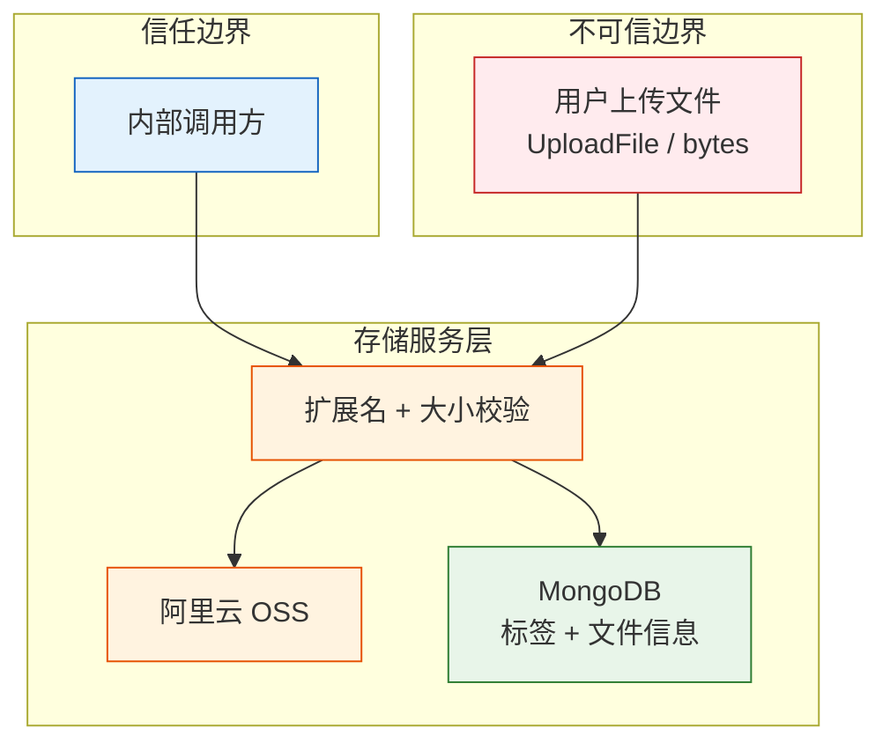

# YiAi-安全审计 — services-storage

> OSS 存储服务的独立安全审计文档。覆盖 `oss_client.py`（文件上传/删除/标签/文件信息）。
>
> **来源**：源码分析 `/rui doc --from-code services-storage`
> **证据等级**：B（只读源码 + 静态分析）
> **项目类型**：backend
> **审计独立性**：由 security agent 独立执行

---

## 效果示意

---

## STRIDE 威胁建模

### S — Spoofing（身份伪造）

| 威胁 | 描述 | 缓解措施 | 评估 |
|------|------|---------|:---:|
| S1 | 伪造上传者身份覆盖他人文件 | 认证在中间件层完成；对象名基于时间戳随机生成，不基于用户输入 | ✅ 已缓解 |
| S2 | OSS AccessKey 泄露被外部利用 | AccessKey 存储在 config.yaml，文件权限控制 | ⚠️ 运维层面 |

---

### T — Tampering（数据篡改）

| 威胁 | 描述 | 缓解措施 | 评估 |
|------|------|---------|:---:|
| T1 | 上传恶意文件（伪装成图片的脚本） | 仅检查扩展名，不检查文件内容（magic bytes） | ⚠️ 中风险 |
| T2 | 通过构造特殊 object_name 覆盖标签/信息 | object_name 来自上传生成的时间戳名，不来自用户输入 | ✅ 已缓解 |
| T3 | 篡改 OSS endpoint 配置重定向上传到恶意服务器 | 配置由管理员控制；运行时不接受外部输入 | ✅ 已缓解 |

**T1 建议**：增加文件 magic bytes 校验（如 `imghdr` 或 `python-magic`），确保 .jpg 文件确实是 JPEG 格式。

---

### R — Repudiation（不可否认性）

| 威胁 | 描述 | 缓解措施 | 评估 |
|------|------|---------|:---:|
| R1 | 文件上传/删除无审计日志 | 不记录谁在什么时间上传/删除了什么文件 | ❌ 未缓解 |

**R1 建议**：上传/删除操作写入审计日志。

---

### I — Information Disclosure（信息泄露）

| 威胁 | 描述 | 缓解措施 | 评估 |
|------|------|---------|:---:|
| I1 | 文件名时间戳泄露文件创建时间 | object_name 格式含精确到秒的时间戳 | ⚠️ 低风险 |
| I2 | 标签聚合泄露系统中所有使用的标签 | `get_all_tags()` 公开所有标签和计数 | ✅ 设计如此 |
| I3 | 错误消息泄露 OSS endpoint/Bucket 信息 | 异常消息可能含 OSS SDK 内部详情 | ⚠️ 低风险 |

**I1 建议**：考虑使用随机字符串命名（UUID）替代时间戳命名。

---

### D — Denial of Service（拒绝服务）

| 威胁 | 描述 | 缓解措施 | 评估 |
|------|------|---------|:---:|
| D1 | 上传超大文件耗尽存储空间 | `oss_max_file_size` 限制单文件大小（默认 50MB） | ✅ 已缓解 |
| D2 | 大量并发上传请求耗尽带宽 | 依赖 FastAPI + OSS 层面的限流 | ⚠️ 运维层面 |
| D3 | list_files 遍历大量文件导致超时 | OSS ObjectIterator 按需获取；但每文件额外查询 DB 标签/信息 | ⚠️ 低风险 |

**D3 建议**：list_files 中对 tags 和 info 的查询改为批量查询（一次 find_many 替代 N 次 find_one）。

---

### E — Elevation of Privilege（权限提升）

| 威胁 | 描述 | 缓解措施 | 评估 |
|------|------|---------|:---:|
| E1 | 通过构造 directory 参数进行路径遍历（../） | 未对 directory 参数做路径遍历过滤 | ⚠️ 中风险 |
| E2 | OSS AccessKey 具有过度权限（如删除 Bucket） | 依赖 RAM 策略最小化权限 | ⚠️ 运维层面 |

**E1 建议**：在 `upload_file_to_oss` 和 `upload_bytes_to_oss` 中对 directory 参数进行路径遍历检查（拒绝 `..` / `//` / 绝对路径）。

---

## 安全评分

| 维度 | 评分 | 说明 |
|------|:---:|------|
| 文件类型校验 | 🟡 良 | 扩展名白名单，但缺少 magic bytes 校验 |
| 路径安全 | 🟡 良 | 时间戳命名降低冲突，但 directory 参数无遍历过滤 |
| 访问控制 | 🟡 良 | 依赖中间件层 + OSS RAM 策略 |
| DoS 韧性 | 🟡 良 | 单文件大小限制，但 list_files N+1 查询 |
| 审计日志 | 🔴 缺 | 无上传/删除审计 |

---

## 改进建议优先级

| # | 建议 | 威胁 | 优先级 | 难度 |
|---|------|------|:---:|:---:|
| 1 | directory 参数路径遍历过滤 | E1 | P0 | 低 |
| 2 | 文件 magic bytes 校验 | T1 | P1 | 中 |
| 3 | list_files 批量查询优化（N+1 问题） | D3 | P2 | 中 |
| 4 | 文件操作审计日志 | R1 | P2 | 中 |

---

### 主要价值

- 🛡️ **上传安全** — 扩展名白名单 + 大小限制双重防护
- 🔍 **路径遍历风险发现** — directory 参数未过滤 `../`，建议 P0 修复
- 🎯 **可操作建议** — 4 条按优先级排列

---

## 回溯链

| 来源 | 路径 | 证据级别 |
|------|------|---------|
| 源码 | `src/services/storage/oss_client.py` (366 lines) | A |
| 技术评审 | `YiAi-技术评审.md` §7 安全设计 | A |

### 变更记录

| 日期 | 版本 | 变更内容 | 来源 |
|------|------|---------|------|
| 2026-05-22 | 1.0.0 | 初始文档基线，从源码反推生成 | /rui doc --from-code services-storage |
