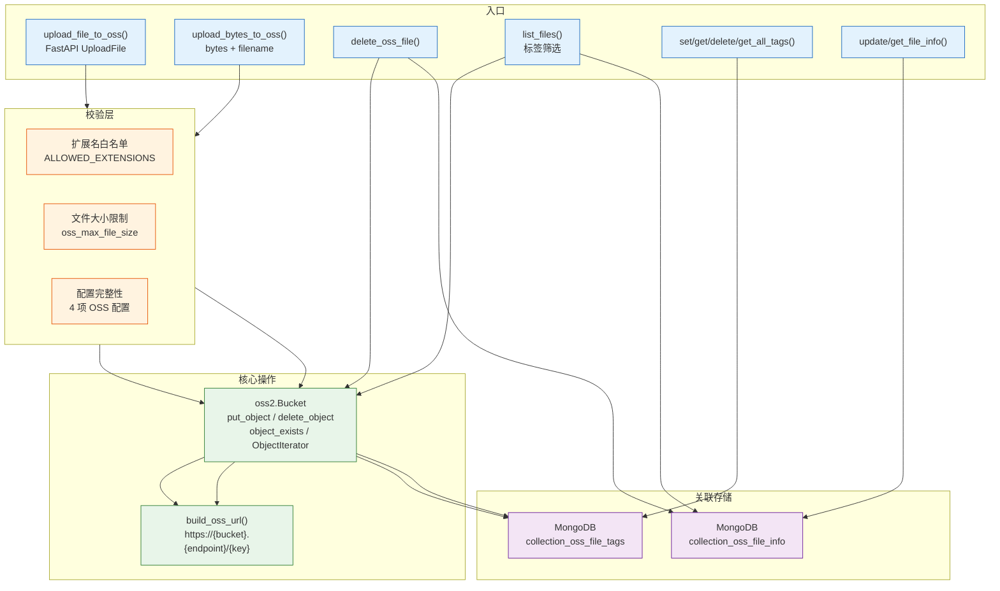
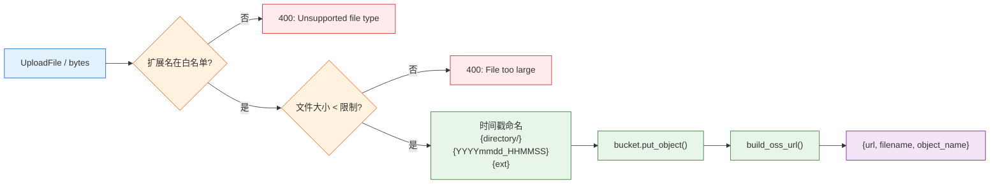

# YiAi-技术评审 — services-storage

> OSS 存储服务的技术设计评审文档。覆盖 `oss_client.py`（阿里云 OSS 封装：上传/删除/标签/文件信息/列表）。
>
> **来源**：源码分析 `/rui doc --from-code services-storage`
> **证据等级**：B（只读源码 + 静态分析）
> **项目类型**：backend → 跳过 §4 组件、§5 交互、§6 DOM/事件

---

## 效果示意



---

## §1 架构设计

### 1.1 整体架构

```
oss_client.py
├── OSSConfig                OSS 连接参数加载（key/secret/endpoint/bucket）
├── get_bucket()             Auth + Bucket 客户端构建
├── build_oss_url()          公开访问 URL 生成
├── upload_file_to_oss()     UploadFile → OSS
├── upload_bytes_to_oss()    bytes → OSS
├── delete_oss_file()        OSS 删除 + DB 清理
├── set_file_tags()          标签 upsert
├── get_file_tags()          标签查询
├── delete_file_tags()       标签删除
├── get_all_tags()           全局标签聚合
├── update_file_info()       文件信息 upsert（含时间戳）
├── get_file_info()          文件信息查询
└── list_files()             目录列表 + 标签过滤
```

### 1.2 上传管道



---

## §2 API / 方法签名

### 2.1 upload_file_to_oss

| 参数 | 类型 | 必填 | 说明 |
|------|------|:---:|------|
| file | UploadFile | ✓ | FastAPI 上传文件 |
| directory | str | — | 目录前缀 |

### 2.2 upload_bytes_to_oss

| 参数 | 类型 | 必填 | 说明 |
|------|------|:---:|------|
| content | bytes | ✓ | 文件内容 |
| filename | str | ✓ | 文件名（为空默认 image.png） |
| directory | str | — | 目录前缀 |

### 2.3 delete_oss_file

| 参数 | 类型 | 必填 | 说明 |
|------|------|:---:|------|
| object_name | str | ✓ | OSS 对象名 |

**处理流程**：object_exists 检查 → delete_object → delete_one(tags) → delete_one(info)

### 2.4 list_files

| 参数 | 类型 | 必填 | 说明 |
|------|------|:---:|------|
| directory | str | — | 目录前缀 |
| tags | str | — | 逗号分隔的标签筛选 |

**实现**：OSS ObjectIterator 遍历 + MongoDB 查询合并标签/信息。

### 2.5 标签操作签名

| 方法 | 参数 | 返回 |
|------|------|------|
| set_file_tags | object_name, tags: List[str] | {object_name, tags} |
| get_file_tags | object_name | List[str] |
| delete_file_tags | object_name | bool |
| get_all_tags | — | [{name, count}, ...] |

### 2.6 文件信息操作签名

| 方法 | 参数 | 返回 |
|------|------|------|
| update_file_info | object_name, title?, description? | {object_name, title, description} |
| get_file_info | object_name | {object_name, title, description} |

upsert 模式：`$set`（title/description/updatedTime）+ `$setOnInsert`（createdTime）。

---

## §3 数据模型

### 3.1 标签存储（collection_oss_file_tags）

```json
{
  "object_name": "images/20260522_103000.jpg",
  "tags": ["vacation", "2026"],
  "updatedTime": "2026-05-22 10:30:00"
}
```

### 3.2 文件信息存储（collection_oss_file_info）

```json
{
  "object_name": "images/20260522_103000.jpg",
  "title": "海滩日落",
  "description": "2026年夏威夷旅行",
  "createdTime": "2026-05-22 10:30:00",
  "updatedTime": "2026-05-22 11:00:00"
}
```

---

## §7 安全设计

| 措施 | 实现 | 位置 |
|------|------|------|
| 扩展名白名单 | `ALLOWED_EXTENSIONS` set，拒绝非图片类型 | oss_client.py:70,102 |
| 文件大小限制 | `len(content) > settings.oss_max_file_size` | oss_client.py:79,108 |
| 配置完整性 | 四项 OSS 配置任一项为空 → RuntimeError | oss_client.py:42–43 |
| 对象存在检查 | 删除前 `bucket.object_exists()` 验证 | oss_client.py:142 |
| URL 构建安全 | 自动去除 endpoint 中已有协议前缀 | oss_client.py:59 |
| DB 清理容错 | 清理失败仅 warning，不抛异常 | oss_client.py:151–152 |

---

## §8 性能设计

| 策略 | 实现 |
|------|------|
| 直传模式 | 小文件直接 put_object（无分片） |
| 迭代器遍历 | OSS ObjectIterator 按需获取 |
| 标签聚合 | 内存中计数排序（非聚合管道） |
| DB 合并查询 | list_files 中对每个文件独立查询 tags+info（可优化为批量查询） |

---

### 主要价值

- 📤 **双上传模式** — UploadFile（HTTP 表单）+ bytes（程序化）两套接口
- 🛡️ **三层安全校验** — 扩展名白名单 + 大小限制 + 配置完整性检查
- 🏷️ **标签系统** — CRUD + 全局聚合统计 + 按标签过滤文件
- 📋 **元数据管理** — 文件标题/描述独立存储，upsert 自动时间戳

---

## 回溯链

| 来源 | 路径 | 证据级别 |
|------|------|---------|
| 源码 | `src/services/storage/oss_client.py` (366 lines) | A |
| 配置 | `config.yaml` — oss.* | B |

### 变更记录

| 日期 | 版本 | 变更内容 | 来源 |
|------|------|---------|------|
| 2026-05-22 | 1.0.0 | 初始文档基线，从源码反推生成 | /rui doc --from-code services-storage |
