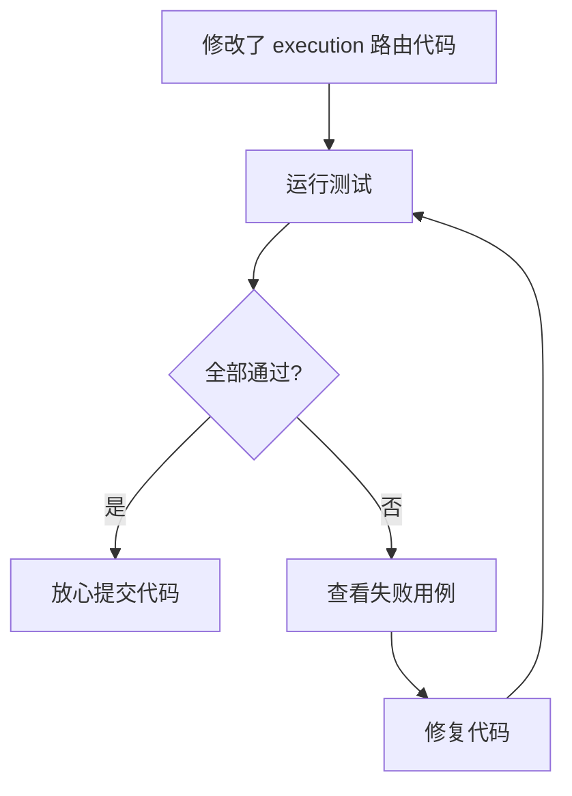
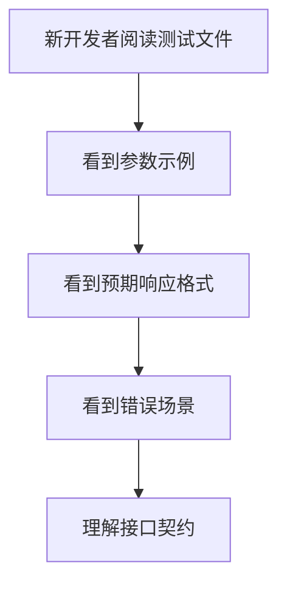
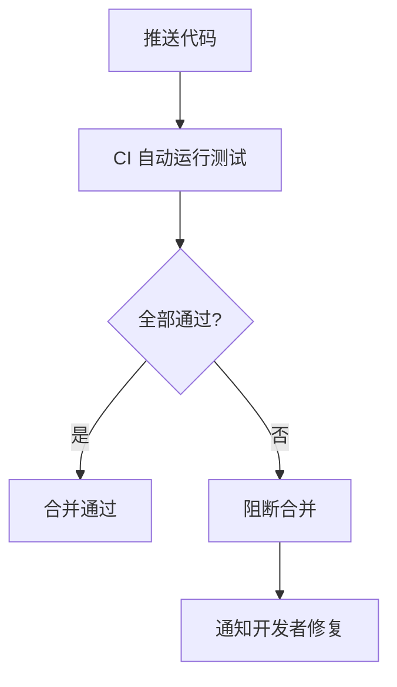

> | v1.0.0 | 2026-05-22 | deepseek-v4-pro | 🌿 feat/test-coverage | 📎 故事任务 §1

> **导航**: [← YiAi-故事任务](./YiAi-故事任务.md) · [YiAi-技术评审 →](./YiAi-技术评审.md)

### 主要价值

- 👤 两个用户角色 — API 调用方验证接口行为正确，项目维护者通过测试保护回归
- 🔀 三条路径覆盖 — 每场景含正常/空状态/错误恢复
- 📊 覆盖矩阵可追溯 — 场景 ↔ FP# ↔ 测试文件映射完整
- 🛡️ 语言边界自检 — 零技术术语污染

---

## §1 场景

### 场景 1：开发者验证接口正确性

### 场景 2：新成员理解接口行为

### 场景 3：CI 自动门禁拦截回归

---

## §2 覆盖矩阵

| 场景 | FP# | 正常 | 空状态 | 错误 |
|------|-----|:--:|:--:|:--:|
| 场景 1：验证正确性 | FP1-FP6 | ✅ | ✅ | ✅ |
| 场景 2：理解接口 | FP1-FP4 | ✅ | — | ✅ |
| 场景 3：CI 门禁 | FP1-FP6 | ✅ | — | ✅ |

---

### 变更记录

| 版本 | 日期 | 变更 |
|------|------|------|
| v1.0.0 | 2026-05-22 | 初始生成 |
