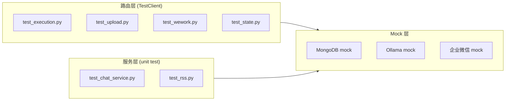

> | v1.0.0 | 2026-05-22 | deepseek-v4-pro | 🌿 feat/test-coverage | 📎 故事任务 §2

> **导航**: [← YiAi-使用场景](./YiAi-使用场景.md) · [YiAi-测试设计 →](./YiAi-测试设计.md)

### 主要价值

- 🏗️ 分层测试架构 — 路由层用 TestClient 集成测试，服务层用 mock 隔离单元测试
- 📐 mock 边界清晰 — MongoDB/外部 API 全 mock，纯逻辑函数直接测试
- 🔗 用例映射完整 — 每模块覆盖正常/边界/异常三类场景
- ⚡ 异步适配 — pytest-asyncio + FastAPI TestClient 协同

---

## §1 测试架构

---

## §2 测试策略

| 模块 | 类型 | Mock 范围 | 用例数 |
|------|------|------|:--:|
| test_execution.py | 集成 | executor + 数据库 | ≥ 6 |
| test_upload.py | 集成 | OSS + 文件系统 | ≥ 6 |
| test_wework.py | 集成 | aiohttp session | ≥ 5 |
| test_state.py | 集成 | MongoDB state store | ≥ 6 |
| test_chat_service.py | 单元 | ollama Client | ≥ 8 |
| test_rss.py | 单元 | aiohttp + feedparser | ≥ 6 |

---

## §3 mock 策略

| 外部依赖 | mock 方式 | 原因 |
|---------|---------|------|
| MongoDB (motor) | `unittest.mock.patch` database module | 无真实数据库连接 |
| Ollama | `unittest.mock.patch` ollama.Client | 无本地模型 |
| aiohttp | `unittest.mock.AsyncMock` | 无外部网络 |
| 企业微信 API | `unittest.mock.AsyncMock` | 无 webhook 端点 |
| OSS | `unittest.mock.patch` oss_client | 无对象存储 |

---

### 变更记录

| 版本 | 日期 | 变更 |
|------|------|------|
| v1.0.0 | 2026-05-22 | 初始生成 |
