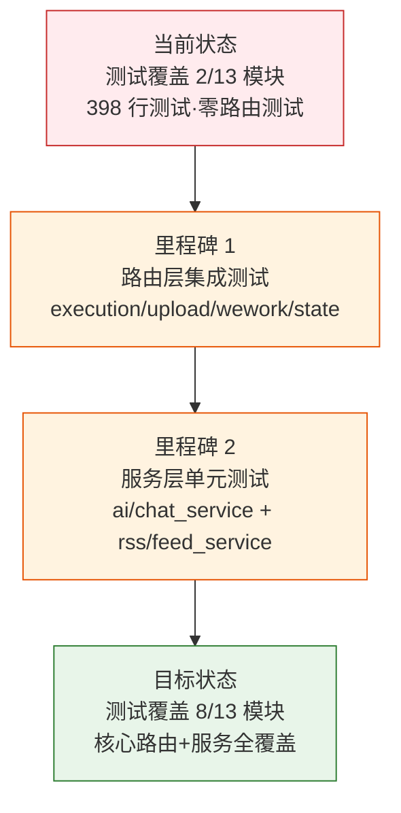

> | v1.0.0 | 2026-05-22 | deepseek-v4-pro | 🌿 feat/test-coverage | ⏱️ — | 📎 [CLAUDE.md](../../../CLAUDE.md) |

> **导航**: [YiAi-使用场景 →](./YiAi-使用场景.md)

> **来源引用**: `/rui "扩展测试覆盖" --name test-coverage`，P1 质量门推荐，L-1 基建扫描发现测试覆盖仅 2 模块（398 行）

[§1 Story](#sec1-story) · [§2 Requirements](#sec2-requirements) · [§3 成功标准](#sec3-success) · [§4 范围边界](#sec4-scope) · [§5 AC](#sec5-ac) · [§6 风险与假设](#sec6-risks) · [§7 跨文档索引](#sec7-index)

---

### §0 基线声明

> **问题空间基线**: 本文档定义"做什么(WHAT)"和"为什么(WHY)"。

---

### 需求概述

当前测试仅覆盖 `test_utils.py`（212 行）和 `test_data_service.py`（181 行），7 个 API 路由模块和 6 个服务模块中仅 data_service 有测试。需扩展至 execution/upload/wework/state 四个核心路由和 ai/rss 两个核心服务的测试覆盖。

### 效果示意

### 主要价值

- 🧪 路由层覆盖归零 — 当前 7 个路由模块零测试，任何接口变更无回归保护
- 🛡️ 核心服务验证 — ai/chat_service 处理大模型调用，rss/feed_service 处理外部源解析，均属高风险区域
- 📈 覆盖率从 15% 提升到 60%+ — 2 模块 → 8 模块测试覆盖
- 🔄 回归保护网 — 后续 rui update/yry 自改进有测试兜底

---

## §1 Story

### Story 1: API 路由层集成测试

| 字段 | 内容 |
|------|------|
| 作为 | 项目维护者 |
| 我想要 | execution/upload/wework/state 四个核心路由有集成测试 |
| 以便 | 路由参数校验、响应格式、错误处理有自动化验证 |
| 优先级 | P0 |
| 范围边界 | 新增 `tests/test_execution.py`, `tests/test_upload.py`, `tests/test_wework.py`, `tests/test_state.py` |

### Story 2: 核心服务单元测试

| 字段 | 内容 |
|------|------|
| 作为 | 项目维护者 |
| 我想要 | ai/chat_service 和 rss/feed_service 有单元测试 |
| 以便 | 服务逻辑、边界条件、错误处理有独立验证 |
| 优先级 | P1 |
| 范围边界 | 新增 `tests/test_chat_service.py`, `tests/test_rss.py` |

---

### §2 Requirements

#### 功能点

| FP# | 描述 | 优先级 |
|-----|------|:--:|
| FP1 | execution 路由测试 — GET/POST 模块执行、参数解析、SSE 流 | P0 |
| FP2 | upload 路由测试 — 文件上传/读取/写入/删除、路径安全校验 | P0 |
| FP3 | wework 路由测试 — Webhook 消息发送、URL 校验、错误响应 | P0 |
| FP4 | state 路由测试 — 状态记录 CRUD、查询过滤、分页 | P0 |
| FP5 | chat_service 测试 — 文本提取、图片 URL 检测、消息构建 | P1 |
| FP6 | rss_service 测试 — RSS 源获取、XML 解析、错误处理 | P1 |

#### 业务规则

| R# | 描述 |
|----|------|
| R1 | 使用 FastAPI TestClient + pytest-asyncio |
| R2 | 外部依赖（MongoDB/Ollama/企业微信）用 mock 隔离 |
| R3 | 每模块测试含正常/边界/异常三类用例 |

---

### §3 成功标准

| SC# | 描述 | 目标值 | 优先级 |
|-----|------|--------|:--:|
| SC1 | 新增 6 个测试文件 | 6 个文件 | P0 |
| SC2 | 测试用例总数 | ≥ 40 个 | P0 |
| SC3 | 路由层覆盖 | 4/7 核心路由 | P0 |
| SC4 | 服务层覆盖 | 2/6 核心服务 | P1 |

---

### §4 范围边界

**范围内**: `tests/test_execution.py`, `tests/test_upload.py`, `tests/test_wework.py`, `tests/test_state.py`, `tests/test_chat_service.py`, `tests/test_rss.py`

**范围外**: maintenance/observer_health/story_panel 路由测试（低优先级）、rss_scheduler 测试（需时间模拟）、E2E 测试

---

### §5 AC

| AC# | Given | When | Then |
|-----|-------|------|------|
| AC1 | 6 个测试文件存在 | `pytest tests/ -v` | ≥ 40 个用例，全部通过 |
| AC2 | mock 外部依赖 | 无 MongoDB/Ollama 运行 | 测试不依赖外部服务 |
| AC3 | 异常路径覆盖 | 非法参数输入 | 返回预期错误码和消息 |

---

### §6 风险与假设

| # | 风险 | 缓解 |
|---|------|------|
| 1 | FastAPI TestClient 与 motor 异步不兼容 | 用 mock.patch 隔离数据库调用 |
| 2 | aiohttp 在测试中需要 mock | 用 pytest-asyncio + unittest.mock |
| 3 | 部分路由依赖 settings 配置 | 测试中覆盖配置值 |

---

### §7 跨文档索引

| 文档 | 路径 |
|------|------|
| 使用场景 | [YiAi-使用场景.md](./YiAi-使用场景.md) |
| 技术评审 | [YiAi-技术评审.md](./YiAi-技术评审.md) |
| 测试设计 | [YiAi-测试设计.md](./YiAi-测试设计.md) |
| 安全审计 | [YiAi-安全审计.md](./YiAi-安全审计.md) |
