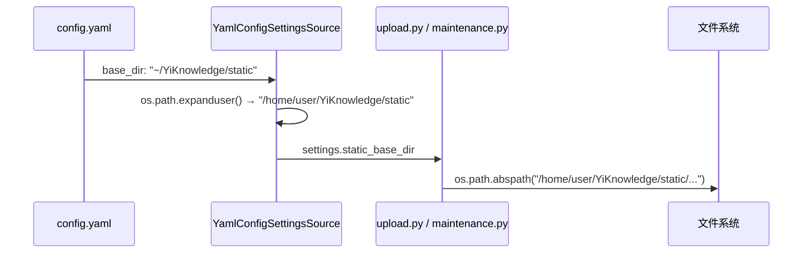

# YiKnowledge 路径迁移

> v1 | 2026-05-09 | deepseek-v4-pro | /rui | main | 📎 [CLAUDE.md](../../../CLAUDE.md)

> 证据标准: A=已验证(附路径) · B=可推导(附规则) · C=未验证(标注 `> 待补充`) · D=禁止(视为幻觉)

> 技术评审: 详见 [02-后端技术评审.md](./02-后端技术评审.md) | 非 UI 故事，无前端评审

---

## Story 1: YiKnowledge 静态文件路径迁移

### §1 Story（pm 定义）

| 字段 | 详情 |
|-------|--------|
| 作为 | 运维/开发者 |
| 我想要 | 将 YiAi 引用的 YiKnowledge 静态文件路径从 `/var/www/YiKnowledge/static` 更新为 `~/YiKnowledge/static` |
| 以便 | YiKnowledge 迁移到 `~/YiKnowledge` 后静态文件服务正常工作 |
| 优先级 | 🔴 P0 |
| 范围边界 | 仅更新 `config.yaml` 中的 `static.base_dir` 配置值和 `config.py` 中的路径展开 |
| 依赖 | — |
| 子项目 | YiAi |

**范围外**: 不修改 YiKnowledge 本身，不修改 OSS 上传逻辑，不修改 sandbox 路径

---

### §1.1 User Operations（tester 描述）

非 UI 故事，§1.1 仅含 User Operations。

| # | 操作 | 触发条件 | 操作步骤 | 预期结果 |
|---|-----------|---------|-------------|-----------------|
| U1 | 静态文件访问 | 请求 `/static/<path>` | 服务从 `~/YiKnowledge/static` 读取文件 | 返回文件内容，状态 200 |

---

### §2 Requirements（pm 描述）

#### 功能点

| FP# | 描述 | 输入 | 输出 | 错误行为 | 优先级 |
|-----|-------------|-------|--------|---------------|----------|
| FP1 | 静态文件目录指向迁移后的 YiKnowledge 路径 | HTTP 静态文件请求 | 正确读取 `~/YiKnowledge/static/` 下的文件 | 文件不存在时返回 404 | 🔴 |

#### 业务规则

| 规则# | 描述 | 校验方式 | 证据级别 |
|-------|-------------|-------------|----------|
| R1 | `static.base_dir` 使用 `~` 表示用户 home 目录 | 后端校验（`os.path.expanduser` 自动展开） | A |
| R2 | 路径展开后必须存在且可读 | 运行时文件系统检查 | A |

---

### §3 Design（coder + security 描述）

#### 影响分析

| 影响面 | 变更 | 说明 |
|--------|------|------|
| config.yaml | 修改 `static.base_dir` | `/var/www/YiKnowledge/static` → `~/YiKnowledge/static` |
| src/core/config.py | 新增 `os.path.expanduser` 展开 `~` | `YamlConfigSettingsSource.__init__` 后处理 |
| src/api/routes/upload.py | 无变更 | 已通过 `settings.static_base_dir` 间接消费 |
| src/api/routes/maintenance.py | 无变更 | 已通过 `settings.static_base_dir` 间接消费 |
| src/main.py | 无变更 | 已通过 `settings.static_base_dir` 间接消费 |

#### 技术设计（coder 描述）

| 模块 | 文件 | 职责 | 变更类型 |
|--------|------|---------------|-------------|
| 配置源 | `config.yaml` | 声明静态文件根目录 | 修改 |
| 配置加载 | `src/core/config.py` | YAML 值读取后展开 `~` | 修改 |

**数据流**:

| 流程 | 来源 | 目标 | 数据 | 转换 |
|------|------|----|------|-----------|
| F1 | config.yaml `static.base_dir` | `settings.static_base_dir` | `"~/YiKnowledge/static"` | `os.path.expanduser()` → 展开为 `/home/<user>/YiKnowledge/static` |

#### 安全约束（security 注入）

| # | 威胁 | 信任边界 | 缓解措施 | 优先级 |
|---|--------|---------------|-----------|----------|
| 1 | 路径遍历（通过 `~` 绕过） | config.yaml → 文件系统 | `os.path.expanduser()` 后仍经过 `os.path.abspath()` + 路径前缀验证 | P1 |

---

### §4 Tasks（pm + coder + security + reporter 拆解）

| ID | 描述 | 工作量 | 依赖 | 交付物 | Agent | 门禁 |
|----|-------------|--------|---------|-------------|-------|------|
| T1 | pm: 故事拆解/协调 | S | — | 故事文档 | pm | — |
| T2 | coder: 更新 config.yaml 路径 | S | T1 | `config.yaml` | coder | — |
| T3 | coder: config.py 添加 expanduser | S | T2 | `src/core/config.py` | coder | — |
| T4 | tester: 验证路径展开 + 静态文件访问 | S | T3 | 验证报告 | tester | Gate B |

**任务依赖图**:

---

### §5 Acceptance Criteria（tester 定义）

| AC# | 验收条件（可度量） | 测试方法 | 预期结果 | 门禁 |
|-----|------------------------|-------------|-----------------|------|
| AC1 | `settings.static_base_dir` 为已展开的绝对路径 | `python -c "from src.core.config import settings; print(settings.static_base_dir)"` | 输出以 `/home/` 开头，不含 `~` | Gate B |
| AC2 | 服务启动时 StaticFiles 挂载不报错 | `python main.py` 启动后检查日志 | 无 "directory does not exist" 错误 | Gate B |
| AC3 | 路径遍历防护仍然有效 | 请求 `../../../etc/passwd` 类路径 | 拒绝（BusinessException） | Gate B |

---

### §6 .claude 改进清单

（本次为 T1 微观变更，无结构性改进项）

---

### §7 系统架构演进任务

（本次为配置值迁移，无架构演进任务）
