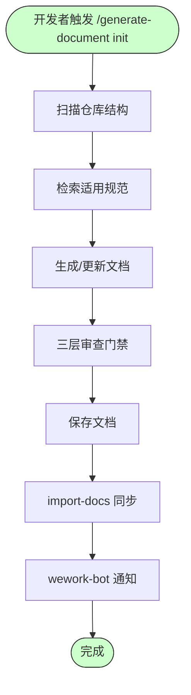
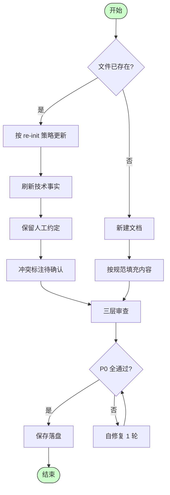
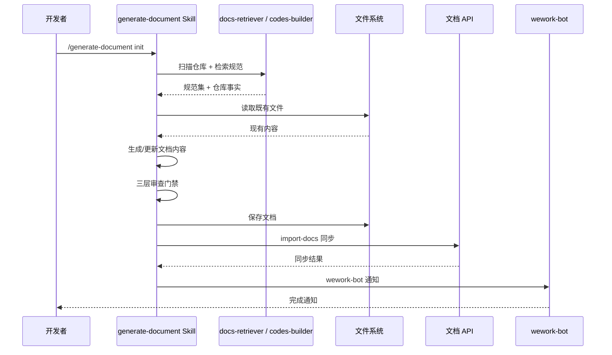

# 项目初始化

> **文档版本**: v1.0 | **最后更新**: 2026-04-30 | **维护者**: kimi-k2.6 | **工具**: Claude Code
>
> **关联文档**: [需求文档](./01_需求文档.md) | [设计文档](./03_设计文档.md) | [使用文档](./04_使用文档.md)
>
> **Git 分支**: main
>
> **文档开始时间**: --:--:-- | **文档最后更新时间**: --:--:--
>

[功能概述](#功能概述) | [功能分析](#功能分析) | [主要操作场景](#主要操作场景) | [功能详情](#功能详情) | [验收标准](#验收标准) | [影响分析](#影响分析) | [使用场景示例](#使用场景示例)

---

## 功能概述

YiAi 项目是一个基于 FastAPI 的 AI 服务后端，当前已具备 RSS 管理、文件上传、AI 聊天和动态模块执行等核心功能。本次"项目初始化"旨在为 YiAi 建立一套完整的文档体系和开发规范，覆盖项目基础文件和全文档编号集，使项目具备可维护、可扩展、可协作的工程化基础。

**核心价值**
- 🎯 建立统一的开发规范和行为准则，降低协作成本
- ⚡ 通过标准化文档加速新成员 onboarding 和功能迭代
- 📖 形成可追溯的知识资产，支持长期演进

---

## 功能分析

### 功能分解图

```mermaid
graph TB
    Root["项目初始化"] --> B1["项目基础文件"]
    Root --> B2["全文档编号集"]
    Root --> B3["质量门禁"]
    B1 --> F1["CLAUDE.md"]
    B1 --> F2["README.md"]
    B1 --> F3["docs/architecture.md"]
    B1 --> F4["docs/changelog.md"]
    B1 --> F5["docs/devops.md"]
    B1 --> F6["docs/network.md"]
    B1 --> F7["docs/state-management.md"]
    B1 --> F8["docs/FAQ.md"]
    B1 --> F9["docs/auth.md"]
    B1 --> F10["docs/security.md"]
    B2 --> D1["01_需求文档.md"]
    B2 --> D2["02_需求任务.md"]
    B2 --> D3["03_设计文档.md"]
    B2 --> D4["04_使用文档.md"]
    B2 --> D5["05_动态检查清单.md"]
    B2 --> D6["06_实施总结.md"]
    B2 --> D7["07_项目报告.md"]
    B3 --> Q1["语法层审查"]
    B3 --> Q2["质量层审查"]
    B3 --> Q3["测试层审查"]

    style Root fill:#ccffcc,stroke:#333,stroke-width:2px
    style B1 fill:#e1f5ff,stroke:#007acc
    style B2 fill:#e1f5ff,stroke:#007acc
    style B3 fill:#e1f5ff,stroke:#007acc
```

**功能分解图说明**：项目初始化分为三大块——10 个基础文件、7 个全文档编号集、三层质量门禁。

### 用户流程图

**用户流程图说明**：开发者通过命令触发初始化，系统自动扫描、生成、审查、保存并同步文档。

### 功能流程图

**功能流程图说明**：根据文件是否存在选择更新或新建，更新时优先刷新事实并保留人工约定，最终通过三层审查后落盘。

### 完整时序图

**时序图说明**：开发者触发命令后，Skill 协调多个 Agent 完成扫描、生成、审查、保存、同步和通知的全流程。

---

## 主要操作场景

#### 🎯 场景：新成员通过文档快速上手

**关联用户故事**：🔴 作为开发者，我想要一套完整的项目文档和规范，以便快速理解项目结构和开发约定

**场景描述**：新开发者 clone YiAi 仓库后，通过阅读 README.md、CLAUDE.md 和 architecture.md，在 10 分钟内理解项目结构和技术栈，能够定位相关代码并开始开发。

**前置条件**：
- 项目基础文件已生成且内容真实
- Git 仓库可正常 clone

**操作步骤**：
1. 打开 README.md 了解项目概述和技术栈
2. 阅读 CLAUDE.md 了解编码规范和开发工作流
3. 查阅 docs/architecture.md 了解目录组织和放置规则
4. 根据需要查阅 FAQ、auth、security 等专题文档

**预期结果**：新成员能够在不询问他人的情况下独立完成环境搭建和首次代码提交。

**验证关注点**：
- README.md 是否包含快速开始步骤
- CLAUDE.md 是否包含明确的编码规范
- architecture.md 的目录结构是否与实际一致

**相关设计文档章节**：[03_设计文档 §架构设计](#架构设计)

---

#### 🟡 场景：维护者排查认证故障

**关联用户故事**：🟡 作为维护者，我想要架构设计和运维文档，以便进行部署扩展和故障排查

**场景描述**：生产环境 API 返回 401，维护者通过查阅 auth.md 和 network.md 快速定位问题并修复。

**前置条件**：
- auth.md 和 network.md 已生成
- 维护者有权限访问服务器和配置

**操作步骤**：
1. 查阅 docs/auth.md 了解认证流程和白名单规则
2. 检查 config.yaml 中的 `middleware.auth_enabled`
3. 检查 `API_X_TOKEN` 环境变量或 `middleware.auth_token`
4. 对比请求头中的 `X-Token` 与配置值

**预期结果**：在 5 分钟内定位并修复认证问题。

**验证关注点**：
- auth.md 是否包含完整的认证流程图
- 是否明确说明了令牌优先级（环境变量 > 配置文件）
- 是否列出了白名单路径

**相关设计文档章节**：[03_设计文档 §认证设计](#认证设计)

---

## 功能详情

#### 项目基础文件生成

**功能说明**：在仓库根目录和 docs/ 目录下生成 10 个基础文件，覆盖行为规范、项目概述、架构约定、变更日志、运维指南、网络约定、状态管理、常见问题、认证方案和安全策略。

**价值**：为所有协作者提供单一真源，降低认知成本和沟通开销。

**解决的痛点**：
- 新成员上手慢，需要反复询问项目约定
- 架构知识分散在口头或记忆中，容易遗忘和偏差
- 排查问题时缺乏统一的参考文档

#### 全文档编号集生成

**功能说明**：在 `docs/项目初始化/` 目录下按规范生成 01-07 全文档编号集，形成标准化的文档管理能力。

**价值**：建立文档生成和管理的基础设施，支持后续功能迭代的文档化。

**解决的痛点**：
- 功能文档缺乏统一结构和质量标准
- 文档与代码容易脱节

#### 质量门禁

**功能说明**：所有生成的文档须通过三层审查门禁（语法层、质量层、测试层），P0 检查项全部通过。

**价值**：确保文档真实可信，避免幻觉和错误信息误导开发者。

**解决的痛点**：
- AI 生成文档容易出现幻觉（虚构路径、命令、依赖）
- 文档质量参差不齐

---

## 验收标准

### P0 - 必须通过
- [ ] **验收项1**：10 个基础文件全部存在且非空，路径与规范一致
- [ ] **验收项2**：`docs/项目初始化/01-07` 全部存在且非空
- [ ] **验收项3**：文档中引用的所有文件路径在仓库中真实存在
- [ ] **验收项4**：无凭空编造的技术栈、依赖或命令

### P1 - 应该通过
- [ ] **验收项5**：CLAUDE.md 包含固定头两行（behavioral-guidelines.md + architecture.md）
- [ ] **验收项6**：README.md 包含项目名、技术栈表、快速开始、目录结构
- [ ] **验收项7**：docs/architecture.md 包含目录组织（与实际目录一致）、放置规则、核心架构模式

### P2 - 可以有
- [ ] **验收项8**：文档包含 Mermaid 图表（架构图、流程图等）
- [ ] **验收项9**：07_项目报告包含 skills/agents/rules 自我改进建议

---

## 影响分析

> **强制执行**：按 `../../../shared/impact-analysis-contract.md` 对整个项目执行完整影响分析。

### 搜索词与改动点清单

| 改动点 | 类型 | 搜索词 | 来源 | 备注 |
|--------|------|--------|------|------|
| CLAUDE.md | 更新 | CLAUDE.md | 现有文件 | 添加固定头两行，保留现有内容 |
| README.md | 更新 | README.md | 现有文件 | 保留现有内容，按规范补充 |
| docs/architecture.md | 新建 | architecture | init 规范 | 无既有文件 |
| docs/changelog.md | 新建 | changelog | init 规范 | 无既有文件 |
| docs/devops.md | 新建 | devops | init 规范 | 无既有文件 |
| docs/network.md | 新建 | network | init 规范 | 无既有文件 |
| docs/state-management.md | 新建 | state-management | init 规范 | 无既有文件 |
| docs/FAQ.md | 新建 | FAQ | init 规范 | 无既有文件 |
| docs/auth.md | 新建 | auth | init 规范 | 无既有文件 |
| docs/security.md | 新建 | security | init 规范 | 无既有文件 |

### 改动点影响链

| 改动点 | 搜索词 | 命中文件 | 引用方式 | 影响层级 | 依赖方向 | 处置方式 | 闭合状态 | 说明 |
|--------|--------|----------|----------|----------|----------|----------|----------|------|
| CLAUDE.md | CLAUDE.md | README.md | 链接引用 | 低 | 反向 | 保留链接 | ✅ 已闭合 | README 引用 CLAUDE.md |
| docs/architecture.md | architecture.md | CLAUDE.md | 链接引用 | 低 | 反向 | 保留链接 | ✅ 已闭合 | CLAUDE.md 引用 architecture.md |

### 依赖闭合摘要

| 改动点 | 上游依赖是否核对 | 反向依赖是否核对 | 传递依赖是否闭合 | 测试/文档/配置是否覆盖 | 结论 |
|--------|------------------|------------------|------------------|------------------------|------|
| 项目基础文件 | 是 | 是 | 是 | 文档已覆盖 | 已闭合 |
| docs/项目初始化/ | 是 | 是 | 是 | 文档已覆盖 | 已闭合 |

### 未覆盖风险

| 风险来源 | 原因 | 影响 | 缓解方式 |
|----------|------|------|----------|
| 文档与代码后续脱节 | 代码演进后文档未同步 | 误导开发者 | 建立定期 re-init 机制，代码变更时同步更新文档 |
| re-init 覆盖人工补充 | 自动更新时误删团队约定 | 知识丢失 | 使用哨兵块包裹可重写段落，块外内容保留 |

### 改动范围汇总

- **需直接修改的文件数**：2 个（CLAUDE.md、README.md）
- **需验证兼容性的文件数**：2 个（确认链接有效）
- **需追踪传递影响的文件数**：0 个
- **需人工复核或阻断的风险**：文档与代码后续脱节风险（缓解：建立 re-init 机制）

---

## 使用场景示例

#### 📋 场景一：新成员首次上手

> **背景**：新开发者 clone 了 YiAi 仓库，需要快速了解项目。
>
> **操作**：阅读 README.md 了解项目概述和技术栈，阅读 CLAUDE.md 了解开发规范，阅读 docs/architecture.md 了解架构约定。
>
> **结果**：在 10 分钟内理解项目结构、技术栈和开发约定，能够定位相关代码。

#### 📋 场景二：排查认证问题

> **背景**：API 返回 401，开发者需要排查原因。
>
> **操作**：查阅 docs/auth.md 了解认证流程和白名单规则，检查 config.yaml 中的 `middleware.auth_enabled` 和 `API_X_TOKEN` 环境变量。
>
> **结果**：快速定位是令牌配置问题还是白名单路径问题，并按文档指引修复。

#### 📋 场景三：生产环境部署

> **背景**：需要将 YiAi 部署到生产服务器。
>
> **操作**：查阅 docs/devops.md 了解环境要求和部署步骤，查阅 docs/security.md 了解安全配置建议。
>
> **结果**：完成安全加固的生产环境部署，包括启用认证、禁用重载、配置日志轮转等。
